<!-- 飞书版：https://wrpnn3mat2.feishu.cn/docx/SGh0dCub5oRBLpxkiq0cB0X3nrd -->

# 拉比克 Rubick 2.0 开发者手册

> 本手册写给平台里的**「开发者」角色**——把一段 SQL 做成任务、交给业务同学自助取数的人。
> 第 8 章是**业务同学那侧的界面速览**（答疑用）；完整的业务操作说明见[用户使用说明手册](./user-manual.md)，
> 部署与运维请看 [README](../README.md)。
> 对应 2026-09-22 的线上功能（含团队、团队取数账号、跨团队隔离、任务编号与按编号搜索、开放 API 与 Agent Skill）。界面与手册不一致时**以系统实际显示为准**，并把差异反馈给平台管理员。
> 文中所有示例（任务名、大区、日期、人名）均为演示用的虚构值，截图取自本地演示实例。

## 目录

1. [开发者能做什么](#1-开发者能做什么) —— 含 [1.1 团队](#11-团队)、[1.2 团队取数账号（数据权限）](#12-团队取数账号数据权限)
2. [五分钟建成第一个任务](#2-五分钟建成第一个任务)
3. [任务编辑器详解](#3-任务编辑器详解)
4. [变量怎么设计](#4-变量怎么设计)
5. [SQL 规范与安全网关](#5-sql-规范与安全网关)
6. [状态、版本与回收站](#6-状态版本与回收站)
7. [给业务同学授权](#7-给业务同学授权)
8. [业务同学看到的界面](#8-业务同学看到的界面)
9. [验收与排障](#9-验收与排障)
10. [上线前自检清单](#10-上线前自检清单)
11. [开放 API（/api/v1）](#11-开放-apiapiv1)
12. [附录：口径速查 · 审计动作码 · 运营分析口径表 · 术语对照](#12-附录口径速查--审计动作码--术语对照)

---

## 1. 开发者能做什么

登录后右上角头像旁的标签写着你的角色。三种角色的能力边界：

| 能力 | 普通用户 | **开发者** | 管理员 |
|---|:--:|:--:|:--:|
| 运行被授权的任务、预览下载结果 | ✅ | ✅ | ✅ |
| 看**本团队**任务（含同事的草稿、已下线） | ✖ | ✅ | 全部团队 |
| 新建任务（**必须选一个团队**） | ✖ | ✅ | ✅ |
| 编辑 / 上线 / 下线**自己建的**任务 | ✖ | ✅ | ✅ |
| 编辑**同团队他人**的任务 | ✖ | 团队管理员 ✅ / 普通成员需被授予该任务的编辑权 | ✅ |
| 测试运行（试跑）、SQL 预览、测试枚举 SQL | ✖ | ✅ | ✅ |
| 给业务同学授权（查看 / 运行 / 下载） | ✖ | 自己有编辑权的任务 | ✅ |
| 看某任务下**所有人**的运行记录 | 只看自己的 | 本团队任务 ✅ | ✅ |
| 配置**团队取数账号** | ✖ | 仅团队管理员 | ✅ |
| 添加团队成员 | ✖ | 仅团队管理员 | ✅ |
| 建团队 / 指定团队管理员 / 转移任务所属团队 | ✖ | **✖** | ✅ |
| 转移**任务作者**（离职交接） | ✖ | 作者本人 ✅ / 团队管理员 ✅（只被授予编辑权的 **✖**） | ✅ |
| 改用户角色 / 配置数据源 / 查审计日志 | ✖ | **✖** | ✅ |

**开发者之间按团队隔离**：你看得到同团队成员的任务，但默认**不能编辑**他们的；需要编辑时，
由**团队管理员**对**指定任务**授予编辑权（见 [1.1](#11-团队)）。团队管理员可编辑本团队全部任务。
**不同团队的任务互相不可见。**

任务列表标题旁的 **我开发的** 勾选框把范围收窄到**你建的**、加上**别人授予你编辑权的**任务。
「能编辑」不等于「我开发的」：团队管理员和平台管理员对全部任务都有编辑权，但那是治理权限，
不会落进这个筛选。旁边的 **我订阅的** 只看你订阅了定时运行的任务，普通用户也有这一个；
两个勾选框互相独立，同时勾就是取交集。属于多个团队时还会出现一个**团队下拉**。
以上筛选都先于上方的计数片（「已上线 / 草稿 / 总数」，本团队有闲置任务时还会多一枚「闲置」，
见 [6.1](#61-闲置长期没人跑的已上线任务)）生效，所以数字和卡片永远一致。

任务列表右上还有一对**视图切换**（⊞ 卡片 / ☰ 列表）：任务多起来时列表模式一屏能看几十行，
选择会记在本机浏览器里。**两种视图的动作完全相同** —— 下文说的「卡片 ⋮」在列表模式就是**行尾的 ⋮**，
「卡片右下的虚线 +」就是**行尾的 +**，「点卡片本体取数」就是**点那一行**。
列表模式还可以点 ID / 任务名 / 状态 / 计划 / 时间 的列头排序。详见用户手册 4.1.1。

**平台管理员不受团队约束**：他可见并可编辑所有团队的所有任务；但他自己建任务时**同样必须选团队**
——取数身份只能来自团队账号。

**这四件事必须找管理员**：建团队 / 指定团队管理员、新增或修改数据源、给同事改平台角色、检索审计日志。
左侧菜单里的「用户管理 / 团队管理 / 数据源 / 取数账号 / 审计」对你不可见。

### 1.1 团队

**任务归属团队，团队是可见范围与取数身份的双重边界。** 入口在左侧菜单「我的团队」。

- 团队由**平台管理员**创建并指定**团队管理员**；团队成员只能是「开发者」角色。
- 一个人可以属于**多个**团队；一个团队可以有**多个**团队管理员。
- **你必须先属于某个团队才能新建任务** —— 不属于任何团队时，「新建任务」按钮是灰的。

团队页有三个页签：

| 页签 | 谁能改 | 干什么 |
|---|---|---|
| 成员 | 团队管理员 | 添加/移出成员（只能加开发者） |
| 团队取数账号 | 团队管理员 | 配置本团队在各数据源上的库账号,见 [1.2](#12-团队取数账号数据权限) |
| 任务编辑权 | 团队管理员 | 按任务把编辑权授予某个成员;上方搜索框可按 任务名 / 任务编号 / 作者 / 可编辑的人 筛 |

**编辑权的三条口径**：

1. 你对**自己建的**任务天然可编辑；
2. **团队管理员**对本团队**全部**任务天然可编辑，不需要给自己授权；
3. 其他成员要改你的任务，需要团队管理员在「任务编辑权」里对**那一个任务**授予。

被移出团队后，你不再看得到该团队的任务，已授予你的编辑权也随之失效并清除。
**任务本身留在团队里继续可运行** —— 人走任务不停。

> 需要把某个任务换到别的团队？那会同时改变它的可见范围与取数账号，属于跨组织的治理动作，
> 只有**平台管理员**能做（在任务编辑器里改「所属团队」）。

#### 离职 / 转岗交接：先转作者，再降角色

任务的**作者**不再能改代码之外的任何东西时，它仍决定两件事：谁天然可编辑这个任务，
以及**订阅定时运行失败时通知谁**。所以人要走的时候，作者得跟着交接，否则失败通知会一直
发给一个已经不在的人（实际表现是没人收到，只剩团队管理员）。

交接分两步，**顺序不能反**：

1. **先转作者**。任务列表右上角的「批量交接」可以一次转走一批：先选接手人，
   表格随即标出哪些能勾、哪些不能（悬停看原因），勾完一次提交。
   只转一两个的话，从 ⋮ 菜单进「转移作者」更快。两个入口的规则完全一样，
   作者本人、本团队的团队管理员、平台管理员都能做这一步。
2. **再请平台管理员改角色**。降级会把他清出全部团队。

批量交接有两条值得先知道的性质：

- **全部成功才生效**。只要勾中的任务里有一个转不了（比如接手人不在它所属的团队），
  整批都不会动，并会逐条告诉你是哪几个、为什么。不会出现「转了一半」。
- **通知按人合并**。你和接手人各收到**一条**汇总通知，列出这一批的任务，
  而不是每个任务各推一条。

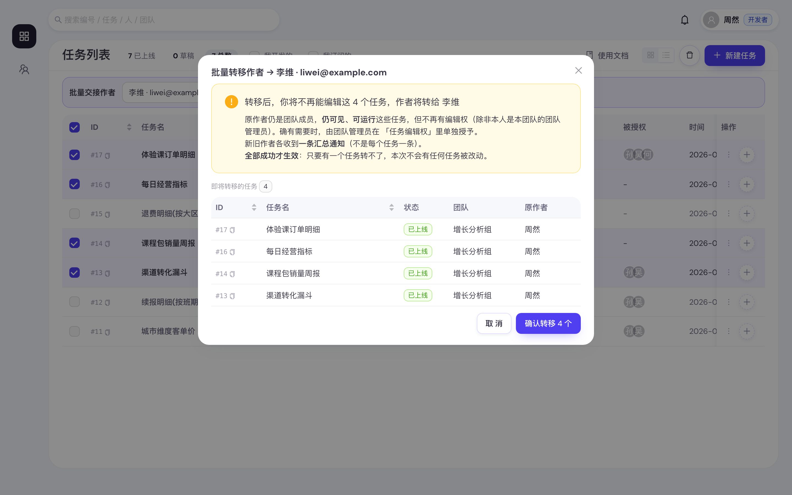

顺序反了的话，他就再也做不了第 1 步了 —— 降级已经把他清出团队，
而作者的编辑权本来就以「仍在团队内」为前提。这时只能由**团队管理员或平台管理员代办**，
所以并不会卡死，只是多绕一圈。

几条容易问到的：

- **接手人只能是本任务所属团队的在职成员。** 要交给别队的人，得先把任务转到那个团队
  （平台管理员操作），或者先把人加进这个团队。批量交接里这体现为：选定接手人后，
  不属于他团队的任务会直接置灰勾不上——不用先勾再被退回。
- **平台管理员不能作为接手人** —— 管理员不进团队（团队成员只收开发者）。
- **只被授予了「任务编辑权」的人不能转移作者。** 编辑权是「来帮着改这个 SQL」的委托，
  不是处分归属的权力。
- **转移后原作者不再能编辑**（除非他是团队管理员），但仍看得见、跑得动。
  确实还需要他改，让团队管理员在「任务编辑权」里单独授予一条。
- **草稿和回收站里的任务同样能转**，交接不该漏掉它们。
- 版本历史里「哪一版是谁保存的」**不会**被改写；业务方的授权、订阅关系、运行记录也都不受影响。

### 1.2 团队取数账号（数据权限）

**任务用「所属团队」的数据库账号取数。** 入口在「我的团队 → 团队取数账号」。

为什么这样设计：平台里的数据源自带一套公共账号，它能看到那个库的**全部**数据。如果所有任务都走它，
「谁能建任务」就等于「谁能看全部数据」。改成用团队的库账号后，取不到的数据由数据库直接拒绝——
**你的团队取不到的数据，别人也无法通过你的任务取到**。

怎么用(由**团队管理员**操作;每个数据源各配一套,因为 Hive 和 MySQL 的账号体系本来就不同):

1. 打开团队页的「团队取数账号」,列表里是全部数据源,逐个点「配置」,填本团队在该库上的用户名和密码
   (Hive 在 `NONE` 认证方式下可不填密码),点「保存」—— **到这一步账号就生效了**;
2. **「测试连接」是可选的自检**。想当场确认账号填对没,弹窗里点「保存并测试连接」一步到位,
   或在列表里单独点「测试连接」。不测也一样能上线、能取数;
   它验的是「这个账号能不能登进数仓」,并**列出这个账号能访问的库**(跑一句 `SHOW DATABASES`,
   不碰任何业务表)。它**压根不进入任何库**(Hive 侧跳过了驱动那句 `USE`),所以进不去
   数据源那个 Database 都不影响测通。提示分三种:能列出且进得去数据源默认库(成功)、
   能列出但进不去它(提示任务 SQL 要写全限定表名)、一个库都列不出(账号在数仓里没有任何
   数据权限,得找数仓授权)。
   **库 / 表权限的完整答案仍在试跑**,那才与上线后的取数同一套身份、同一条 SQL;
3. 状态列会显示 `未配置` / `已配置 · 未验过` / `已测通`,并显示「最后由谁、什么时候改的」。

必须知道的四条规则:

- **没登记账号 = 任务不能上线、也不能运行**(连都没得连)。上线时会直接被拦下;已上线的任务如果
  团队账号后来被回收了,业务同学点运行会收到一条指名**团队**的报错,同时该团队的**全体团队管理员**
  会收到站内 / 飞书通知(团队一个管理员都没有时,退化为通知全体平台管理员,免得这条消息掉进无人区)。
  受影响的任务卡片上还会挂一枚橙色 **缺取数账号** 告警 —— **只有对该任务有管理权的人看得见**,
  业务同学不会看到一堆自己修不了的红字。
- **「未验过」不拦任何事。** 从前测通是上线卡点,代价是团队管理员改完密码忘了点一下,
  该数据源上本团队的全部任务就集体停摆;而测通只代表**那一刻**连得上(库侧权限随时会变),
  拦不住真正的失败。现在账号真连不上就在取数时报错,那条报错同样指名团队与补救路径。
  改过用户名或密码后「已测通」标记仍会清空 —— 那条记录只对被换掉的那套凭证成立,
  留着会误导人,但**任务照跑**,前端也不再为此做二次确认。
- **密码加密存储,谁都看不到**,包括平台管理员。库**用户名**只对本团队的团队管理员与平台管理员可见,
  普通成员只看得到三态。
- 平台管理员可以在「取数账号」页看到全平台的覆盖矩阵,并在权限调整时**回收**某个团队的账号。

> ⚠️ **团队就是数据边界。** 团队账号是共享的:任何团队成员都能在任务编辑器里用它试跑任意 SQL。
> 因此**团队账号能读到的数据,全体团队成员都能读到** —— 把一个人加进团队,等于把该团队的全部
> 数据权限授予他。「密码不可见」防的是账号被带出平台,防不了(也不打算防)成员在平台内用它取数。
> 所以成员只能是开发者,且每一次成员变更都会进审计。

各处用谁的账号,一张表说清:

| 动作 | 用哪个库账号 |
|---|---|
| 业务同学填参运行任务 | **任务所属团队**的账号 |
| 业务同学点「更新枚举值」 | **任务所属团队**的账号(跑的是任务里的枚举 SQL) |
| 你在编辑器里「测试运行」/「测试枚举 SQL」 | **任务所属团队**的账号(与正式取数完全同一套) |
| 管理员在数据源页点「测试连接」 | 数据源的公共账号(与团队无关) |

最后一行之外的三行都是同一套身份,这带来一个实际好处:**试跑通过就代表上线后能跑**。
(个人账号时代不是这样——那时试跑用你自己的账号、正式取数用作者的账号,两者库权限可能不同,
于是「我这儿明明跑通了」而业务同学却失败。)

---

## 2. 五分钟建成第一个任务

1. **点右上「新建任务」**，填任务名称、选**所属团队**、选数据源（数据源决定 SQL 方言与默认超时）。
   选完团队与数据源，下方会当场告诉你这个组合的团队账号就绪没——不必等到点上线才发现。
   （按钮是灰的?说明你还不属于任何团队,见 [1.1](#11-团队)。）
2. **把 SQL 贴进来**，要让业务填的地方写成 `:变量`。带底色的行就是「参数影响行」，行内高亮的即占位符。
3. 停手约 0.4 秒，**变量卡自动出现**。逐个展开，填「变量说明」和「测试值」（见[第 4 章](#4-变量怎么设计)）。
4. 点 **SQL预览** 看参数代入后的语句对不对——只渲染，不连数据库。
5. 点 **测试运行** 用测试值真跑一次（最多取 50 行），确认列名与数据符合预期。
6. 点 **创建** → 任务落为**草稿**（提示「已创建（草稿）」）。
7. 卡片 **⋮ → 上线**。上线后业务侧才可能运行。
8. 卡片右下虚线 **+ → 授权**给具体的人，勾选「查看 / 运行 / 下载」。**不授权，业务同学看不到这个任务。**

> 最后自己以业务视角开一次取数抽屉（点卡片本体）验收一遍，见[第 10 章](#10-上线前自检清单)。

---

## 3. 任务编辑器详解

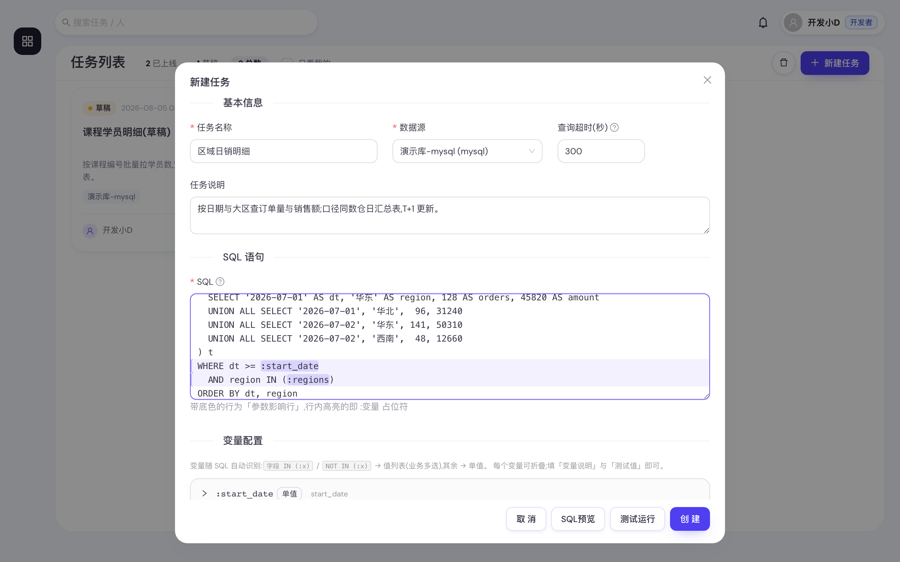

### 3.1 基本信息

> **任务编号**不在这张表里 —— 它由平台在创建时分配（`#128`），**不可改、改名也不变**，
> 编辑器标题、任务卡片、列表第一列都显示它，点一下复制纯数字。审计日志里的 `任务 #12` 就是它。
> **别和「运行编号」混**：那是每跑一次给一个的流水号，出现在结果文件名 `<任务名>_<运行编号>.csv`
> 与运行记录里。排障时说清楚是哪一个 —— 两者会同屏出现。

| 字段 | 必填 | 说明 |
|---|:--:|---|
| 任务名称 | 是 | 业务方在卡片上看到的名字；也是结果文件名的前缀（`<任务名>_<运行编号>.csv`） |
| 所属团队 | 是 | 决定**谁看得见这个任务**，以及**取数用哪套数据库账号**。下拉里是你所属的团队。任务建好后你改不了它——需要转移请找平台管理员 |
| 作者 | — | 建任务时就是你，不在表单里。转岗或离职时，在任务列表的 ⋮ 菜单里「转移作者」交给**同团队**的在职成员，一次要转一批就用右上角的「批量交接」；转移后你不再能编辑它（除非你是团队管理员），详见 [1.1](#11-团队) |
| 数据源 | 是 | 下拉里是管理员配好的，格式「名称 （引擎）」。**它决定 SQL 方言和默认超时**，改数据源等于换方言。选完会提示「所属团队在这个源上的账号」就绪没 |
| 查询超时（秒） | 否 | 留空按引擎默认：MySQL 120 秒、Hive 3600 秒。作用于业务的正式取数；**试跑用同一超时、但另有 180 秒上限**（见 [3.4](#34-底部四个按钮)），枚举查询不受它影响 |
| 任务说明 | 否 | 显示在业务取数抽屉顶部的灰底框里，也在任务卡片标题下浅色显示两行。写清口径、时间范围限制、更新频率 |

### 3.2 SQL 框

- 用 `:变量名` 作占位符（字母或下划线开头）。
- **含变量的行常驻浅色底纹**（「参数影响行」），变量本身是药丸底色——扫一眼就知道哪几行会被业务填的值改写。
- 只允许**单条 SELECT / WITH**，详见[第 5 章](#5-sql-规范与安全网关)。

### 3.3 变量配置

- 停止输入 SQL **约 0.4 秒后自动重扫**：新变量补上、消失的移除、已配好的保留。
- 变量卡**默认全部收起**，卡头显示 `:变量名` + `值列表`/`单值` 标签 + 变量说明。收起状态下配置**不会丢**，放心折叠。
- 变量形态**不用手选**，由 SQL 写法决定（见下一章）。

### 3.4 底部四个按钮

| 按钮 | 到底做了什么 |
|---|---|
| **取消** | 关闭不保存 |
| **SQL预览** | 把当前测试值代入，弹窗展示即将执行的语句。**不连数据库**；没填测试值的变量原样保留 `:变量` |
| **测试运行** | 用各变量的**测试值**真跑一次，最多取 50 行，弹出「试跑结果」浮窗（返回行数 · 列数，可查看执行 SQL）。所有变量都要有测试值才跑。 **超时与正式取数同一口径、但最多 180 秒**（任务配的「查询超时」与引擎默认都会生效，再夹一道 180 秒的前台上限）——长耗时 Hive 任务试跑仍可能撞上 180 秒，属正常，可先用小时间范围的测试值验证写法；真被上限夹到时，报错里会写明这是试跑的上限、同一条 SQL 正式跑未必超时 |
| **创建 / 保存** | 落库。新建 → 提示「已创建（草稿）」 |

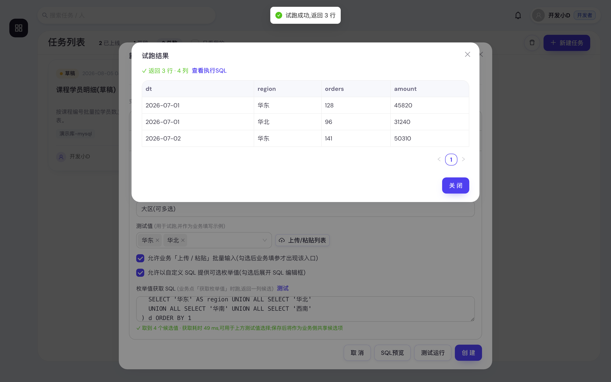

**保存提示三态**，如实反映发生了什么：

| 原状态 | 保存后提示 | 含义 |
|---|---|---|
| 新建 | 已创建（草稿） | 还需手动上线 |
| 已上线 | 已保存，线上版本已更新 | **新版本自动接替上线**，业务立刻用上，不必再点一次上线 |
| 草稿 / 已下线 | 已保存 | 状态不变 |

> 编辑**已保存**的任务时点「测试运行」，会在该任务的运行记录里留下一条标记为**试跑**的记录（带结果文件，可预览/导出），**不发通知**。新建未保存的任务试跑则不留痕。

---

## 4. 变量怎么设计

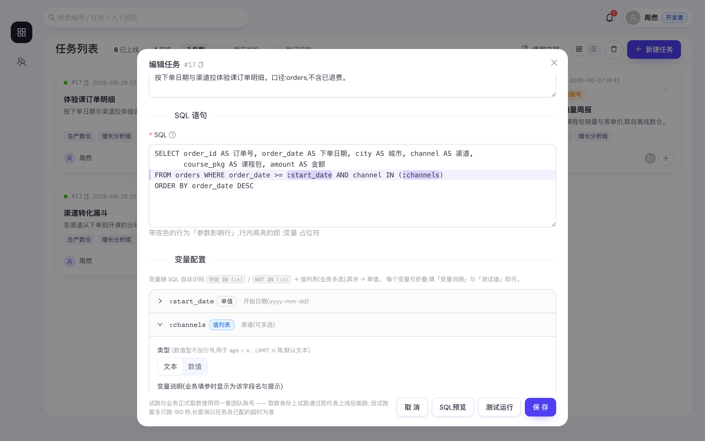

### 4.1 形态由 SQL 写法决定

| SQL 里怎么写 | 形态 | 业务侧看到 |
|---|---|---|
| `字段 IN (:x)` 或 `字段 NOT IN (:x)` | **值列表** | 可多选的标签框（可粘贴、可选候选） |
| 其他任何位置，如 `dt = :dt`、`spend >= :n`、`LIMIT :n` | **单值** | 一个输入框 |

括号由你自己写好；运行时平台把 `:x` 展开成 `:x__0, :x__1, …`，于是天然得到 `IN (…)` / `NOT IN (…)`，
方向完全由你写的 IN / NOT IN 决定。**落库时后端会按同一规则再判一次**，前端显示什么不影响最终口径——
想让业务多选，唯一办法是把条件写成 `IN (:x)`。

### 4.2 每个变量可配的项

| 配置项 | 适用 | 说明 |
|---|---|---|
| 类型 **文本 / 数值** | 全部 | 数值型绑定为数字、**不加引号**，用于 `spend >= :n`、`LIMIT :n`；业务填了非数字会报「参数「X」需为数值」。默认文本 |
| 变量说明 | 全部 | 业务填参时该字段的**名字兼提示**。把格式写进去，例如「开始日期（格式 yyyy-mm-dd）」 |
| 测试值 | 全部 | 试跑用它；**同时作为业务侧灰字「示例：…」**。所以测试值要写成业务照抄不会错的样子 |
| 允许业务「上传 / 粘贴」批量输入 | 仅值列表 | 勾选后业务填参才出现「上传/粘贴列表」入口（支持 .csv/.txt，换行/逗号/分号/空格/制表符分隔，自动去重） |
| 允许以自定义 SQL 提供可选枚举值 | 仅值列表 | 勾选后展开「枚举值获取 SQL」编辑框 |

所有参数**一律必填、没有默认值**——业务不填就报「缺少必填参数」。

### 4.3 枚举值获取 SQL 与「共享候选值」

一段**独立的查询**，返回**一列**候选值（取结果第一列去重），让业务在标签框里直接勾选。

- 它由后端以**空参数绑定**执行，**不接受 `:变量`**；写成 `SELECT DISTINCT region FROM dim_region ORDER BY 1` 这种就行。
- 旁边的 **测试** 按钮当场验证，成功显示取到多少个、耗时多少毫秒。
- **这批值在你点「保存」后会直接成为业务侧的共享候选**：业务打开抽屉即可勾选，不必现跑查询（所以抽屉是秒开的）。

候选值的生命周期——记住这四条就够：

| 什么时候 | 发生什么 |
|---|---|
| 你点「测试」后**保存** | 这批候选随任务落库，成为该任务该变量的**共享候选**（全员可见） |
| 你测完**又改了这段 SQL** 才保存 | 那批值被丢弃（值必须与 SQL 对得上）。**想让业务一上手就有候选，改完记得再点一次「测试」再保存** |
| 你改了枚举 SQL 或**换了数据源** | 旧候选立即作废，业务侧显示「作者已更新配置，请点『获取枚举值』」——平台刻意不拿旧值糊弄人 |
| 变量被删 / 改名 / 不再是配了枚举 SQL 的值列表 | 对应候选行被清理 |

其它口径：一次最多 **1000** 个候选（超出截断，业务仍可手输未列出的值）；**超时 120 秒**，与任务的
「查询超时」无关——所以这段 SQL 请指向小维表，别拿事实表 `DISTINCT`；任何能运行该任务的人都可以点
「更新枚举值」真跑一次，**结果对该任务所有人生效**，30 秒内重复点直接复用最新结果。

---

## 5. SQL 规范与安全网关

保存、试跑、业务取数**每一次执行前**都过一遍安全网关：按数据源引擎的方言解析，只放行只读的单条查询。

| 判定 | 结果 |
|---|---|
| 单条 `SELECT` / `WITH`（可含子查询、UNION） | 放行 |
| 多条语句（多余的分号） | 拒绝：「只允许执行单条查询语句」/「不允许多语句执行」 |
| `INSERT / UPDATE / DELETE / MERGE` | 拒绝：「只允许 SELECT 查询，检测到：…」 |
| `CREATE / DROP / ALTER / TRUNCATE / GRANT / SET / USE / LOAD` 等 | 拒绝：「语句包含非只读操作」或「检测到危险关键字：…」 |
| `WITH` 的主体不是 SELECT | 拒绝：「CTE 主体必须是 SELECT 查询」 |

写法约定与坑：

- **要临时表就用 CTE**（`WITH t AS (…) SELECT …`），平台不允许建表。
- **方言跟着数据源走**，不用手填；换数据源后原来的函数写法可能不再适用，记得重新试跑。
- ⚠️ **冒号字面量会被误认成变量**：`DATE_FORMAT(t, '%H:%i:%s')` 里的 `:i`、`:s` 会被扫成变量并生成变量卡
  （前后端一致的已知口径）。改用不带冒号的写法（如 `%T`）或换函数规避。
- **结果行数没有平台上限**（原来的 10 万行静默截断已放开）：有多少行给多少行，取数进程是边取边写盘的，
  行数多不会把它撑爆。但**大结果的代价还在别处**：CSV 体积、下载时长、业务方能不能打开
  （Excel 单表 1,048,576 行）。所以「一次该取多大」仍然是你的设计：需要时自己在 SQL 里加
  `LIMIT`（想让业务控制就写 `LIMIT :n` 并把变量设为数值型），或在任务说明里写清建议的时间范围。
- **列名就是 CSV 表头**，给业务看的字段请起中文可读的别名。

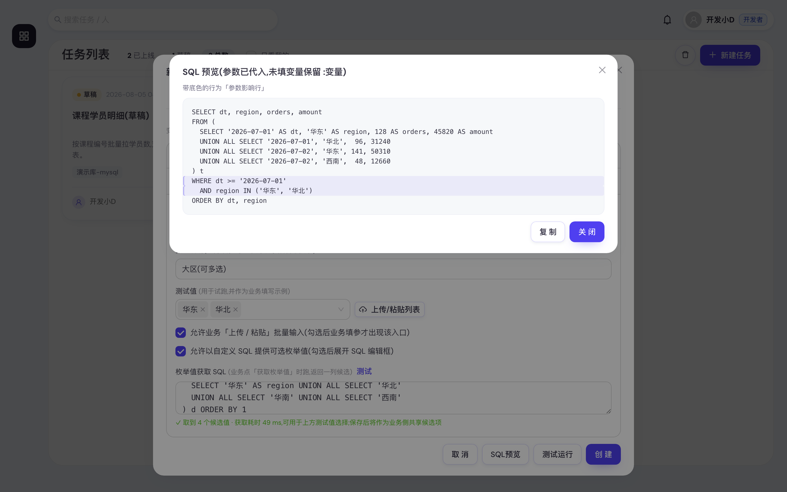

---

## 6. 状态、版本与回收站

| 状态 | 业务能运行吗 | 你能编辑吗 | 怎么切换 |
|---|:--:|:--:|---|
| **草稿** | ✖ | ✅ | ⋮ → **上线**；写废了 ⋮ → **移入回收站** |
| **已上线** | 被授权的人可以 | ✅ | ⋮ → **下线**（进回收站） |
| **已下线** | ✖ | ✅ | 回收站里 ⋮ → **恢复为草稿** 或 **重新上线** |

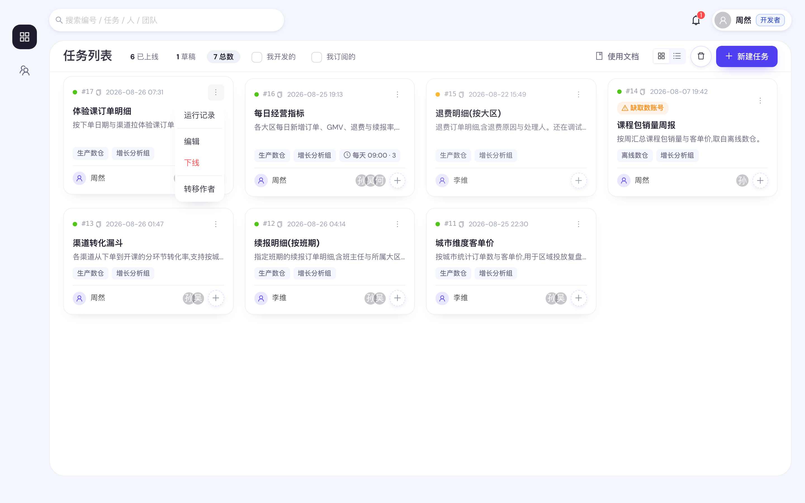

- 每次保存都**生成一个新版本**（版本号累加）。已上线的任务保存后新版本自动接替上线；草稿与已下线的任务保持原状态。
- 业务运行的永远是**当前已上线的那个版本**，不是你手上最新编辑的草稿内容——除非任务本来就是已上线状态（那两者一致）。
- **任务不能删除**，只能收进回收站。任务列表右上圆形回收站按钮切换视图，再点一次返回。
- **草稿也能进回收站**。写废的草稿不必一直占着列表——⋮ → 移入回收站，它就从任务列表消失、只在回收站里能看到。
- **回收站有两个出口，出来时你说了算**：「恢复为草稿」把它捡回你的工作台（业务仍然跑不了，也不检查取数账号），
  「重新上线」直接放给业务。任务进了回收站之后看不出它原本是草稿还是已上线，所以平台不替你猜——
  猜错的代价是把一个半成品直接放到业务面前。
- 上线会记录上线人与备注；「下线」「从回收站恢复（重新上线）」「从回收站退回草稿」在审计里是三个不同的动作码。

#### 6.1 闲置：长期没人跑的已上线任务

**已上线**但连续 **90 天**（由部署方在 `config.ini` 的 `TASK_IDLE_DAYS` 里配置）没有任何运行记录的任务，
会在任务列表里被标成**闲置**：

- 卡片上原本显示日期的那一格改写成「**闲置 167 天**」（悬停可看最后一次运行的确切时间与说明），
  卡片本身去掉阴影、标题墨色降一档 —— 视觉上往后站，但**照样点得开取数**，能力一点没变；
- **被排到列表最末尾**（两种视图都是）。列表视图点了列头排序后，按你选的列排，不再沉底；
- 任务列表标题栏多一枚「**N 闲置**」筛选片，点一下只看这些任务，集中处理完再点「总数」退出。

几条口径：

| 问题 | 答案 |
|---|---|
| 「运行」算哪些？ | 与卡片上「最后运行」同一个时间，**含你在编辑器里的试跑、也含订阅的定时运行**。所以有定时计划在跑的任务永远不会闲置 —— 它确实还在产出 |
| 从没运行过的呢？ | 从**创建时间**起算。「上线至今没人跑过」比「跑过但很久没跑」更该被看见 |
| 草稿和已下线的呢？ | **不参与判定**。草稿还没给人用，已下线的已经在回收站里了 |
| 谁看得见？ | **只有对该任务有管理权的人**（平台管理员 / 团队管理员 / 作者本人 / 被授予编辑权的人）。业务使用者那里完全看不到，卡片和顺序都不变 —— 一个一年跑一次的任务被标成「闲置 300 天」，只会让他不敢用 |
| 会自动下线吗？ | **不会**。它只是一条线索，下不下线是你的决定 —— 季度 / 年度才跑一次的任务一旦被自动下线，恰恰最没人记得重新上线 |

看到闲置标记之后：确认确实没人再用，就 ⋮ → **下线**（进回收站，随时可恢复）；
如果它本来就是低频任务，放着不管即可，标记不影响任何人使用。

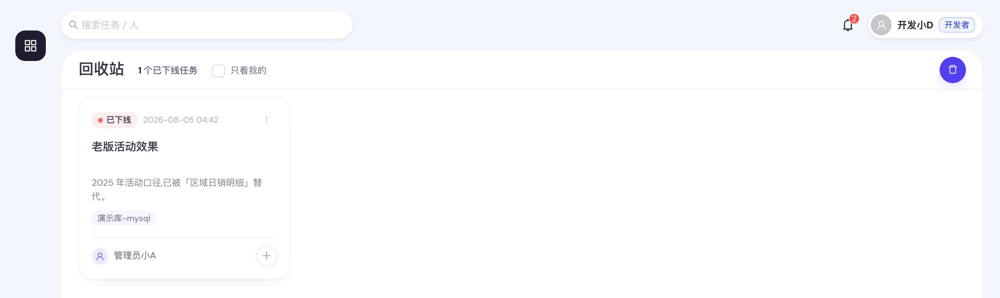

---

## 7. 给业务同学授权

平台上有**两层**授权，别混：

| | 谁对谁 | 在哪儿操作 | 给的是什么 |
|---|---|---|---|
| **团队** | 同事之间 | 团队页(成员 / 任务编辑权) | 本团队任务的**可见**与**可运行**;编辑权按任务单独授予 |
| **任务授权** | 你 → 业务同学 | 任务卡片右下的虚线 **+** | 某个任务的 查看 / 运行 / 下载 |

**同团队可见 ≠ 业务可见**:团队成员天然看得到本团队任务,业务同学则必须逐人授权。本章讲第二层。

**上线 ≠ 业务能看到。** 还要在卡片右下角点虚线 **+**（悬停「授权用户」）逐人授权。

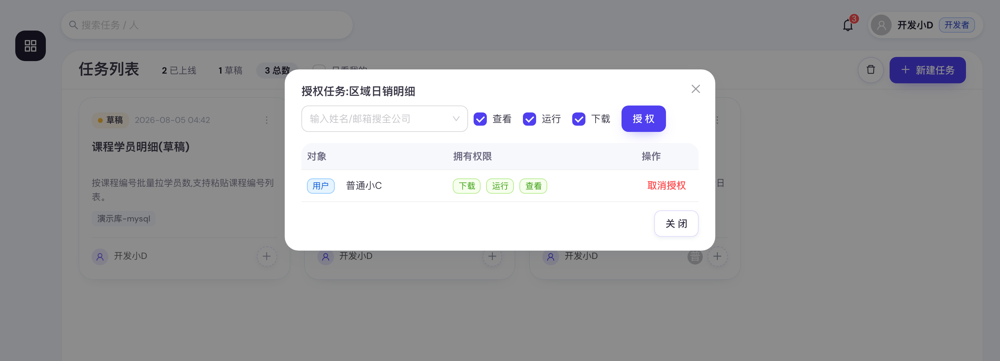

1. 下拉框里**输入姓名或邮箱搜全公司**（走飞书通讯录，按**你自己**的可见范围；搜不到会提示「没搜到?可能不在可见范围」）。
2. 勾权限（默认三个全勾），点 **授权**：

   | 权限 | 含义 |
   |---|---|
   | 查看 | 能在任务列表里看到这个任务（**仅已上线的**：草稿不会因为一条查看授权就暴露出去） |
   | 运行 | 能填参数运行取数 |
   | 下载 | 能下载 / 导出结果文件 |

   只给「查看」不给「运行」时，业务点卡片会提示「未授权，暂不可取数」——要么补授权，要么别只给查看。
   > 这个弹窗里**没有「编辑」** —— 任务编辑权是团队内的事,由团队管理员在团队页的
   > 「任务编辑权」里授予,见 [1.1](#11-团队)。
3. **取消授权** 一次收回该人在这个任务上的全部权限。

被授权「运行」的人会出现在卡片右下的头像组里。**你、同团队成员、平台管理员对任务天然可见**，
不出现在这份名单里，也不算进头像组。

只能对**你有编辑权的任务**授权(自己建的 / 你是团队管理员的团队里的 / 被授予了编辑权的)。

> 授权完他到底看到什么、点什么，见[第 8 章](#8-业务同学看到的界面)。

---

## 8. 业务同学看到的界面

你上线并授权之后，业务同学看到的就是下面这些。**答疑和验收都要用到这一章**——他们说"看不到""点不开""候选值不对"时，先在这里对一下他们该看到什么。（更细的业务操作说明见[用户使用说明手册](./user-manual.md)。）

### 8.1 登录与任务列表

登录页只有一个 **飞书登录** 按钮，登录态 12 小时，过期自动跳回登录页。

**他说「登不进去」时先问一句：他有这个飞书应用的权限吗？** 没有权限的人会被飞书挡在授权页，平台这边只看得到「他没登录」，帮不上任何忙。任务列表页右上角、「使用文档」旁边的 **申请链接** 按钮就是干这个的：点一下复制成一整句「我在飞书分享了一个应用给你，点击链接查看 …」，粘进聊天框发给他即可。（这枚按钮只有开发者 / 管理员看得到；登录页上另有一行自助申请入口，他自己也能点。两处都由 `FEISHU_APP_APPLY_URL` 控制，管理员没配就都不出现。）

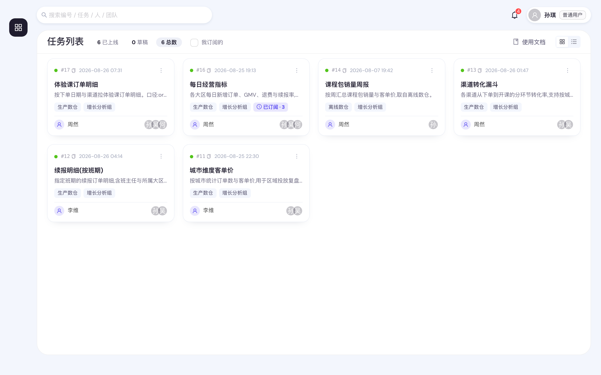

和你的视角比，普通用户少了很多东西：

| 你（开发者）有 | 普通用户 |
|---|---|
| 全部任务（含草稿、别人的、已下线） | **只有被授权给他、且已上线**的任务（所以草稿数通常是 0） |
| 右上「新建任务」+ 回收站按钮、「我开发的」 | 都没有（「我订阅的」他有） |
| ⋮ 里有 编辑 / 上线 / 下线 | ⋮ 里**只有「运行记录」** |
| 卡片右下虚线 **+**（授权） | 没有 |

卡片能不能点，鼠标悬停的提示会说明原因：**「点击填参取数」**／**「任务未上线，暂不可取数」**（你还没上线或已下线）／**「未授权，暂不可取数」**（只给了查看、没给运行）。

### 8.2 填参

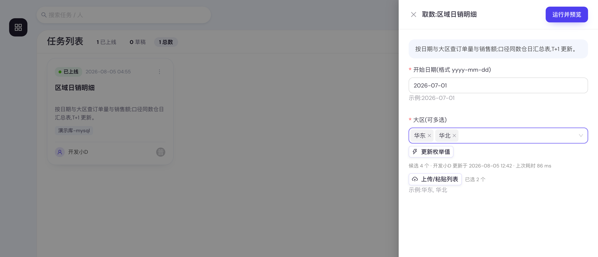

这一屏几乎全部由你在编辑器里的配置决定：

| 业务侧看到的 | 来自你配的 |
|---|---|
| 顶部灰底框里的说明 | 任务说明（`description`） |
| 每个字段的名字与提示 | 变量说明（`label`） |
| 控件下方灰字「示例：…」 | 该变量的测试值 |
| 标签框里可勾的候选值 | 枚举值获取 SQL 产出的**共享候选**（打开即有，不现跑查询） |
| 候选旁灰字「候选 N 个 · 谁 更新于 某时 · 上次耗时 N ms」 | 最近一次更新这批候选的人与耗时 |
| **上传/粘贴列表** 按钮 | 你勾了「允许业务上传 / 粘贴批量输入」才有 |

**所有参数必填**，没有默认值。值列表右侧还会显示「已选 N 个」，超过 5000 个会提示可能过慢。

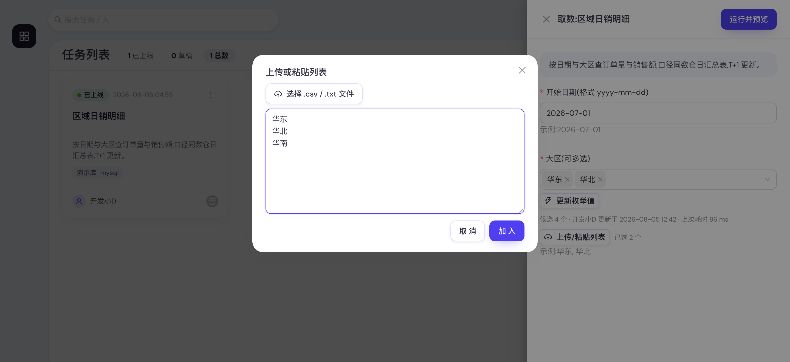

业务点 **更新枚举值** 会真跑一次你写的枚举 SQL，**结果对该任务所有人生效**；显示「作者已更新配置，请点『获取枚举值』」时，说明你改过那段 SQL 或换了数据源。

### 8.3 运行、预览、下载

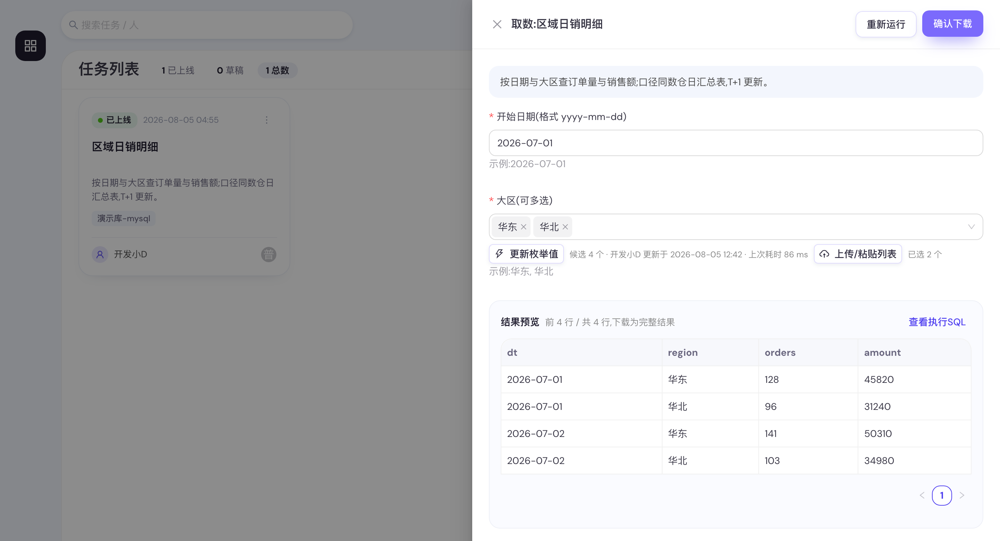

1. 点右上 **运行并预览**，表单上方出现进度提示：**排队中**（前面还有几个取数在等、已等多久）或 **正在取数**（已等多久）。
2. 跑完抽屉变宽，出现「结果预览」：**只给前 50 行**，标题旁写着「前 N 行 / 共 M 行，下载为完整结果」。
3. **查看执行SQL** 能看到参数已代入的最终语句——业务截这张图给你，排错最快。
4. **确认下载** 才真正下载完整 CSV（UTF-8 BOM，Excel 直接打开不乱码），文件名是 `<任务名>_<运行编号>.csv`；**重新运行** 则回到表单换参数。

页面最多等 20 分钟，超时会提示「查询仍在执行，完成后会在「运行记录」和通知里」——此时结果不会丢，跑完照样能领。

### 8.4 运行记录与通知

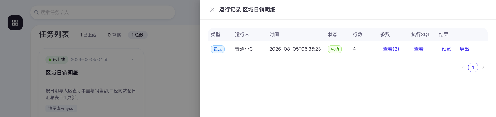

**普通用户在同一个抽屉里只看到自己跑过的记录**（你看到的是所有人的、还多了试跑那几条）。结果超过 7 天显示「已过期」，只能重新跑。

他还有第二个入口：**取数抽屉下方的「运行记录」折叠区块**——填参时就能直接预览／导出以前跑好的结果，不必先关掉抽屉再从 ⋮ 进。所以「这个数上周谁跑过」这类问题，业务同学自己就能看到答案（口径与列见 [9.1](#91-运行记录怎么读)）。

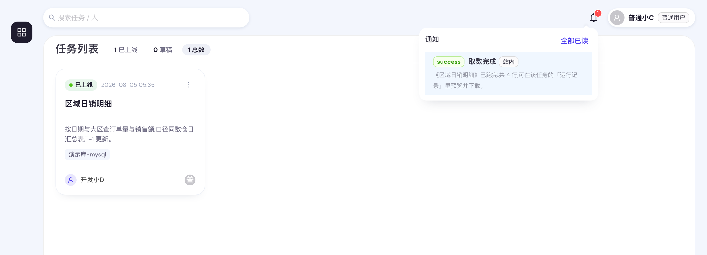

取数跑完（成功或失败）会推**飞书机器人消息 + 站内通知**；条目上带「站内」标签表示这条只发了站内（没配飞书凭证或推送失败）。点通知会**直接跳到对应任务的运行记录**，可以马上预览下载。未读数每 8 秒刷新。

### 8.5 业务同学最常问的三句话

| 他说 | 通常是什么 | 你做什么 |
|---|---|---|
| 「我列表里没有这个任务」 | 没授权，或任务被你下线了 | 给他 查看 + 运行 + 下载；确认任务是「已上线」 |
| 「卡片点不开」 | 只有查看权限，或任务未上线 | 补「运行」权限；或把任务上线 |
| 「候选值里没有我要的值 / 是旧的」 | 共享候选过期，或枚举 SQL 覆盖不全 | 让他点一次 **更新枚举值**；仍不对就改你的枚举 SQL，改完点「测试」再保存 |

> 让他**报任务编号**（卡片上 `#128`，点一下就复制走纯数字），别报任务名 —— 任务是可以重名的，
> 而编号粘进任务列表的搜索框就直接定位到那一个。搜索框里 `128` 会连名字带 128 的任务一起列出来
> （编号命中的排最前），写成 `#128` 则只剩那一条。

---

## 9. 验收与排障

### 9.1 运行记录怎么读

两个入口看的是同一份记录：**卡片 ⋮ → 运行记录**（独立抽屉，列最全，点通知也跳这里），
以及**取数抽屉里的「运行记录」折叠区块**（业务同学填参时就能直接拿以前跑好的结果；那儿窄，
省掉了「运行人」「执行SQL」两列，排障还是走 ⋮ 这个入口）。

可见口径按**团队**算：你看到这个任务下**所有人**的运行，别的团队的开发者一条也看不到，
被授权的业务用户只看自己的。列表只给**最近 200 次**（界面不会提示更早的被截掉了）。

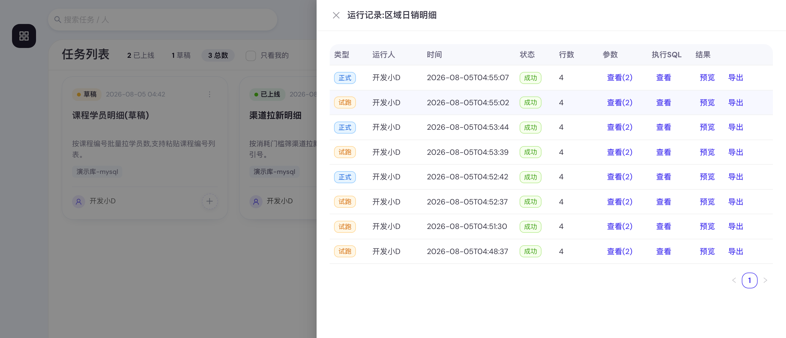

| 列 | 说明 |
|---|---|
| 类型 | **正式** = 业务填参取数（会发通知）；**试跑** = 你在编辑器点「测试运行」（不发通知） |
| 状态 | 排队 → 运行中 → 成功 / 失败 |
| 行数 | 成功时的结果行数。平台不再截断，所以**比预期少就是 SQL 或参数的问题**，不必再怀疑上限 |
| 耗时 | **查询执行到结果落盘**这一段，**不含排队等待**——业务说「等了半小时」而这里写着 12 秒，两个都是真的，差额在队列里（并发度看 `WORKER_CONCURRENCY`）。只有成功的行才有值 |
| 参数 | **查看(N)** 看业务这次填的每个值，复现问题最快的入口 |
| 执行SQL | **查看** 看参数已代入的最终语句，可直接复制到客户端里跑。超长语句（如粘贴了几千个值）落库时按 60KB 截断，末尾会带「已截断」注记 |
| 结果 | 成功且未过期：**预览**（前 50 行）/ **导出**；超过 7 天显示 **已过期**；失败显示 `-` |

业务反馈「取数报错」时的顺序：运行记录 → 找到那条失败记录 → 看**参数**和**执行SQL** → 复制 SQL 自己跑一遍。

### 9.2 常见报错速查

| 报错（原文） | 原因 | 怎么处理 |
|---|---|---|
| 只允许 SELECT 查询 / 只允许执行单条查询语句 / 检测到危险关键字 | 安全网关拒绝 | 删掉多余分号与写操作，复杂逻辑改用 `WITH` |
| 缺少必填参数：XX | 该变量没填 | 所有参数必填、无默认值；值列表要确认标签真的加进框里了 |
| 参数「XX」需为数值，收到：… | 变量配成了数值型但填了非数字 | 去掉引号 / 空格 / 中文单位，或把变量类型改回文本 |
| 该变量未配置枚举值获取 SQL，请直接输入或上传列表 | 任务的**已上线版本**里没有这段配置 | 你可能改了配置但任务是草稿 / 已下线；补上线或让业务先手输 |
| 无权编辑该任务：需为任务作者、该团队的团队管理员，或已获得该任务的编辑授权 | 这是同团队他人的任务 | 请该团队的团队管理员在团队页「任务编辑权」里给你授予(见 [1.1](#11-团队)) |
| 无权查看该任务 | 任务属于别的团队 | 跨团队互不可见。确实需要就请平台管理员把你加进那个团队,或把任务转移过来 |
| 需要开发者或管理员权限 | 平台角色不足 | 确认自己的角色标签是「开发者」；若显示「普通用户」找管理员改角色 |
| 你还不属于任何团队,请联系平台管理员把你加入一个团队后再建任务 | 没有团队 | 找平台管理员把你加入团队 —— 任务必须归属团队 |
| 你不是团队《XX》的成员,无法使用该团队的取数账号 | 试跑时选了不属于你的团队 | 在编辑器里把「所属团队」换成你自己的团队 |
| 任务编辑权不含「转移作者」;请让作者本人或团队《XX》的团队管理员操作 | 你对这个任务的编辑权是被授予的，而处分归属不在其中 | 找作者本人或该团队的团队管理员来做这一步 |
| XX 不是团队《YY》的成员,不能成为该任务的作者 | 接手人不在这个任务所属的团队里 | 先请团队管理员把他加进团队；或让平台管理员先把任务转到他所在的团队 |
| 该任务还没有所属团队,请先联系平台管理员为它指定团队 | 历史遗留的「无主任务」 | 找平台管理员先指定团队——没有团队就没有合法的接手人 |
| 团队《XX》尚未配置数据源《YY》的取数账号 | 该团队还没登记这个源的账号 | 你是该团队的团队管理员就去「我的团队 → 团队取数账号」登记一套（见 [1.2](#12-团队取数账号数据权限)，**不必先测通**）；否则把这条报错转给团队管理员 |
| 任务上线被拦下：…取数账号… | 上线卡点 | 同上；注意**编辑已上线任务也算一次上线**，所以保存时同样会检查 |
| 连接失败：Access denied for user '…' (using password: …) | 填的团队库账号或密码不对（点「测试连接」时，或运行任务时） | 在数据库客户端里用同一套账号验证，再回来重填 |
| 一段找不到表的报错（Table not found），而你确信表就在那 | 账号进不去数据源配的 Database，裸表名解析不到。建连本身不受影响（会话不进入任何库），只有不写库名的 SQL 会挂 | 任务 SQL 里把表名写全（`库名.表名`）。点一次「测试连接」看列出的库，就知道这个账号能取哪些库 |
| 一段找不到表的报错（Table not found / doesn't exist），而你确信表就在那 | 同上的延伸：账号进不去数据源配的默认库，裸表名解析不到 | 同上：写全限定表名，或补授权。点一次「测试连接」能确认是不是这个原因 |
| 报错里出现 `***` | 面向使用者的报错会把库账号名脱敏 | 这是有意的（库账号名不该给到业务方）；要看原文请让管理员在审计日志里查那条运行记录 |
| 试跑失败：… / 一段数据库原文英文报错 | 数据库原样返回 | 是 SQL 或数据源的问题；复制执行 SQL 到客户端里定位 |
| 结果已超过保留期（7 天）并被自动清理 | 结果文件到期被清 | 重新运行；参数可在运行记录的「查看(N)」里照抄 |
| 取数进程在本次运行期间被中断（服务重启或异常退出），这次运行没有产出结果，请重新运行 | 卡在「运行中」的记录被自动收回为失败并通知发起人。**常规版本更新不再造成这种中断**——`deploy.sh update` 会先等在跑的取数跑完；剩下的来源是进程崩溃、机器重启，或运维显式用了 `--force` | 重新运行即可；参数照抄「查看(N)」 |
| 查询仍在执行，完成后会在「运行记录」和通知里 | 前台等待超过 20 分钟 | 正常；业务可关掉抽屉，跑完有通知，结果在运行记录里领 |

### 9.3 资源治理：别把库跑挂

- **超时**：MySQL 默认 120 秒、Hive 默认 3600 秒；任务上可单独设「查询超时（秒）」覆盖（正式取数与试跑都按它算，试跑另有 180 秒的前台上限）。
- **枚举 SQL 固定 120 秒**，请指向小维表。
- **值列表规模**：业务选超过 5000 个值会收到「过多可能导致查询过慢或失败」的提示；真要批量匹配大列表，考虑改成 join 维表的写法。
- **行数不再有上限**：内存不再随行数增长（服务端游标 → CSV 直接落盘），但**磁盘和下载体验会**。
  结果文件在服务器上留 7 天，所以「几百万行的任务被订阅成每天自动跑」这种组合要自己掂量；
  任务说明里写清「一次建议取多久的数据」仍然是最省事的办法。

---

## 10. 上线前自检清单

- [ ] 任务名称一眼能看出查什么；任务说明写清了**口径、时间范围限制、更新频率**
- [ ] **所属团队选对了**——它决定谁看得见这个任务(选错就是给错团队开了可见性)
- [ ] 数据源选对（方言、库都对），超时按引擎与查询实际耗时设过
- [ ] **所属团队在该数据源上已登记取数账号**（编辑器里数据源下方会提示；没登记则上线会被拦下。测通与否不影响上线，但建议顺手点一次「测试连接」）
- [ ] **测试运行**跑通过——试跑与正式取数是同一套团队账号,所以试跑通过就代表上线后能跑
- [ ] 每个变量都填了**变量说明**（含格式）和**测试值**（业务能照抄）
- [ ] 需要多选的变量确实写成了 `IN (:x)` / `NOT IN (:x)`
- [ ] 数值比较 / `LIMIT` 的变量类型设成了**数值**
- [ ] 值列表变量：该开的「上传 / 粘贴」开了；配了枚举 SQL 的**改完最后点过一次「测试」再保存**
- [ ] **SQL预览**看过代入后的语句，没有残留的 `:变量`，也没有被误认的冒号字面量
- [ ] **测试运行**跑通，行数与列名符合预期（试跑只取 50 行，正式取数的量级要自己估一下：
      几百万行没人拦你，但业务方得打得开）
- [ ] 卡片 ⋮ → **上线**，左上角状态色点由黄（草稿）变绿（已上线）
- [ ] **点卡片本体以业务视角走一遍**：说明看得懂、字段名清楚、候选值秒开且是最新的、示例格式正确

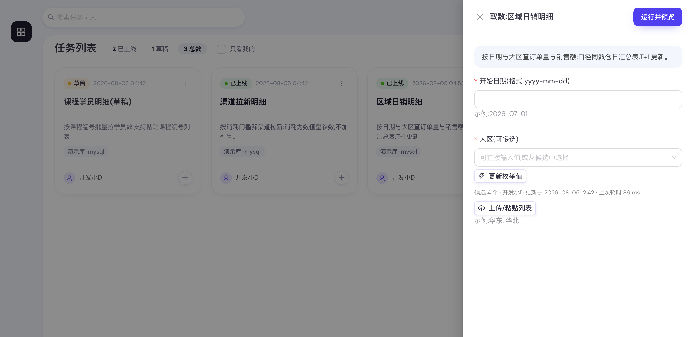

- [ ] 卡片右下 **+** 给需要的人授权（查看 / 运行 / 下载），头像组里出现他们

---

## 11. 开放 API（/api/v1）

除了网页界面，平台还提供一组开放 API，让业务同学把自己的脚本或 AI Agent 接到取数能力上：
列出我可见的任务 → 填参触发运行 → 轮询状态 → 预览 / 下载 CSV。
**完整接口契约（逐字段表、错误码、限流）见 [开放 API 文档](./open-api.md)**；
给用户的 Agent 用的现成 skill 文件挂在站点根路径 `/rubick-skill.md`
（源文件 `frontend/public/rubick-skill.md`），下载后下发给 Agent 即可，不必让他们自己摸接口。
任务列表页右上的「**Agent Skill**」按钮把这件事包成一句话（见下一节的第二个签发入口）。

### 11.1 鉴权：API Token

- 用户在界面生成自己的 token（形如 `rk_...`），**每人一个**，可重置 / 吊销；重置后旧 token 立即失效。
  两个入口通到**同一个端点**（`POST /api/auth/api-token`，语义即「给我一个新的，旧的作废」）：
  头像菜单的「**API Token**」管凭证本身（看签发 / 最近使用、重置、吊销），
  任务列表页的「**Agent Skill**」在拼安装指令时顺手签一枚附进去。
- 调用方在请求头带 `Authorization: Bearer rk_...`。**仅 `/api/v1/*` 接受 token** ——
  网页的会话接口不认它，token 也进不了网页登录态。
- 后端由 **`get_api_user` 依赖**把 token 解析成用户：从请求头取 token，SHA-256 后查库，
  失败返回 401。之后的任务过滤与权限检查**复用网页同一套 service**，所以 API 的可见范围、
  运行 / 下载权限与界面完全一致，没有任何放大。
- **token 不落明文**：库里只存 SHA-256 哈希（哈希列 + 持有人 + 吊销标记），明文只在生成时
  展示一次，接口永不回传。泄漏了让本人去界面吊销即可。
  这条也解释了 Agent Skill 弹窗为什么**只能现签一枚新的、不能把已有那枚附上去**：后端自己也没有明文。
- **每人单枚**是产品决策，代价由签发入口承担：给已有 token 的人签发＝重置，会掐断他正在跑的脚本，
  所以每个入口都得自己长一道二次确认。两个入口尚可接受；**再出现第三个签发入口，就该把
  `users.api_token_hash` 那三列拆成一张 `api_tokens` 表**（一人 N 枚具名 token），
  签发从此非破坏性，泄漏时也能只吊销漏掉的那一枚。

### 11.2 端点与运行语义

| 端点 | 干什么 |
|---|---|
| `GET /api/v1/tasks` | 我可见的任务数组，含参数定义 `params`（带共享候选值 `enum`）与 `can_run` / `can_download` / `allow_api` |
| `POST /api/v1/tasks/{id}/runs` | 填参触发一次运行，立即返回 job |
| `GET /api/v1/runs` | 我看得见的运行记录列表（口径同网页，不只有本人发起的） |
| `GET /api/v1/runs/{job_id}` | 单个 job：`status`（`queued/running/success/failed`）、`queue_ahead` 排队位次等 |
| `GET /api/v1/runs/{job_id}/preview` | 表头 + 前 50 行 |
| `GET /api/v1/runs/{job_id}/result` | 下载完整 CSV（`text/csv`） |

- 运行是**异步**的：提交立即返回，调用方轮询 `status` 至 `success` / `failed`；
  排队时 `queue_ahead` 给出前面还有几个（口径与 [JobOut](../backend/app/schemas/query.py) 一致：
  仅 `queued` 时有值）。
- **限流 120 请求/分钟/token**（`rate_limit` 按 token 计数），超限 429，调用方应退避重试。
- 结果文件**保留 7 天**，与网页同一口径，过期后 `result` / `preview` 返回 **404**（`ResultExpiredError`），需重跑。

### 11.3 对任务作者的两条口径

1. **`allow_api` 是运行闸，不是授权。** 任务上的这个开关只决定「允不允许被 API 触发」，
   关掉后即使调用者有运行权限也一律 403。它**不放宽任何权限** —— 能跑的人仍然是你在卡片
   **+** 里授权过的那些（见[第 7 章](#7-给业务同学授权)）。**新任务默认开着**，所以想让一个
   任务能被 Agent 调用，你要做的只是给调用者本人授权「运行」；不希望某个任务被 API 触发时，
   在编辑器的「开放 API」一节把它关掉（每次变动都进任务编辑审计的 diff）。
   **下载结果另需「下载」授权**：这道闸在 `permission_service.can_download_job`，两个
   **带身份**的入口共用（界面的签名 URL 签发步与开放 API 的直出，都走
   `query_service.assert_downloadable`；界面兑付那步 `/jobs/{id}/file` 只验令牌、不认人，
   所以撤权不会作废已签发的链接），没有授权就是 403 ——
   它刻意**不认「这条运行是我自己跑的」**，否则任何有运行权限的人跑一次就绕过去了。
   例外只有一个：订阅推送给某人的那几期结果，他不必再被授权「下载」（订阅就是「定期送你
   这份结果」的承诺，代订阅只补 view 是刻意的，见 `permission_service.grant_view`）。
2. **API 触发的运行记 `source='api'`**，与网页正式取数（`run`）、试跑（`test`）、
   订阅定时（`subscribe`）区分开；审计里对应记录带 `via=api` 标记。业务说「我没跑过这个」时，
   先看这条运行是不是从 API 进来的。

### 11.4 实现位置（改这块代码时看这里）

- 路由：`/api/v1` 一组独立路由，只挂 token 鉴权，不复用网页会话。
- 依赖：`get_api_user` 解析 token → 用户；任务列表、运行权限、下载权限复用既有
  permission / template / query service，**不在 API 层重写权限规则**。
- 对外形状：`schemas/v1.py` 的 `V1TaskOut` / `V1ParamOut` / `V1JobOut` 是**投影类**，
  不复用内部 `ParamDef` / `JobOut`——内部模型会随编辑器、执行器的需要长字段，直接外抛
  等于让每次内部改动都成为一次对外契约变更（曾因此把 `enum_sql`、`executed_sql`、
  他人运行的入参原文发给了纯业务身份的 token）。改 v1 的响应字段时改这三个类，
  别把内部模型接上去。
- 共享候选值：`enum_cache_service.read_bulk` 一次查询批量取回，只给 `can_run` 的任务带。
- token 存储：SHA-256 哈希列 + 吊销标记，明文不落库。
- 限流：`rate_limit`（阈值见 [12.1 口径速查](#121-口径速查代码默认值管理员可在部署配置里调整)），超限 429。
- 审计与来源：`submit_query` / `run_query` / `download` 带 `via=api` 标记；
  运行记录 `source='api'`（见 [12.2](#122-你的操作在审计里长什么样) 与 [12.4](#124-术语对照与研发管理员沟通时用)）。

---

## 12. 附录：口径速查 · 审计动作码 · 运营分析口径表 · 术语对照

### 12.1 口径速查（代码默认值，管理员可在部署配置里调整）

| 项目 | 默认值 | 作用范围 |
|---|---|---|
| 查询超时 | MySQL 120 秒 / Hive 3600 秒 | 正式取数；任务上可单独覆盖 |
| 试跑超时 / 取样行数 | 与正式取数同一超时、上限 180 秒 / 50 行 | 编辑器「测试运行」；任务配的超时小于 180 秒时按任务的算 |
| 枚举 SQL 超时 | 120 秒 | 「测试」与业务「更新枚举值」 |
| 单次结果行数上限 | 无上限 | 有多少给多少（配置项 `MAX_RESULT_ROWS = 0` 即不限；填正数则恢复为静默截断） |
| 枚举候选值上限 | 1000 个 | 超出截断，业务仍可手输 |
| 枚举更新复用窗口 | 30 秒 | 窗口内重复点击复用最新结果 |
| 值列表建议规模 | 5000 个值 | 超过给业务提示 |
| 结果文件保留期 | 7 天 | 到期显示「已过期」 |
| 运行记录显示条数 | 最近 200 次 | `GET /tasks/{id}/jobs` 的硬上限，两个入口共用；界面不提示更早的被截掉了。要查更早的走审计日志 |
| 下载链接有效期 | 1 小时 | 点「导出」时现签 |
| 页面等待运行结果 | 20 分钟 | 超时后改由通知 + 运行记录领取 |
| 登录有效期 | 12 小时 | 过期跳回登录页 |
| 开放 API 限流 | 120 请求/分钟/API Token | 仅 `/api/v1/*`；超限返回 429，见[第 11 章](#11-开放-apiapiv1) |
| 结果格式 | CSV（UTF-8 BOM） | 暂不支持 xlsx |

**平台当前没有的能力**（别按这些做方案）：字段级 / 行级脱敏、结果水印、枚举候选值定时自动刷新
（只能手动点「更新枚举值」）、产品内提需求单、按部门 / 用户组授权、自定义角色、
**团队级数据源白名单**（团队能用哪些数据源不受限;受限的是那个源上的团队账号配没配)。

另外一条口径:**团队取数账号强制生效,没有开关**。团队账号未就绪的任务不允许上线也不允许运行,
不会静默回退到数据源的公共账号。

### 12.2 你的操作在审计里长什么样

管理员在审计页按动作检索时会看到这些（你自己看不到审计页）：

| 动作码 | 审计里的中文标签 |
|---|---|
| `task_create` / `task_update` | 新建任务 / 编辑任务（记版本号、SQL 原文、变更字段，以及是否自动接替上线） |
| `task_publish` / `task_archive` / `task_restore` / `task_unarchive` | 任务上线 / 任务下线（进回收站） / 任务从回收站恢复（重新上线） / 任务从回收站退回草稿 |
| `task_enum_refresh` | 更新枚举候选值（记变量名、候选个数、耗时；候选值本身不入库） |
| `permission_grant` / `permission_revoke` | 授予任务权限 / 撤销任务权限（业务侧 查看/运行/下载） |
| `task_edit_grant` / `task_edit_revoke` | 授予任务编辑权 / 撤销任务编辑权（团队内点对点） |
| `task_team_transfer` | 转移任务所属团队（记 from/to,以及被连带撤销的编辑权） |
| `task_author_transfer` | 转移任务作者（记 from/to、所属团队、以什么身份发起，以及被清掉的冗余编辑权）。批量交接**每个任务仍各记一条**，共享同一个 `batch_id`——按任务查得到，按批次也聚得起来 |
| `submit_query` / `run_query` / `run_query_failed` / `download` | 提交取数 / 运行取数 / 取数失败 / 下载结果（记 `run_as`：本次用的是**哪个团队**的库账号)；经开放 API 发起的带 `via=api` 标记（见[第 11 章](#11-开放-apiapiv1)） |
| `credential_upsert` / `credential_verify` / `credential_delete` | 配置 / 测试 / 删除团队取数账号（只记团队、数据源与库用户名，**密码永不入库**） |
| `team_create` / `team_update` / `team_delete` | 新建 / 编辑 / 删除团队 |
| `team_member_add` / `team_member_remove` | 添加 / 移除团队成员(移除时连带记下被撤销编辑权的任务) |
| `team_admin_grant` / `team_admin_revoke` | 指定 / 取消团队管理员 |

### 12.3 运营分析的口径表

「运营分析」页（管理员 / 团队管理员可见）上每个数字的确切算法。**页面上每张卡的悬停提示与这张表同源**
（由服务端的 `/api/analytics/meta` 下发），所以两处不会说两套话。

**三条贯穿全表的约定**：

1. **团队收窄分两套口径**。**任务类**（绝大多数指标）看任务现在归谁（`sql_templates.team_id`），
   不看「这次用了谁的账号跑的」（`query_jobs.run_as_team_id`）。后者在「还没解析出取数身份就失败了」
   的运行上是空的——参数校验没过、SQL 被安全网关拦下、还在排队，都属于这种。按它收窄会把这些失败
   **整个漏掉**，成功率被系统性高估。任务转移过团队时同理：历史运行跟着任务走到新团队。
   **人类**（目前只有 API Token 那两项）看团队成员——token 属于人，不属于任务，强行套任务归属只会算错。
   两套并存是有意为之，见下面的「开放 API」一节。
2. **时间窗是半开区间** `[开始, 结束)`。相邻两个区间因此首尾相接、不重不漏，环比与回访率才算得对。
   （注意审计日志页的检索用的是闭区间，那是历史口径，没有跟着改——改了存量导出的 CSV 就对不上了。）
3. **统计「人」时排除两类账号**：定时运行的系统账号（`rubick-system-scheduler`），
   以及从没登录过的壳用户（授权选人时按 open_id 建出来的）。

#### 采纳与活跃

| 指标 | 算法 | 吃时间范围 |
|---|---|---|
| 正式取数 / 作者试跑 / 定时运行 | 按 `query_jobs.source` 三分计数。**永不合并成一个「总运行次数」** | 是 |
| 活跃取数人 | 发起过 `source=run` 的去重人数。**不含试跑**——否则开发者调试很勤会被读成业务很活跃 | 是 |
| 开发侧活跃 | 试跑过的去重人数。与上一条并列单列，不埋没谁的工作量 | 是 |
| 新增用户 | 首次登录落在区间内的人数。取自审计日志的 `login`，不用 `users.created_at`（壳用户会污染） | 是 |
| 回访率 | 本区间活跃人 ∩ 上一个等长区间活跃人 ÷ 上一区间活跃人数 | 是 |
| 首次使用本团队任务 | 团队视角下代替「新增用户」：首次跑过本团队任务的人落在区间内 | 是 |
| 下载转化 | 下载次数 ÷ 成功运行次数。偏低说明跑出来的结果没被真正用上 | 是 |
| 业务自助率 | 普通用户（`role=user`）发起的正式取数 ÷ 全部正式取数 | 是 |
| 复用倍数 | 正式取数次数 ÷ 被跑过的去重任务数。一次开发被复用了几次 | 是 |
| 免人工率 | 定时运行 ÷（正式取数 + 定时运行） | 是 |

> **刻意不做「节省了多少人天」**：它需要一个「人工取一次数要多久」的假设，那是拍脑袋；
> 更糟的是一旦写进看板就会变成 KPI，反过来污染数据（刷运行次数）。上面三条都可核查、零假设。

#### 运行健康

| 指标 | 算法 | 吃时间范围 |
|---|---|---|
| 成功率 | 成功 ÷（成功 + 失败），**按来源分三份**。`queued`/`running` 不进分母——它们还没有结论 | 是 |
| 失败归因 | 对 `query_jobs.error` 做关键词分桶，**首个命中即停**，顺序是：运行被中断 → 缺少取数账号 → 参数或 SQL 被平台拦下 → 查询超时 → 库账号权限不足 → SQL 写法或对象不存在 → 连不上数据源 → 其它 | 是 |
| 未归类样例 | 「其它」桶的去重样例（各截 200 字）。**这是归因规则能继续演进的唯一机制**——没有它，「其它」会永远是最大的桶，且没人知道该往里加什么 | 是 |
| 执行耗时 P50/P90/P95 | 只取成功且有耗时的运行，**按引擎分开**。Hive 与 MySQL 的超时上限差一个量级，混算的分位数没有可比性。用最近秩不用插值——分位数必须是样本里真实存在过的值 | 是 |
| 排队等待 | `started_at - created_at`。**排除试跑**（同步执行、不入队）。没有 `started_at` 的历史运行不参与，也**不当成 0**；页面会显示「排队数据自 X 起可用」 | 是 |
| 成功但 0 行 | 跑通了却没有数据，多半是参数填错或那天确实没数 | 是 |
| 此刻队列 | 当前 `queued` / `running` 的条数 | **否** |

#### 任务资产

| 指标 | 算法 | 吃时间范围 |
|---|---|---|
| 闲置 | **与任务列表页的「闲置」筛选片完全同一口径**（含试跑与定时运行；阈值 `TASK_IDLE_DAYS`，默认 90；设为 0 即关闭该提示，这张卡也一并隐藏）。两处各数一遍的下场是标题栏说 3 个、点进去只有 2 个 | 否 |
| 从未被运行 | 已上线、且一次都没跑过。「做了没人用」最硬的信号 | 否 |
| 跑得最多的任务 | 区间内按正式取数次数排序，带**使用人数**——只有作者一个人在跑，说明它还没真正被业务用起来 | 是 |
| 头部占比 / 长尾 | 前 10 个任务占了多少运行量；跑过 **≤1 次**的已上线任务有几个 | 是 |
| 定时运行中 | 计划 `enabled` **且任务已上线**。下线即暂停，只看 `enabled` 会虚报 | 否 |
| 快被自动退订 | `miss_streak` 达到自动退订阈值一半的订阅 | 否 |

#### 权限与配置

| 指标 | 算法 | 吃时间范围 |
|---|---|---|
| 授权后从没跑过 | （人 × 任务）配对：有 `run` 授权、但从来没有过正式取数。**全期口径，不吃时间范围**——授权是存量事实，套时间窗会把三个月前用过的人误报成僵尸 | 否 |
| 失效的编辑权 | 授过编辑权、人却已不在该任务所属团队里。权限实际已经失效，行却还留着 | 否 |
| 缺账号的已上线任务 | 复用取数账号页的同一份计算：只收「压根没有账号」的，**不收「没测通」**——测试连接是自愿的自检，未验过的账号照样能跑 | 否 |
| 下载集中度 | 下载最多的那个人占了多少。不是指控，是发现「一个人在替全组取数」这种反模式 | 是 |

#### 开放 API

| 指标 | 算法 | 吃时间范围 |
|---|---|---|
| 已发放 Token | 此刻 `users.api_token_hash` 非空的人数，**每人至多一枚**；吊销会把哈希 / 签发时间 / 最近使用三列一起清空，清空即不计入。团队视角按**团队成员**收窄（见本节开头的约定 1） | **否** |
| 近 7 天用过 | `api_token_last_used_at` 落在最近 7 天内的 token 数。**固定 7 天**（`API_TOKEN_ACTIVE_DAYS`），刻意不吃时间范围——它问的是「这些长期凭证还活着吗」（安全卫生），不是「这段时间 API 用得多不多」（那是下一行）。写入按 60 秒节流（`LAST_USED_WRITE_INTERVAL_SECONDS`），所以精度到分钟 | **否** |
| API 调用 | 区间内 `query_jobs.source='api'` 的次数。`has_data` 看**全期**——「这段时间没人调」与「从来没人调过」指向不同的下一步 | 是 |
| API 占比 | API 调用 ÷ 区间内**全部**运行（含试跑与定时运行，不只是正式取数）。一次运行都没有时是「没得算」，不是 0% | 是 |
| API 下载 | `download_events.via='api'` 的次数，即经开放 API 直出 CSV。界面里点导出记 `web`，不计入 | 是 |
| 被调用最多的任务 | 区间内按 API 调用次数排序取前 10。任务被硬删后名字取不到，编号与次数仍在 | 是 |

#### 团队管理员看不到的

平台级的这些整块不下发（**键在响应里都不存在**，不是给个 0）：新增用户 / 回访率、角色分布、
团队总数与「没有团队管理员的团队」、跨团队排行、审计动作流水、上线次数。

其中**审计派生的指标一条都不给团队管理员**：审计接口本身是管理员专属，运营分析不该开一条绕过它的侧门；
而且审计的 `detail` 里可能带别的团队的信息（比如任务转移团队时的 from/to），逐条脱敏的成本远大于收益。
团队管理员那一侧改用授权与订阅这类**挂得住任务编号的存量表**，够用且没有泄漏面。

取数账号那一块两种视角**形状相同**，都只有四个计数（已配置 / 需配置 / 缺账号任务数 / 覆盖率），
一个字符串都不带——库账号名是半机密，看板从头到尾不需要它。

开放 API 那一块两种视角也**形状相同**，一个平台专属键都没有：token 按团队成员收窄，
运行与下载按任务归属收窄。两套收窄口径并存是有意为之——token 属于人，运行属于任务，
强行统一只会让其中一个算错。所以团队视角下「3 枚 token、100 次 API 调用」并不矛盾。

### 12.4 术语对照（与研发、管理员沟通时用）

| 产品里的说法 | 代码 / 数据里的东西 |
|---|---|
| 任务 | `SqlTemplate`（模板）；每次保存产生一个 `TemplateVersion` |
| 上线 / 下线 / 恢复为草稿 | `publish` / `archive` / `unarchive`（状态 `published` / `draft` / `archived`） |
| 试跑 / 正式 / API 触发 | 运行记录 `QueryJob.source = test / run / api`（另有订阅定时 `subscribe`） |
| 共享候选值 | `TemplateEnumValues`，按 任务 × 变量 存一行 |
| 单值 / 值列表 | 参数 `kind = single / list`；文本 / 数值 = `value_type = text / number` |
| 授权 | `Permission`，动作 `view / run / download`(业务侧)与 `edit`(团队内编辑权) |
| 团队 | `Team` |
| 团队管理员 | `TeamMember.is_team_admin`（成员关系上的标记,不是第四种平台角色） |
| 团队取数账号 | `TeamDataSourceCredential`，按 **团队 × 数据源** 存一行；密码为加密列,接口永不回传 |
| 任务所属团队 | `SqlTemplate.team_id` |
| 本次取数用了哪个团队的账号 | `QueryJob.run_as_team_id` / `run_as_username` |

**反馈渠道**：数据源、角色、审计相关找平台管理员；功能问题与口径疑问找平台负责人。
