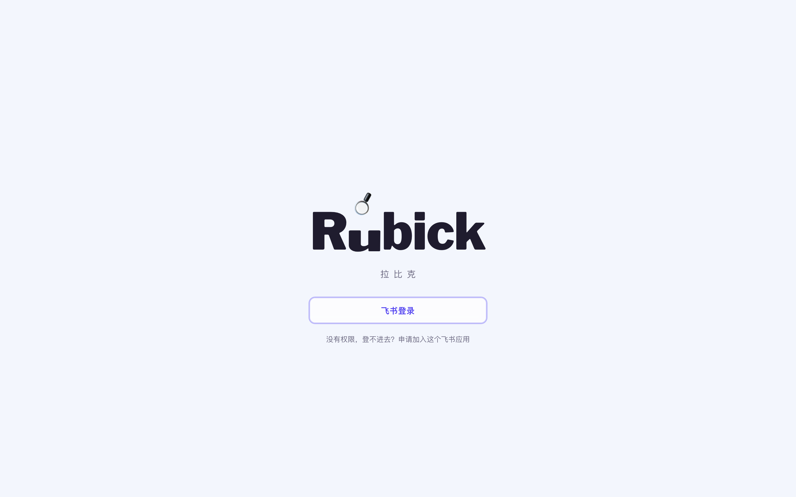
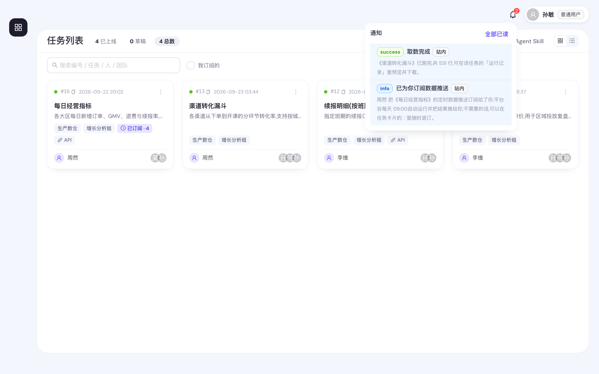
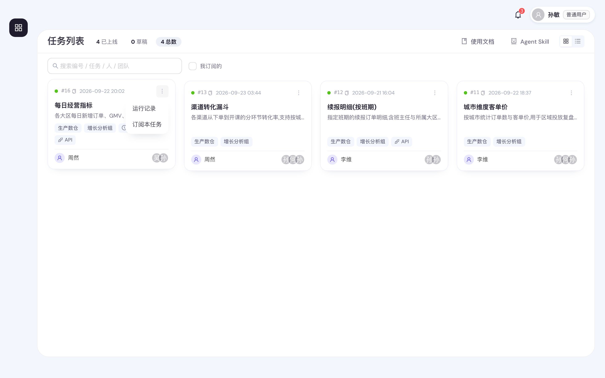
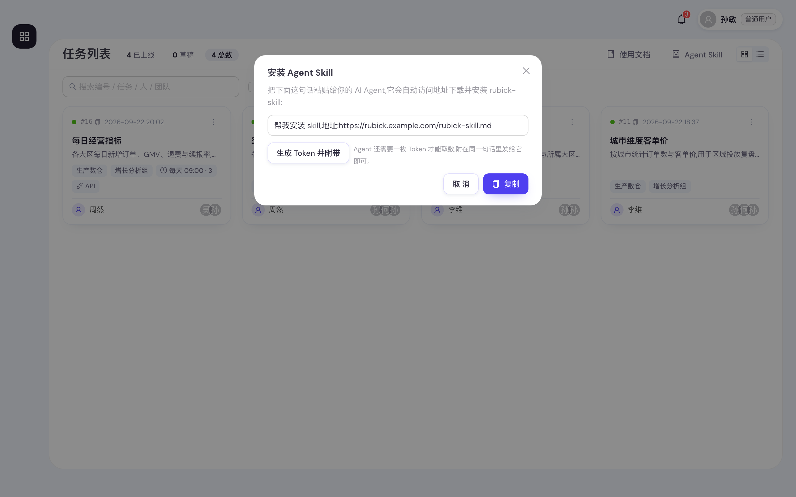
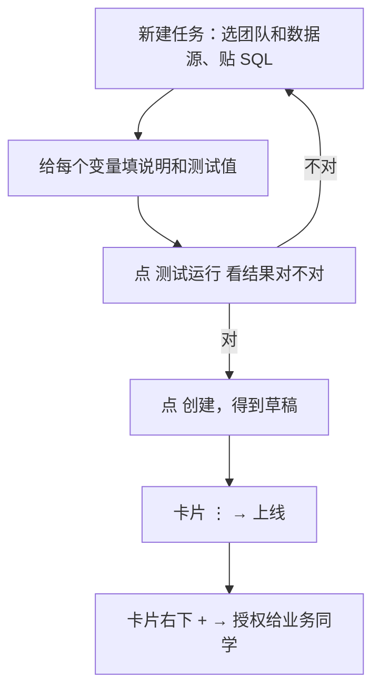
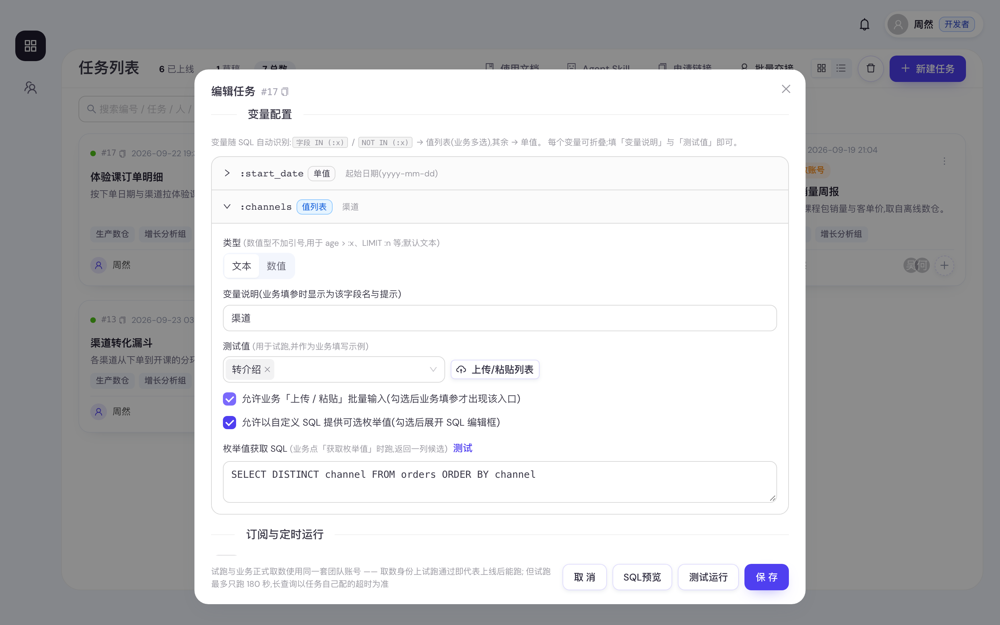
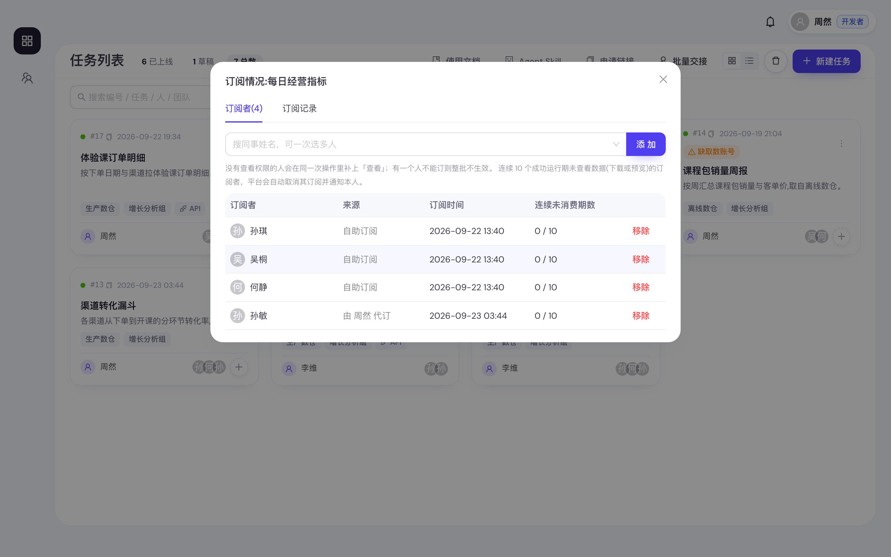
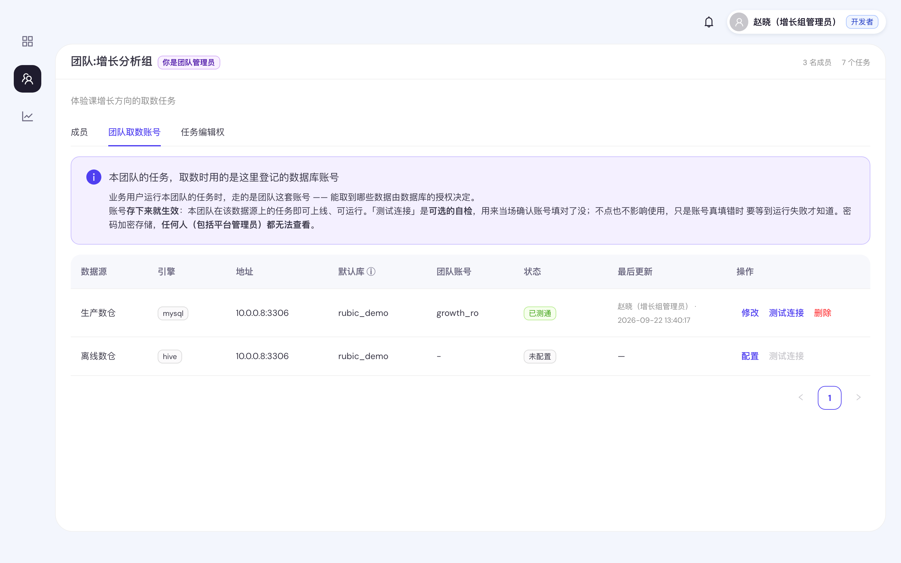
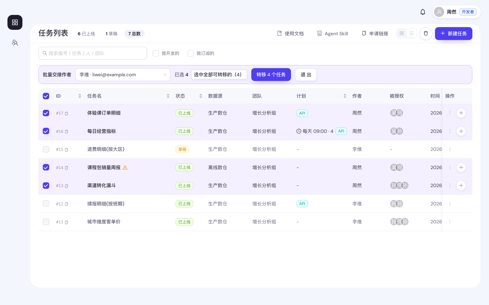

<!-- 飞书版：https://wrpnn3mat2.feishu.cn/docx/ZlYBdS3fGoBosXx5btpcWs8yn8Y -->

# 拉比克 Rubick 使用手册

**一句话**：懂 SQL 的同学把查询做成「任务」，其他人填几个参数就能自己取数、下载，不用找人代跑。

> 本手册对应 2026-09-23 的线上功能，界面与手册不一致时以界面为准。文中的任务名、人名都是虚构的演示数据。

**怎么读**：只取数，读第 1 章就够了；要建任务，再读第 2 章；遇到问题查第 3 章。

## 目录

1. [取数（所有人）](#1-取数所有人)
2. [建任务（开发者）](#2-建任务开发者)
3. [常见问题](#3-常见问题)
4. [常用限制](#4-常用限制)

---

## 1. 取数（所有人）

### 1.1 登录

点登录页的 **飞书登录** 即可，第一次登录会自动建号。

- **登不进去**（点了没反应、飞书提示没权限）：点登录按钮下方的「申请加入这个飞书应用」自助申请。
- **登录后列表是空的**：你只看得到**别人授权给你、且已上线**的任务。找任务作者要权限。

### 1.2 五步取到一份数据

1. 在「任务列表」找到任务。任务多的话用列表上方的搜索框，按任务名、作者或**任务编号**（如 `128`）搜。
2. 点开卡片，右侧弹出取数抽屉。
3. 填参数（见下）。
4. 点 **运行并预览**，等结果出来。重复点不会多跑：你刚提交的同参数运行还没跑完时，会直接接上那一次。
5. 核对预览的前 50 行，没问题点 **确认下载**，拿到完整的 CSV。

**填参数**：所有参数都必填。灰字「示例：…」是作者给的格式，照着填。参数只有两种：

- **输入框**：填一个值，如 `2026-07-01`。
- **多选标签框**：填一组值。有候选值就展开直接勾；值很多可以点 **上传/粘贴列表**，一行一个。候选值觉得旧了可点 **更新枚举值**，更新结果所有人共用。

**要知道的两件事**：

- **能运行不等于能下载**。「运行」和「下载」是分开给的权限，只有「运行」时能看预览、不能下载——自己跑的也一样。要下载找任务作者补权限。
- **关掉抽屉不影响运行**。跑完会发飞书消息和站内通知（顶栏铃铛），点通知就能回到结果。

**有人今天已经跑过同样的参数？直接给你那份结果。** 预览上方会写「复用了 HH:MM 有人以相同参数跑出的结果，没有重新执行」，
几乎不用等。想要此刻的最新数据，点同一行里的 **仍要重新运行**，平台会真的再跑一次。
MySQL 这类实时库只复用最近半小时内的结果；作者也可能给某个任务关掉了复用。

### 1.3 找以前跑过的结果

卡片右上角 **⋮ → 运行记录**，能看到这个任务跑过的每一次，可以直接预览、导出。同事刚跑过的数，不用自己再跑。
标着 **复用** 的那几行是直接用了现成结果、没有重新执行的；状态 **已取消** 是 API 调用方撤回的排队运行。

- 你只看得到自己跑的；同团队的开发者看得到所有人的。
- 结果保留 **7 天**，过期后重跑一次即可，点 **查看(N)** 可以照抄当时的参数。

### 1.4 订阅：让平台定期把数推给你

卡片上有「每天 10:30」这类计划标签的任务，平台会定时自动跑。点 **⋮ → 订阅本任务**，之后每期跑完你都会收到通知，点进去就是结果。不想要了点 **⋮ → 退订**。

- **连续 10 期没看会自动退订**（没预览也没导出算没看）。想继续收就重新订一次。
- 任务下线期间暂停推送，重新上线后自动恢复。
- 收到「已为你订阅数据推送」，是任务负责人替你订的，不需要就退订。
- 收到「本期数据已补发」或「本期数据已更新，请以此版为准」，是任务负责人手动补推的本期数据，以最新这一版为准。

### 1.5 让 AI Agent 替你取数

不想开网页，可以让自己的 AI Agent 去取数：

1. 任务列表右上角点 **Agent Skill**，复制弹窗里的那句话，发给你的 AI Agent。点弹窗里的 **生成 Token 并附带**，Token 会一起放进这句话，Agent 装完马上就能用（已经有 Token 的，按钮是「重置 Token 并附带」，旧 Token 会失效）。
2. 之后直接用大白话吩咐它，比如「帮我跑一下 #128，日期填上个月」。

**Token**（给 Agent 或脚本用的登录凭证）在右上角 **头像 → API Token** 里生成、重置或吊销：

- Token 就代表你本人，Agent 能做的事跟你在网页上一样，不会多出权限。
- Token 只在生成时显示一次；重置后旧的立即失效。**别发到群里或截图外传**，怀疑泄漏就马上吊销。
- 卡片上带 **API** 小标签的任务才能被 Agent 调用。

自己写脚本对接，看[开放 API 文档](./open-api.md)。

---

## 2. 建任务（开发者）

> 要更细的说明（变量设计、排障、上线前自检），看[《开发者手册》](./developer-manual.md)。

### 2.1 整体流程

**开始之前**：你得是「开发者」角色，并且被加进了某个团队（找平台管理员）。否则「新建任务」按钮是灰的。

### 2.2 写 SQL 和变量

任务列表右上角点 **新建任务**。

- **基本信息**：填任务名称、所属团队、数据源。「任务说明」会显示在业务同学的取数抽屉顶部，写清口径。
- **SQL**：只能是**一条** `SELECT` 或 `WITH` 查询。需要业务填的地方写成 `:变量名`：
  - 写成 `字段 IN (:x)` → 业务同学看到**多选标签框**；
  - 写在别处（如 `dt = :dt`）→ 看到**输入框**。
- **变量配置**：SQL 里的变量会自动出现在下方。每个都要填「变量说明」（业务同学看到的字段名）和「测试值」。多选变量还可以：
  - 勾「允许上传/粘贴」，方便业务同学批量输入；
  - 填一段「枚举值获取 SQL」提供候选值——**填完点一次「测试」再保存**，候选值才会生效。
- **底部按钮**：**SQL预览**看代入测试值后的语句；**测试运行**用测试值真跑一次（最多 50 行）；**创建**保存为草稿。

### 2.3 上线与授权

1. 卡片 **⋮ → 上线**。
2. 点卡片右下角的虚线 **+**，搜同事的姓名或邮箱，勾选权限后点 **授权**：
   - **查看**：能在列表里看到；**运行**：能填参跑；**下载**：能导出完整结果。

- 已上线的任务改完直接保存，新版本立即生效，不用重新上线。
- 任务不能删除。不要了就 **⋮ → 下线** 或 **移入回收站**，之后可以在回收站里恢复。
- 编辑器底部的「允许 API 调用」默认开着，只决定能不能被 Agent/脚本调用，不会给任何人加权限。
- 编辑器底部的「结果可复用」默认也开着：当天有人以相同参数跑过，别人再运行就直接拿那份结果，不重复执行（MySQL 任务只复用最近 30 分钟内的）。任务依赖实时数据，或 SQL 里用了 `now()` 这类当前时间，就把它关掉。

### 2.4 定时运行

在编辑器最下面打开 **允许订阅**，选每天 / 每周 / 每月和运行时刻，保存后业务同学就能订阅了。

- 只有**没有变量**的任务能开（定时跑时没人填参）。
- 想直接推给某人：**⋮ → 订阅者名单**，搜人添加。对方还没有权限的，平台会顺手补上「查看、运行、下载」。
- 跑失败时你会收到带原因的通知。平台不会自动重跑，修好后按下面的「补推」把本期数据发出去。
- **补推**：先正常取数一次，在运行记录里 **预览** 确认数据无误，再点那一行的 **推送给订阅者**，这次的结果就会作为本期数据推给所有订阅者（不会重新执行 SQL）。只能推本期内、当前上线版本跑成功的结果，每条记录只能推一次；本期已经推过的，会替换成新的一版。有编辑权的人都能补推。
- 关掉「允许订阅」再保存，所有订阅者都会被退订。

### 2.5 团队须知

- **同团队的人能看到彼此的任务**，但默认只能改自己建的。要改别人的，找团队管理员在「我的团队 → 任务编辑权」里授权。
- ⚠️ **进了团队，就能用团队账号查到它能查的所有数据**，加人前想清楚。

**取数用的是团队的数据库账号**。上线时提示「团队 X 尚未配置数据源 Y 的取数账号」，说明下图里对应那一行还是「未配置」，请团队管理员到「我的团队 → 团队取数账号」点 **配置** 补上。

**离职交接**：在 ⋮ 菜单里「转移作者」给同团队同事；一次转很多个，用任务列表右上角的 **批量交接**，选好接手人后勾选任务提交。要先转作者，再让管理员改角色。

---

## 3. 常见问题

### 取数时

**任务列表是空的 / 找不到同事说的任务？**
任务还没授权给你，或者已经下线了。把**任务编号**（卡片上的 `#128`）发给作者要权限，编号比任务名准。

**卡片点不开？**
鼠标停在卡片上看提示：「未上线」找作者上线；「未授权」说明你只有查看权限，找作者补「运行」。

**跑出来了却下载不了？**
你只有「运行」权限，没有「下载」。找作者（卡片左下角）补一个。

**报错是一段看不懂的英文？**
数据库返回的错误，一般是 SQL 或数据源有问题，不是你填错了。截图发给作者。

**多选框没有候选值？**
作者没配候选值，直接手动输入就行。

**订阅了但这期没收到？**
可能是任务下线了、这期跑失败了（任务负责人修好后会补推），或者你连续 10 期没看被自动退订了（重新订一次就好）。

**AI Agent 说没权限或不让调用？**
先确认你在网页上能跑这个任务，网页上不能跑的 Agent 也不能跑。卡片上没有 **API** 标签，说明作者关掉了 API 调用，找作者打开。Token 重置过的话，要把新 Token 给 Agent。

**页面突然跳回登录页？**
登录 12 小时后过期，重新登录即可。

**作者离职了找谁？**
找任务所属团队（卡片上的团队标签）的团队管理员。

### 建任务时

**保存时提示「只允许 SELECT 查询」或「只允许单条语句」？**
只能写一条查询。删掉多余的分号和 `SET`、建临时表等语句，复杂逻辑用 `WITH`。

**写了变量却没出现在变量配置里？**
变量要写成 `:名字`，以字母或下划线开头。变量卡默认是收起的，注意看一下。

**业务同学要多选，却只有一个输入框？**
把条件改成 `字段 IN (:x)` 再保存。

**同团队的任务改不了？**
默认只能改自己建的，找团队管理员授权。

---

## 4. 常用限制

| 项目 | 限制 |
|---|---|
| 结果预览 | 前 50 行，下载的是完整结果 |
| 结果保留 | 7 天（订阅任务的最新一期一直保留） |
| 页面等结果 | 最多 20 分钟，超时后到通知或运行记录里领 |
| 查询超时 | MySQL 120 秒、Hive 3600 秒（作者可以单独调） |
| 测试运行 | 最多 50 行、180 秒 |
| 候选值 | 最多 1000 个，更多的可以手动输入 |
| 结果格式 | CSV，Excel 直接打开中文不乱码 |
| 登录有效期 | 12 小时 |

**有问题找谁**：找任务作者（卡片左下角）或平台管理员。
