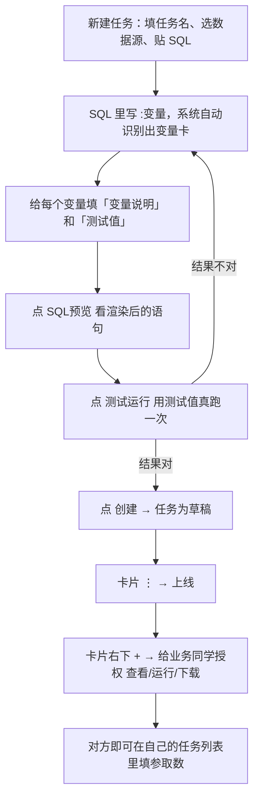
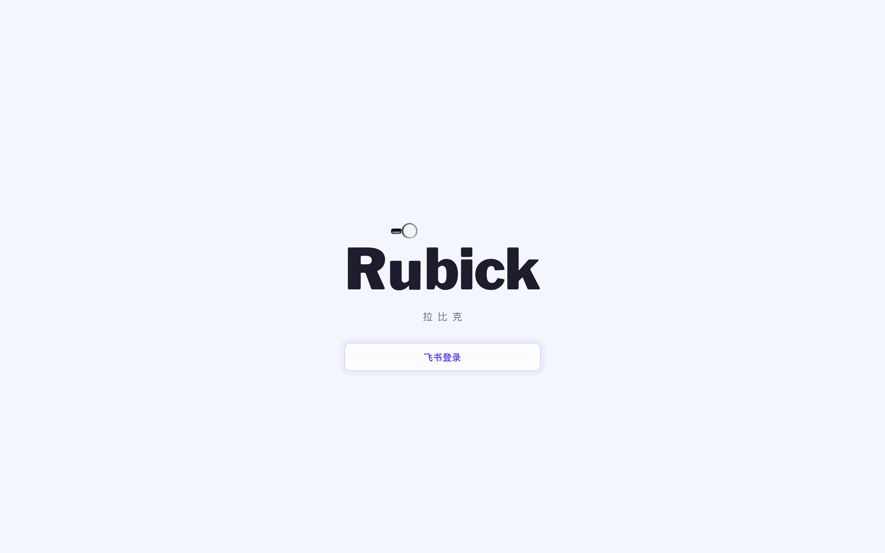
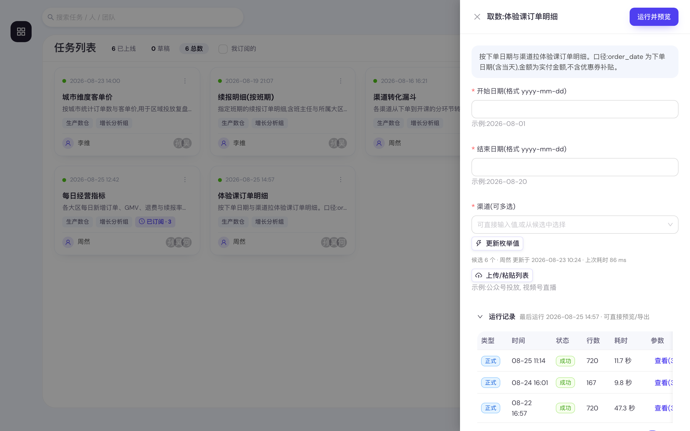
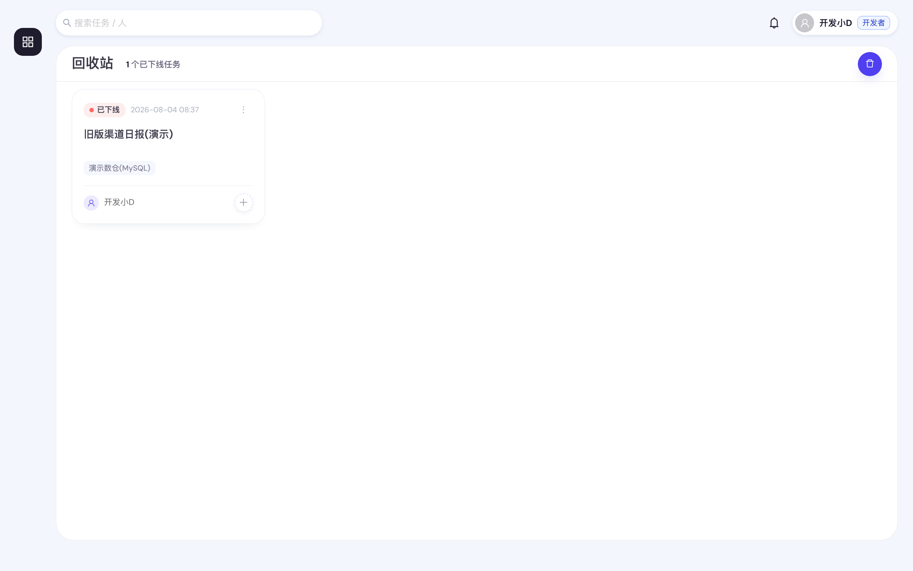

<!-- 飞书版：https://wrpnn3mat2.feishu.cn/docx/ZlYBdS3fGoBosXx5btpcWs8yn8Y -->

# 拉比克 Rubick 2.0 用户使用说明手册

> 本手册对应 2026-08-25 的线上功能（含团队、团队取数账号、跨团队隔离、订阅与定时运行）。界面与手册描述不一致时，**以系统实际显示为准**，并把差异反馈给平台管理员。
> 文中所有示例数据（任务名、客户名、日期、人名）均为演示用的虚构值，不代表任何真实业务数据。

## 目录

1. [拉比克是什么、给谁用](#1-拉比克是什么给谁用)
2. [快速上手](#2-快速上手)
3. [登录与界面导航](#3-登录与界面导航)
4. [取数：填参、运行、预览、下载](#4-取数填参运行预览下载)
5. [运行记录、通知与订阅](#5-运行记录通知与订阅)
6. [新建与维护取数任务](#6-新建与维护取数任务)
7. [给同事授权](#7-给同事授权)
8. [管理员专属页面](#8-管理员专属页面)
9. [规则与限制（口径）](#9-规则与限制口径)
10. [常见问题 FAQ](#10-常见问题-faq)
11. [术语速查与反馈](#11-术语速查与反馈)

---

## 1. 拉比克是什么、给谁用

拉比克是**面向不懂 SQL 的同学的自助取数平台**：懂 SQL 的同学把一段带变量的查询在产品里建成一个「任务」并上线，其他人只要填参数、点运行、下载结果，不用写代码、不用找人代跑。全程飞书登录，谁跑了什么、下载了什么都有审计留痕。

平台有三种固定角色，登录后在右上角头像旁的标签上可以看到自己是哪一种：

| 角色 | 能做什么 | 该读哪几章 |
|---|---|---|
| **普通用户** | 运行被授权的任务、预览与下载结果、查看自己的运行记录 | 第 2~5 章 |
| **开发者** | 普通用户的全部能力 + 在**自己所属团队**里新建/编辑/上线/下线任务、给人授权、看本团队任务与运行记录 | 第 2~7、9 章 |
| **管理员** | 开发者的全部能力 + 团队管理、用户角色分配、数据源配置、审计日志;且**不受团队约束**(可见并可编辑全部团队的任务) | 全部 |

首次飞书登录会自动建号，默认是**普通用户**；需要建任务或做管理的，找管理员在「用户管理」页改角色。

**开发者还需要被加入一个团队才能建任务。** 任务必须归属团队 —— 团队决定谁看得见这个任务、
以及取数时用哪套数据库账号。团队由管理员创建(见 [8.3](#83-团队管理))。

---

## 2. 快速上手

### 2.1 我要取一份数据（普通用户）

1. 打开平台地址，点 **飞书登录**，用飞书扫码/授权。
2. 进入「任务列表」，找到要跑的任务卡片（顶栏搜索框可以按任务名搜）。
3. 点卡片，右侧弹出「取数」抽屉，把参数填完。
4. 点 **运行并预览**，等结果出来（复杂查询可能要几分钟，表单上方的进度提示会实时显示「排队中 / 正在取数」和已等时长）。
5. 在「结果预览」里核对前 50 行对不对。
6. 点 **确认下载**，浏览器新标签页开始下载 CSV 文件。

只能看到被授权给自己的、且已上线的任务。列表里空的、或卡片点不开，看第 10 章 FAQ。

不用填参数的任务（比如每日看板）可能带一枚「每天 09:00」这样的**计划标签** —— 点卡片 **⋮ → 订阅本任务**，之后平台按计划自动跑、跑完通知你，不用再自己点（见 [5.3](#53-订阅让平台按计划自动跑)）。

### 2.2 我要把一段 SQL 做成任务（开发者 / 管理员）

---

## 3. 登录与界面导航

**登录**：登录页只有一个 **飞书登录** 按钮，点击跳转飞书授权，授权后自动回到平台并提示「欢迎，<你的名字>」。登录状态有效期 12 小时，过期后页面会自动跳回登录页，重新点一次即可。

**主菜单**在窗口左侧，是一列图标，鼠标悬停显示名称：

| 图标位置 | 菜单名 | 地址 | 用途 | 谁能看到 |
|---|---|---|---|---|
| 第 1 个 | 任务列表 | `/tasks` | 所有取数任务的入口：跑数、建任务、授权、看运行记录、回收站 | 所有人 |
| 第 2 个 | 我的团队 | `/teams` | 团队成员、团队取数账号、任务编辑权 | 开发者 / 管理员 |
| 第 3 个 | 用户管理 | `/admin/users` | 看谁登录过、给人改角色 | 仅管理员 |
| 第 4 个 | 团队管理 | `/admin/teams` | 建团队、指定团队管理员、删团队 | 仅管理员 |
| 第 5 个 | 数据源 | `/admin/datasources` | 配置可被任务查询的数据库 | 仅管理员 |
| 第 6 个 | 取数账号 | `/admin/credentials` | 看各**团队**的库账号配置情况、回收账号、看此刻跑不动的任务 | 仅管理员 |
| 第 7 个 | 审计 | `/admin/audit` | 检索并导出全平台操作留痕 | 仅管理员 |

**顶栏**从左到右：

- **搜索框**（提示语「搜索任务 / 人 / 团队」）：对任务列表做即时过滤，可按**任务名、作者姓名、团队名、被授权人姓名**匹配，不区分大小写。搜索词会写进网址，可以直接把链接发给同事。
- **通知铃**：右上角带未读数角标，见 5.2。
- **头像 + 姓名 + 角色标签**：点开下拉里只有 **退出登录**。团队与团队取数账号的入口在左侧
  「我的团队」(见 [6.3](#63-团队与团队取数账号))。

---

## 4. 取数：填参、运行、预览、下载

### 4.1 任务列表怎么读

标题右侧的三个小片是**状态筛选**，点一下只看该状态，再点一下或点「总数」取消：

| 小片 | 含义 |
|---|---|
| N **已上线** | 已上线、可被授权用户运行的任务数 |
| N **草稿** | 还没上线的任务数 |
| N **总数** | 上面两类的合计（**不含**已下线任务，已下线的只在回收站里数） |

上图是开发者视角。右上的 **新建任务** 按钮和圆形回收站按钮**只有开发者和管理员看得到**；普通用户那里只剩视图切换（见 [4.1.1](#411-卡片--列表两种视图)），且列表只包含被授权给自己的已上线任务（草稿数因此通常是 0）。

开发者看到的是**自己所属团队**的任务 —— **不同团队的任务互相不可见**;管理员看到全部。
属于多个团队时,标题旁会多一个**团队下拉**用来只看某一个团队;旁边还有两个勾选框:
**我开发的**(自己建的,加上被授予编辑权的)与 **我订阅的**(自己订阅了定时运行的,普通用户
也有),两个可以同时勾选,取交集。它们都会同时改变上方那几个计数,所以数字和卡片永远一致。

> 开发者和管理员那里还可能多一枚「**闲置**」筛选片 —— 指已上线但长期没人运行、可以考虑下线的任务,
> 那些卡片会被标出闲置天数并排到列表最后。**普通用户看不到这枚片、卡片和顺序也不受影响**,
> 所以你在自己的列表里不会遇到它。口径见开发者手册 6.1。

每张卡片上：

| 位置 | 内容 |
|---|---|
| 左上 | 状态色点：**黄** = 草稿、**绿** = 已上线、**红** = 已下线（悬停色点可看中文状态） |
| 状态右侧 | 时间，悬停可看是「最后运行 / 最后编辑 / 创建于」哪一种。对**有管理权的人**，长期没人运行的已上线任务这里改写成「闲置 167 天」，悬停看确切时间与说明 |
| 时间右侧 | 橙色 **缺取数账号** 告警（**只有对该任务有管理权的人看得到**）：所属团队在这个数据源上**压根没登记**取数账号，该任务当前跑不动。悬停可看详细提示，处理办法见 [6.3](#63-团队与团队取数账号)。账号已登记但没点过「测试连接」**不会**出现这个告警——那种账号照样能跑 |
| 右上 **⋮** | **运行记录**（所有人可见）；任务开了定时运行时还有 **订阅本任务** / **退订**；有管理权的人还有 **编辑**、**上线** / **下线** / **重新上线**，以及 **订阅者名单** |
| 中间 | 任务名称；下面浅色两行是**任务说明**（作者没写就不占位，长说明截断、悬停看全文）；再下面灰色小标签是这个任务查询的**数据源名**与**所属团队** |
| 中间（标签行） | 开了定时运行的任务，标签后面还多一枚**计划标签**：没订阅时显示计划本身（如「每天 09:00 · 3」，3 是订阅人数），自己订了则变成品牌色的「已订阅 · 3」。悬停可看完整说明，详见 [5.3](#53-订阅让平台按计划自动跑) |
| 左下 | 作者 |
| 右下 | 已被授权运行的人的头像组；有管理权的人还有一个虚线 **+** 按钮（悬停「授权用户」） |

**卡片本体点一下就是取数**。点不动时把鼠标停上去，提示会说明原因：「点击填参取数」／「任务未上线，暂不可取数」／「未授权，暂不可取数」。

#### 4.1.1 卡片 / 列表两种视图

右上角有一对视图按钮（⊞ 卡片 / ☰ 列表），**所有人都能用**。任务多起来以后卡片一屏只放得下十几个，
换成**列表模式**一屏能看几十行。选了哪种视图**会被记住**（存在你这台电脑的浏览器里），
下次打开还是它；换台电脑则各记各的，也不会因为别人点开你分享的链接而变。

两种视图看的是**同一批任务**：上方的状态筛选片、团队下拉、「我开发的」「我订阅的」、
顶栏搜索、回收站，在两种视图下都照样生效，计数与内容始终一致。

列表模式下每一行的列，与卡片上的信息一一对应：

| 列 | 对应卡片上的 |
|---|---|
| 任务名 | 卡片中间的任务名；**任务说明挂在悬停上**（列表以密度为先，不单独占一列）。所属团队缺取数账号时，名字后面跟一枚橙色 ⚠（同样只有有管理权的人看得到） |
| 状态 | 卡片左上的状态色点，这里写成中文标签（草稿 / 已上线 / 已下线） |
| 数据源 · 团队 | 卡片标签行的两枚灰标签 |
| 计划 | 卡片的计划标签（「每天 09:00 · 3」／品牌色的「已订阅 · 3」） |
| 作者 | 卡片左下 |
| 被授权 | 卡片右下的头像组（悬停整格可看全部姓名） |
| 时间 | 卡片状态右侧那个时间；悬停可看是「最后运行 / 最后编辑 / 创建于」哪一种。闲置任务同样改写成「闲置 N 天」，整行文字也退一档 |
| 操作 | 卡片右上的 **⋮**（菜单项与卡片完全相同）＋有管理权时卡片右下那个虚线 **+**（授权用户）。窗口窄到需要横向滚动时，这一列**钉在最右边**不会滚走 |

**行点一下也就是取数**，点不动的原因与卡片一样挂在悬停上。
点 **任务名 / 状态 / 计划 / 时间** 四个列头可以排序（再点一下反向，第三下取消）；
列表模式**不分页**，一页到底。

### 4.2 填参数

点开任务（卡片模式点卡片，列表模式点那一行），右侧抽屉标题是「取数：<任务名>」。顶部灰底方框是作者写的任务说明，下面是参数表单。**所有参数都必填**，没有默认值。参数只有两种形态：

| 形态 | 长什么样 | 怎么填 |
|---|---|---|
| **单值** | 一个普通输入框 | 直接输入，例如日期 `2026-07-01`、数字 `100` |
| **值列表** | 可多选的标签框 | 一次填一组值，最终作用于 SQL 里的 `IN` / `NOT IN` |

控件下方的灰色小字「示例：…」是作者填的测试值，照它的格式填不会错。

**值列表**下面可能出现这些辅助按钮（取决于作者有没有开启）：

- **候选值（作者配了「枚举值获取 SQL」时才有）**：打开抽屉时候选值**已经带出来了**，直接展开标签框勾选即可——它读的是这个任务的**共享候选**，不会现跑查询，所以是秒开的。旁边灰字写着「候选 N 个 · 谁 更新于 某时 · 上次耗时 N ms」，据此判断这批值新不新。
  - **更新枚举值**：觉得候选过时了就点它，会真跑一次作者预置的查询，**结果对该任务的所有人生效**（别人下次打开抽屉就用上了，不会实时弹给正在填参的人）。还没有任何候选时按钮显示为 **获取枚举值**，作用相同。30 秒内重复点会提示「刚刚已有人更新过，已复用最新的 N 个候选值」，不会重复消耗数据库。
  - 一次最多 1000 个候选，超出显示「已截断，可直接输入未列出的值」——标签框本来就能手输，截断了不影响填你要的值。
  - 若显示「作者已更新配置，请点『获取枚举值』」，说明作者改了那段查询或换了数据源，旧候选已作废（不会拿旧值糊弄你），点一下重新取即可。
- **上传/粘贴列表**：弹出「上传或粘贴列表」窗口，可以选一个 `.csv` / `.txt` 文件，或直接往文本框粘贴——**一行一个值，也支持逗号/分号/空格/制表符分隔**，重复值自动去重。点 **加入** 合并进已选值。
- 已选数量显示为「已选 N 个」。超过 5000 个会提示「过多可能导致查询过慢或失败」。

### 4.3 运行、预览、下载

1. 填完点右上 **运行并预览**，**不要重复点**。表单上方会出现一条进度提示，分两种：**排队中**（前面还有几个取数在等、你已等了多久）和 **正在取数**（系统正在跑你的这次取数、已等多久）。提示里也写着：关掉抽屉不影响它跑完，完成后会有通知，也可在「运行记录」里取。
2. 跑完抽屉变宽，出现「结果预览」区域，提示「取数完成，共 N 行，请预览确认后下载」。预览只给**前 50 行**，标题旁写着「前 N 行 / 共 M 行，下载为完整结果」。
3. 想核对实际执行的语句，点 **查看执行SQL**（参数已代入的最终 SQL）。
4. 预览没问题点 **确认下载**，浏览器新标签页开始下载完整结果 CSV；想换参数重跑就点 **重新运行**，表单还在。
5. 抽屉下方还有一块可展开的 **运行记录**：这个任务**以前跑过的**结果都在里面，能直接预览／导出——
   要的数据别人刚跑过时，不用自己再跑一遍（详见 [5.1](#51-运行记录)）。

**结果文件**是 CSV（带 UTF-8 BOM，Excel 双击直接打开中文不乱码），文件名形如 `<任务名>_<运行编号>.csv`。

**跑很久的查询**：页面最多等 20 分钟。超过后提示「查询仍在执行，完成后会在「运行记录」和通知里，可稍后查看并下载」——此时可以关掉抽屉去干别的，跑完会收到通知，结果在该任务的「运行记录」里预览和导出。

---

## 5. 运行记录、通知与订阅

### 5.1 运行记录

**两个入口，看的是同一份记录**：

- **取数抽屉里的「运行记录」**：点开任务卡片填参时，抽屉下方有一块可展开的 **运行记录**，
  想拿上次跑好的结果不用先关掉抽屉。折叠标题上写着这个任务的**最后运行**时间。
  展开过一次就会记住，下次打开别的任务也是展开的。**刚跑完的那次会自动出现在最上面**，不用手动刷新。
  抽屉窄，这里省掉了「运行人」「执行SQL」两列，要看它们走下面那个入口。
- **卡片 ⋮ → 运行记录**：独立抽屉，标题「运行记录：<任务名>」，**列最全**。点通知跳过来的也是这里。

**被授权的业务用户只看到自己跑过的**；该任务**所属团队的成员**与平台管理员看到这个任务下
所有人的运行（含试跑）。别的团队的开发者看不到这个任务，自然也看不到它的运行记录。
列表只给**最近 200 次**运行，更早的不再显示。

| 列 | 说明 |
|---|---|
| 类型 | **正式**＝业务填参取数；**试跑**＝作者在编辑器里点「测试运行」留下的；**定时**＝平台按订阅计划自动跑的（见 [5.3](#53-订阅让平台按计划自动跑)） |
| 运行人 | 谁跑的（取数抽屉里的那份没有这一列）。定时运行那几条的运行人是系统账号「定时运行」 |
| 时间 | 提交时间。取数抽屉里的那份省掉年份，悬停可看完整时间 |
| 状态 | **排队** → **运行中** → **成功** / **失败** |
| 行数 | 成功时的结果行数 |
| 耗时 | 这次查询**从开始执行到结果写完**用了多久，**不含在队列里排队等待的时间**（所以排了半小时、耗时写着 12 秒，两个都没错）。只有跑成功的才有，排队中与失败的显示 `—` |
| 参数 | 点 **查看(N)** 看这次填的每个参数值 |
| 执行SQL | 点 **查看** 看参数已代入的最终语句（取数抽屉里的那份没有这一列） |
| 结果 | 成功且未过期：**预览**（前 50 行）／**导出**；超过保留期显示 **已过期**；失败显示 `-` |

### 5.2 通知

取数跑完（成功或失败）会推两处：**飞书机器人消息** + **站内通知**。没配飞书凭证或推送失败时，站内通知条目上会带一个「站内」标签。

点顶栏铃铛看列表，未读条目底色偏蓝，右上有 **全部已读**。点某条通知会标为已读并**直接跳到对应任务的「运行记录」**，可以马上预览下载。未读数每 8 秒自动刷新一次。

订阅了定时运行的任务后，还会收到这几类通知（都在同一个铃铛里）：**订阅数据已生成**（本期跑完，附行数）、**订阅数据本期生成失败**、**订阅推送已暂停**（任务被下线）、**订阅已取消**（作者关闭了订阅）、**订阅已自动取消**（连续 10 期没看，见 [5.3](#53-订阅让平台按计划自动跑)）。

### 5.3 订阅：让平台按计划自动跑

有些任务不用填参数（比如每天的经营看板）。作者可以给这类任务开启**定时运行**；你**订阅**它之后，
平台按计划自动跑，跑完把结果推给你 —— 不必每天自己点一次。

**怎么订阅**：卡片上带「每天 09:00」这类**计划标签**的任务就是开了定时运行的。
点卡片 **⋮ → 订阅本任务** 即可；订上之后标签变成品牌色的「已订阅 · N」（N 是这个任务的订阅人数），
⋮ 里那一项也变成 **退订**。订阅资格 = 你对这个任务有**查看权限**且任务**已上线** —— 看得见就订得上。

**订到的数据在哪**：每一期跑完你会收到通知（飞书 + 站内），点通知直接跳到该任务的「运行记录」，
那一条的**类型是「定时」**，预览与导出跟自己跑出来的完全一样。也可以随时自己去运行记录里翻。

**必须知道的几条**：

| 规则 | 说明 |
|---|---|
| 只有**无变量**的任务能开订阅 | 定时运行时没有人在场填参，而平台的参数一律必填、没有默认值 |
| **连续 10 期不看就自动退订** | 某一期的结果你既没预览也没导出，就算一期「未消费」；连续 10 期未消费，平台自动取消你的订阅**并通知你本人**。这是为了不让没人看的取数一直白跑。想继续要就重新订一次，计数随之清零；**跑失败的那期不计入** |
| 任务下线 = **推送暂停** | 订阅关系还在，任务重新上线自动恢复，不用重订；暂停时你会收到一条通知 |
| 作者关掉订阅 | 全部订阅者被清退并各收到一条「订阅已取消」 |
| 最新一期**不会过期** | 定时运行的结果不受 7 天保留期约束，直到**下一期成功**把它取代为止；更早的几期仍按 7 天清理 |

任务列表标题旁的 **我订阅的** 勾选框用来只看自己订了的任务（普通用户也有），它同时会改变上方那三个计数。

---

## 6. 新建与维护取数任务

本章仅开发者与管理员可操作（普通用户看不到 **新建任务** 按钮，也没有卡片上的编辑/上线菜单）。

> 经常建任务的同学请看更详细的[《开发者手册》](./developer-manual.md)：变量设计、共享候选值的生命周期、
> SQL 安全网关、版本与上线、排障速查与上线前自检清单。

### 6.1 任务的三种状态

| 状态 | 含义 | 业务方能运行吗 | 能编辑吗 | 怎么切换 |
|---|---|---|---|---|
| **草稿** | 新建后的初始状态 | 不能 | 能 | ⋮ → **上线** 变为已上线 |
| **已上线** | 当前有一个生效版本 | 被授权的人能 | 能，**保存后新版本自动接替上线** | ⋮ → **下线** 进回收站 |
| **已下线** | 在回收站里，不在任务列表默认视图 | 不能 | 能 | 回收站里 ⋮ → **重新上线** |

任务不能删除，只能下线进回收站。任务列表右上的圆形回收站按钮（悬停「回收站(已下线任务)」）切换到回收站视图，标题变成「回收站」并显示「N 个已下线任务」；再点一次返回。

### 6.2 新建任务

点任务列表右上 **新建任务**，弹出「新建任务」窗口，分三段填。

> **按钮是灰的?** 说明你还不属于任何团队。任务必须归属一个团队,请联系管理员把你加入团队
> (见 [6.3](#63-团队与团队取数账号))。

**基本信息**

| 字段 | 必填 | 说明 |
|---|---|---|
| 任务名称 | 是 | 业务方在卡片上看到的名字，写清楚查什么 |
| 所属团队 | 是 | 决定**谁看得见这个任务**,以及**取数用哪套数据库账号**。下拉里是你所属的团队;任务建好后你改不了它,需要转移请找管理员 |
| 数据源 | 是 | 下拉里是管理员配好的数据源，格式「名称 (引擎)」；决定 SQL 用哪种方言。选完下方会提示「所属团队在这个源上的取数账号」就绪没 |
| 查询超时(秒) | 否 | 留空按引擎默认：Hive 3600 秒、MySQL 120 秒。超时自动终止查询 |
| 任务说明 | 否 | 会显示在业务方取数抽屉的顶部，写清口径与限制 |

**SQL 语句**：用 `:变量名` 作占位符。变量形态由写法决定，**不用手动选**：

| SQL 里怎么写 | 变量形态 | 业务方看到 |
|---|---|---|
| `字段 IN (:x)` 或 `字段 NOT IN (:x)` | 值列表 | 可多选的标签框 |
| 其他任何位置，如 `dt = :dt`、`age > :n` | 单值 | 单个输入框 |

限制：**只允许单条 SELECT / WITH 查询**。多语句、INSERT/UPDATE/DELETE/DROP/CREATE 等一律被安全网关拒绝。

**变量配置**：停止输入 SQL 约 0.4 秒后，系统自动重扫 `:变量` 并生成一张折叠卡（已配置的保留、消失的移除）。卡头显示 `:变量名` + **值列表** / **单值** 标签 + 变量说明。点开可配：

| 配置项 | 适用 | 说明 |
|---|---|---|
| 类型（**文本** / **数值**） | 全部 | 数值型不加引号，用于 `age > :x`、`LIMIT :n` 等；默认文本 |
| 变量说明 | 全部 | 业务填参时显示为该字段的名字与提示，例如「开始日期(格式 yyyy-mm-dd)」 |
| 测试值 | 全部 | 用于测试运行，**同时作为业务方看到的「示例：…」** |
| 允许业务「上传 / 粘贴」批量输入 | 仅值列表 | 勾选后业务填参才出现该入口 |
| 允许以自定义 SQL 提供可选枚举值 | 仅值列表 | 勾选后展开「枚举值获取 SQL」编辑框 |
| 枚举值获取 SQL | 仅值列表 | **返回一列候选值**的独立查询。旁边 **测试** 按钮当场验证，成功会显示取到多少个、耗时多少毫秒——**这批值在你点「保存」后会直接成为业务侧的共享候选**（不再是一次性的试跑结果），业务方打开抽屉即可勾选，不必自己现跑。 注意：测完又改了这段 SQL 再保存，那批值会被丢弃（值与 SQL 必须对得上）；改了 SQL 或换了数据源而没重测，业务侧旧候选会作废并提示重新获取。想让业务方一上手就有候选，**改完记得点一次「测试」再保存** |

**订阅与定时运行**（变量配置下面那一段）：无变量的任务可以在这里打开「允许订阅」，让平台按计划自动跑，
详见 [6.5](#65-给任务开启订阅与定时运行)。

**底部四个按钮**

| 按钮 | 作用 |
|---|---|
| 取消 | 关闭不保存 |
| SQL预览 | 把当前测试值代入，弹窗展示即将执行的 SQL，**不连数据库**。没填测试值的变量原样保留 `:变量` |
| 测试运行 | 用各变量的**测试值**真跑一次，最多取 50 行、**最多跑 180 秒**（前台自检的上限，比任务自己配的超时更短），弹出「试跑结果」浮窗（显示返回行数与列数，可查看执行SQL）。所有变量都要有测试值才跑 |
| 创建 / 保存 | 落库。新建成功提示「已创建(草稿)」 |

> 编辑**已上线**任务时，保存提示是「已保存，线上版本已更新」——新版本立即对业务生效，不需要再点一次上线。编辑草稿或已下线任务则保持原状态。
> 任务关联到已保存的任务时，「测试运行」会在运行记录里留一条标记为**试跑**的记录（不发通知）。

### 6.3 团队与团队取数账号

左侧菜单 **我的团队** 是开发者的团队入口(只属于一个团队时直接进那个团队)。团队页有三个页签:

| 页签 | 谁能改 | 干什么 |
|---|---|---|
| 成员 | 团队管理员 | 添加 / 移出成员(**只能添加「开发者」角色的用户**) |
| 团队取数账号 | 团队管理员 | 配置本团队在各数据源上的数据库账号（「测试连接」是可选的自检） |
| 任务编辑权 | 团队管理员 | 按任务把编辑权授予某个成员 |

**为什么任务要归属团队**:

- **可见**:同团队成员互相看得到彼此的任务(含草稿);不同团队互不可见。
- **可编辑**:默认只能编辑自己建的。团队管理员可编辑本团队全部任务;其他成员要改别人的任务,
  需要团队管理员在「任务编辑权」里对**那一个任务**授予。
- **取数身份**:业务方运行任务时,用的是**任务所属团队**的数据库账号。该团队在这个数据源上
  **没登记账号**时,该任务不允许上线、也无法运行(不会偷偷改用数据源的公共账号)。

必须知道的三条:

- **「测试连接」是可选的自检,不是必须走的一步。** 账号存下来就生效,任务即可上线、可运行;
  点一下只是当场确认账号填对了没(弹窗里也有「保存并测试连接」一步到位)。不点也行,
  代价是账号真填错时要等到运行失败才知道。改过用户名或密码后「已测通」标记会清空,
  那只是自检痕迹失效,**任务照跑**。
  它验的是「账号能不能登进数仓」,并会**列出这个账号能访问的库**(如「该账号可访问 3 个库:
  default、finance_bp、…」)。它**压根不进入任何库**,所以进不去哪个库都不影响测通 ——
  **这份清单就是这个账号能取的全部范围**。三种提示:能列出且进得去数据源的默认库
  (绿色,没别的要做)、能列出但进不去它(黄色,任务 SQL 要写全限定表名 `库名.表名`)、
  一个库都列不出(黄色,账号在数仓里还没有任何数据权限,得找数仓管理员授权)。
  任务 SQL 只要把表名写全(`库名.表名`),清单里的库都能取。
- **密码加密存储,谁都看不到**,包括管理员。库账号名只对本团队的团队管理员与管理员可见。
- 被移出团队后,你不再看得到该团队的任务,已授予你的编辑权也一并失效。
  **任务本身留在团队里继续可运行。**

> ⚠️ **加入团队 = 拿到该团队取数账号的全部数据权限。** 团队账号是共享的:任何成员都能在任务
> 编辑器里用它试跑任意 SQL。所以团队账号能读到的数据,全体成员都能读到 —— 加人要谨慎,
> 每一次成员变更都会进审计。

### 6.4 上线与下线

- **上线**：卡片 ⋮ → **上线**，确认框写「上线后，被授权的业务用户即可运行该任务的最新版本。」
- **下线**：卡片 ⋮ → **下线**，确认框写「下线后业务用户将不能再运行该任务。」任务进回收站。
- **重新上线**：切到回收站，卡片 ⋮ → **重新上线**。

每次上线都会记录上线人与备注，下线和「从回收站恢复」在审计里是两个不同的动作。

> 上线时被拦下并提示「团队《X》尚未配置数据源《Y》的取数账号」?那是上线卡点:
> 先让团队管理员在 [6.3](#63-团队与团队取数账号) 里登记账号(不必测通)。
> 注意**编辑一个已上线任务会让新版本自动接替上线**,所以保存时同样会做这项检查。

### 6.5 给任务开启订阅与定时运行

任务编辑器最下面有一段 **订阅与定时运行**：打开 **允许订阅** 开关，平台就会按你设的计划自动跑这个任务，
并把结果推送给订阅者（业务侧怎么订、订到什么，见 [5.3](#53-订阅让平台按计划自动跑)）。

| 要点 | 说明 |
|---|---|
| **只有无变量的任务能开** | SQL 里还留着 `:变量` 就存不下来（保存会被拒，界面提前提示）：定时运行没有人在场填参 |
| 频次 | **每天** / **每周**（选周几，可多选） / **每月**（选几号，可多选；29/30/31 遇小月顺延到当月最后一天） |
| 运行时刻 | `HH:MM`，服务器本地时间 |
| **没有单独的「暂停」** | 计划跟着任务状态走：下线即暂停，重新上线自动恢复（并补跑最近一期） |
| 关闭订阅要小心 | 开关旁写着当前有多少人订阅；**关掉再保存 = 清退全部订阅者**并逐一通知，保存前界面会再提醒一次 |
| 跑失败谁知道 | **你**（作者与团队管理员）收到带失败原因的通知；订阅者只收到一句「本期数据生成失败」—— 配置他们改不了，给细节只是徒增困惑 |
| 没人订阅的那一期 | 不会真的去跑（省一次取数），计划本身照常往前走 |

卡片 **⋮ → 订阅者名单** 看谁订了、什么时候订的、连续几期没看（临近 10 期会标橙，到 10 期平台自动退订）；
旁边的「订阅记录」页签是**追加式留痕** —— 谁在何时订阅 / 退订 / 被清退，可按任务审查。

---

## 7. 给同事授权

平台上有**两层**授权,别混:

| | 谁对谁 | 在哪儿操作 | 给的是什么 |
|---|---|---|---|
| **团队** | 同事之间 | 团队页(见 [6.3](#63-团队与团队取数账号)) | 本团队任务的**可见**与**可运行**;编辑权按任务单独授予 |
| **任务授权**(本章) | 开发者 → 业务同学 | 任务卡片右下的虚线 **+** | 某个任务的 查看 / 运行 / 下载 |

**同团队可见 ≠ 业务可见**:团队成员天然看得到本团队任务,业务同学则必须逐人授权。

任务上线后**还要单独授权**，业务方才看得到。只能对**自己有编辑权的任务**授权
(自己建的 / 自己是团队管理员的团队里的 / 被授予了编辑权的);管理员可以对任意任务授权。

在卡片右下角点虚线 **+**（悬停「授权用户」），弹出「授权任务：<任务名>」：

1. 在下拉框里**输入姓名或邮箱搜全公司**（走飞书通讯录，按操作人自己的可见范围；搜不到时提示「没搜到？可能不在可见范围」）。
2. 勾选要给的权限，默认三个都勾上：

   | 权限 | 含义 |
   |---|---|
   | 查看 | 能在任务列表里看到这个任务(**仅已上线的**:草稿不会因为一条查看授权就暴露出去) |
   | 运行 | 能填参数运行取数 |
   | 下载 | 能下载/导出结果文件 |

   这个弹窗里**没有「编辑」** —— 任务编辑权是团队内的事,由团队管理员在团队页授予。

3. 点 **授权**，提示「已授权」，下面名单里出现该用户及其权限标签。
4. 要收回点该行的 **取消授权**（一次收回这个人在该任务上的全部权限）。

被授权运行的人会出现在卡片右下的头像组里。作者、同团队成员、管理员对任务天然可见，**不出现**在这个名单里。

---

## 8. 管理员专属页面

### 8.1 用户管理 / 角色分配

页面标题「用户管理 / 角色分配」，列出 ID、姓名、邮箱、最近登录、当前角色，最后一列 **设置角色** 下拉可直接改成 普通用户 / 开发者 / 管理员，改完提示「角色已更新」。右上「搜姓名/邮箱」按姓名或邮箱过滤，每页 15 条，页脚写「共 N 人(仅登录过的)」。

**只列出登录过的人**——同事通过飞书登录后才会自动出现在这里（默认普通用户）；没登录过的通讯录成员不显示。

**把开发者 / 管理员降为「普通用户」，会连带把他清出所有团队**，并撤销他在这些团队任务上的编辑权——团队成员资格本身就是数据边界，只改角色不清队的话，他仍然看得到并跑得动原团队的全部任务。清了哪些团队，在审计「修改平台角色」那条记录的详情里可查；提为开发者 / 管理员或平级调整不清队。

### 8.2 数据源

列表列出 名称、引擎、地址（`host:port`）、默认库、账号，操作列有 **测试连接**、**编辑**、**删除**。默认库单独一列而不是拼进地址——它只是"不写库名时的解析起点"，不是"平台连哪儿"，「测试连接」压根不用它。右上 **新增数据源** 打开表单：

| 字段 | 必填 | 说明 |
|---|---|---|
| 名称 | 是 | 建任务时下拉里显示的名字 |
| 引擎 | 是 | MySQL 或 Hive |
| Host / Port | 是 | 数据库地址，Port 默认填 3306 |
| Database | 否 | 默认库名，只是**不写库名时的解析起点**：取数账号进不去它时，平台会自动绕开它继续连接，此时任务 SQL 必须把表名写全（`库名.表名`）。「测试连接」不使用这个字段 |
| 只读账号 | 是 | **必须用只读账号**：平台的 SQL 网关只是一层防护，数据库侧的只读权限才是最终兜底 |
| 密码 | 否 | 编辑时**留空则不修改现有密码**；密码在平台库内加密存储 |
| Hive 认证方式 | 仅 Hive | LDAP（默认，已验证）/ NONE / NOSASL / CUSTOM / KERBEROS |

> **关于 Database 这个字段**：它只是"不写库名时的解析起点"。建立连接**不需要**进入它（平台跳过了驱动那句 `USE`），所以账号对它没权限也照样能连、能取数——只是任务 SQL 必须把表名写全（`库名.表名`）。

**测试连接** 成功提示「连接成功」并列出该账号可访问的库，失败会带上数据库返回的原因。它不依赖上面那个 Database——那个库没授权也不影响这里测通。**删除**需二次确认（「删除后无法恢复；仍被任务引用时无法删除。」）——只要还有任务在用这个数据源就删不掉，会提示被几个任务使用。

> KERBEROS 选项在下拉里，但线上依赖尚未安装、未验证可用；接 Kerberos 的 Hive 前先找平台负责人确认。

> 数据源上这套账号是**平台公共账号**。它**只**用于本页的「测试连接」;业务取数一律走
> **任务所属团队**的账号(见 [8.4](#84-团队取数账号))。

### 8.3 团队管理

左侧菜单「团队管理」。团队是任务的归属边界,也是取数身份的边界:

- 开发者**必须先属于某个团队才能建任务**;
- 任务归属团队,同团队成员互相可见,但默认只能编辑自己建的;
- 取数时用的是**任务所属团队**的数据库账号。

列表列出 团队、团队管理员、成员数、任务数、创建时间。右上 **新建团队** 填名称与说明。行操作:

| 操作 | 说明 |
|---|---|
| **成员** | 打开抽屉:加人(**只能加「开发者」角色且登录过的人**)、**设为 / 取消团队管理员** |
| **编辑** | 改团队名与说明 |
| **删除** | 团队下**还有任务时删不掉**(含回收站里已下线的),按钮会灰掉并说明还有几个。先把任务转移走 |

**指定团队管理员是管理员的职责。** 团队管理员之后就能自己加成员、配团队取数账号、
按任务给成员授编辑权 —— 日常不需要再找你。允许一个团队暂时没有团队管理员,
列表里会标一个橙色「无团队管理员」告警(此时只能由你代为配账号与授权)。

**转移任务所属团队**:在任务编辑器里改「所属团队」(只有你能改)。转移会同时改变任务的
可见范围与取数账号,并撤销原团队里已授予的编辑权,操作会进审计。

### 8.4 团队取数账号

左侧菜单「取数账号」。这一页解决的问题是:数据源上的公共账号能看到该库**全部**数据,
于是「谁能建任务」等于「谁能看全部数据」。改用团队账号后,任务用**所属团队**的数据库账号取数,
越权与否由数据库直接裁决 —— 该团队取不到的数据,业务同学也无法通过它的任务取到。

**账号由各团队的团队管理员在团队页配置**,你在这一页只做治理:

- **配置覆盖情况**:一行一个**团队**、一列一个数据源。格内显示该团队在该源上的库用户名,
  绿色=已测通、蓝色=已配置但没验过(**照样能跑**)、灰色=未配置。每格可 **回收**(权限调整时用)。
  **你看不到密码** —— 密码加密存储且接口永不回传,管理员也只能看状态与回收。
  团队名下面列着它的团队管理员;没有团队管理员的团队会标橙色告警(那意味着没人能配它的账号)。
- **此刻缺账号的已上线任务**:所属团队在该任务数据源上**压根没有账号**的**已上线**任务。
  非空即意味着这些任务**现在就跑不动**,业务同学点运行会失败。点团队名可以直接跳去催配。
  **「没验过」不算在内** —— 测试连接是可选自检,没点过的账号照样能跑,把它列进来只会
  制造一份永远清不完、也不该清的清单。

只有两条路径会让它冒出来:

1. 账号被删或被你回收;
2. 任务没有所属团队(历史数据)。

> **没有开关。** 团队取数账号是唯一路径:没登记账号的任务不允许上线、也不允许运行,
> 不会静默回退到公共账号。因此**首次上线本功能前,请先让各团队把账号配齐**,
> 再看这一页清零。

### 8.5 审计日志

筛选条件：**动作**（按域分组的下拉，可搜索）、**资源类型**（任务 / 运行记录 / 数据源 / 用户 / 团队 / 团队取数账号 / 审计日志）、**操作人**（只含登录过的人）、**时间范围**（「开始日期 → 结束日期」，可精确到时分秒）。点 **查询** 应用，**重置** 清空，**导出 CSV** 按当前筛选导出（文件名 `audit_logs.csv`；导出这个动作本身也会留痕）。一次**最多导出最新 5 万条**（按时间倒序取最新的），CSV 文件里不会有截断标记——超过时页面会先弹提示；要全量请缩小时间范围分批导出。

表格列：时间、操作人、动作、资源、详情（点 **点击查阅**，涉及 SQL 的会以代码形式展示）、IP。每页可选 20/50/100/200 条。

**资源列**显示「类型 + 名称」。任务类、数据源类、角色变更类的记录带**名称快照**，改名或删除后依然读得懂；取数类记录（提交取数 / 运行取数 / 取数失败）只带编号，显示成 `任务 #12` —— 要看是哪个任务，点 **点击查阅** 或用任务编号去任务列表核对。

**留痕覆盖的动作全表**：

| 分组 | 动作 |
|---|---|
| auth | 登录 |
| query | 提交取数、运行取数、取数失败、下载结果 |
| task | 新建任务、编辑任务、任务上线、任务下线(进回收站)、任务从回收站恢复、更新枚举候选值 |
| task | (续)转移任务所属团队、订阅任务、退订任务、连续未消费自动退订 |
| permission | 授予任务权限、撤销任务权限、授予任务编辑权、撤销任务编辑权 |
| team | 新建团队、编辑团队、删除团队、添加团队成员、移除团队成员、指定团队管理员、取消团队管理员、配置团队取数账号、测试团队取数账号、删除团队取数账号 |
| admin | 修改平台角色、新建数据源、编辑数据源、删除数据源 |
| audit | 导出审计日志 |

---

## 9. 规则与限制（口径）

以下为代码默认值，管理员可在部署配置里调整；拿不准以实际部署为准。

| 项目 | 默认值 | 说明 |
|---|---|---|
| 查询超时 | MySQL 120 秒 / Hive 3600 秒 | 可在任务上单独设「查询超时(秒)」覆盖；到点强制终止 |
| 单次结果行数上限 | 无上限 | 有多少行给多少行（原先是 10 万行静默丢弃，已放开）。行数极大时下载的 CSV 会很大，Excel 单表最多 1,048,576 行，超了请用其他工具打开 |
| 结果文件保留期 | 7 天 | 到期后由后台清理，运行记录里显示「已过期」，需要重新运行 |
| 运行记录显示条数 | 最近 200 次 | 两个入口都一样；更早的运行不再显示（结果文件本来也只留 7 天）。要查更早的请让管理员在审计日志里按任务检索 |
| 下载链接有效期 | 1 小时 | 点「确认下载」/「导出」时现签，过期重新点一次即可 |
| 订阅计划粒度 | 每天 / 每周 / 每月 + `HH:MM` | 服务器本地时间；每月选 29/30/31 时，遇小月顺延到当月最后一天 |
| 订阅自动退订阈值 | 连续 10 期未消费 | 一期结果既没预览也没导出即算未消费；跑失败的期不计入。自动退订会通知本人，可随时重新订阅 |
| 订阅结果保留 | 最新一期始终保留 | 直到下一期成功把它取代为止，不受 7 天保留期约束；更早的几期照常按 7 天清理 |
| 编辑器「测试运行」 | 最多 50 行 / 180 秒 | 前台自检的上限，比任务自己配的查询超时更短；正式取数不受这 180 秒约束 |
| 枚举候选值返回上限 | 1000 个候选 | 超出提示「已截断，可直接输入未列出的值」 |
| 枚举候选值缓存 | 按 任务 × 变量 共享 | 手动更新，不自动过期；作者改了那段 SQL 或换数据源即作废，需重新获取 |
| 枚举更新的复用窗口 | 30 秒 | 窗口内重复点「更新枚举值」直接复用最新结果，不重复查库 |
| 枚举获取超时 | 120 秒 | **独立于任务的查询超时**，不套用 Hive 的 3600 秒；很慢的维度请把这段 SQL 指向小维表 |
| 值列表建议规模 | 5000 个值 | 超过会提示可能导致查询过慢或失败 |
| 页面等待运行结果 | 20 分钟 | 超时后改由通知 + 运行记录领取结果 |
| 登录有效期 | 12 小时 | 过期自动跳回登录页 |
| 结果格式 | CSV（UTF-8 BOM） | 暂不支持 Excel/xlsx，也没有结果水印 |
| SQL 限制 | 单条 SELECT / WITH | 多语句与任何写操作（INSERT/UPDATE/DELETE/DDL）都会被拒绝 |

**平台当前没有的能力**（别按这些做方案）：字段级/行级脱敏、结果水印、枚举候选值定时自动刷新（只能手动点「更新枚举值」）、产品内提需求单、按部门/用户组授权、自定义 RBAC 角色、**团队级数据源白名单**(团队能用哪些数据源不受限;受限的是那个源上的团队账号配没配)。

另外一条口径:**团队取数账号强制生效,没有开关** —— 团队账号未就绪的任务不允许上线也不允许运行,
不会静默回退到数据源的公共账号。

---

## 10. 常见问题 FAQ

**Q：任务列表是空的，什么都没有？**
A：还没有人给你授权，或授权的任务被下线了。找任务作者或管理员，说明要哪个任务的「查看 / 运行 / 下载」权限。

**Q：卡片点不开、鼠标变不成小手？**
A：把鼠标停在卡片上看提示。「任务未上线，暂不可取数」＝作者还没上线或已下线，找作者；「未授权，暂不可取数」＝你只有查看权限没有运行权限，找作者补授权。

**Q：点运行后提示「缺少必填参数：XX」？**
A：所有参数都必填、没有默认值。值列表类型的参数即使填了也要确认标签真的加进框里了（输入后要回车或从候选里选中）。

**Q：提示「参数「XX」需为数值，收到：…」？**
A：作者把这个变量配成了数值型，填的内容不能转成数字。去掉引号、空格、中文单位等。

**Q：运行报错，红字是一段数据库看不懂的英文？**
A：那是数据库原样返回的报错，通常是 SQL 或数据源的问题，不是你填错了。把任务名和报错截图发给任务作者。

**Q：以前跑的结果点「预览 / 导出」，提示已过期？**
A：结果文件只留 7 天。重新填参跑一次即可，参数可以在运行记录的 **查看(N)** 里照抄。

**Q：收到通知说「取数进程在本次运行期间被中断（服务重启或异常退出），这次运行没有产出结果，请重新运行」？**
A：你的取数被平台进程的中断赶上了（机器重启、进程异常退出等），这次运行没有结果，运行记录会被标为失败。重新跑一次即可，参数可以在运行记录的 **查看(N)** 里照抄。 **常规版本更新不会这样**：更新前平台会先等所有正在跑的取数跑完再停，不会把你等着的那次砍掉。

**Q：下载的 CSV 用 Excel 打开中文乱码？**
A：正常情况不会——文件带 UTF-8 BOM。如果确实乱码，用 Excel 的「数据 → 从文本/CSV」导入并选 UTF-8 编码。

**Q：结果行数看着比预期少很多？**
A：平台不再有行数上限（原来的 10 万行上限已放开），所以少的行不是平台丢的，请从参数（时间范围、筛选值）和任务本身的 SQL 去找；拿不准就把这次运行的 **参数** 和 **执行SQL** 截图给任务作者。

**Q：值列表没有候选值、也没有「获取枚举值」按钮？**
A：那个按钮只在作者为该变量配了「枚举值获取 SQL」时才出现。直接手输，或让作者开启「上传 / 粘贴」批量输入。

**Q：候选值是最新的吗？**
A：它是这个任务的**共享候选**，不会自动刷新。灰字里写着候选个数、谁在什么时候更新的——觉得旧了，任何有权限跑这个任务的人点一下 **更新枚举值** 就会重新取。

**Q：我点了「更新枚举值」，别人看得到吗？**
A：看得到。更新结果对该任务所有人生效，别人下次打开取数抽屉就用上了（不会实时推给正在填参的人）。反过来也一样，别人更新了你重新打开就能看到。

**Q：显示「作者已更新配置，请点『获取枚举值』」，候选值空了？**
A：作者改了那段查询或换了数据源，旧候选已经作废——平台刻意不拿旧值糊弄你。点一下按钮重新取即可。

**Q：点「获取枚举值」提示该变量未配置枚举值获取 SQL？**
A：任务的线上版本里没有这段配置（可能作者改过后没重新上线）。先手输，同时反馈给作者。

**Q：卡片上写着「每天 09:00」，我要怎么才能收到？**
A：那是作者给这个任务开了定时运行。点卡片 **⋮ → 订阅本任务**，之后每期跑完都会有通知，结果在该任务的「运行记录」里（类型是「定时」）。

**Q：我订阅了，怎么这期没收到？**
A：三种可能：① 任务被下线了 —— 订阅推送随之暂停（你会收到一条「订阅推送已暂停」），重新上线自动恢复，不用重订；② 本期跑失败了 —— 你会收到「订阅数据本期生成失败」，平台已同时通知作者；③ 你被自动退订了（见下一条）。

**Q：收到「订阅已自动取消，因为连续 10 期未查看数据」？**
A：连续 10 期的结果你既没预览也没导出，平台就认为这份数据当前没人要，自动取消订阅以免白跑取数。仍然需要的话，去卡片 **⋮ → 订阅本任务** 重订一次即可，计数会清零。

**Q：为什么有的任务没有「订阅本任务」这一项？**
A：只有**没有变量**的任务才能开启定时运行（定时跑时没有人填参），而且要作者显式打开。需要的话找任务作者。

**Q（开发者）：想给任务开订阅，保存时提示「已开启订阅的任务不能有变量」？**
A：把 SQL 里的 `:变量` 去掉（或改成写死的口径），或者先关掉「允许订阅」再保存。二者不能同时成立。

**Q（开发者）：我关掉了任务的「允许订阅」，订阅者会怎样？**
A：保存那一刻全部订阅者被清退，并各收到一条「订阅已取消」。界面在保存前会提示还有几个人在订，别顺手关掉。

**Q（开发者）：保存任务时提示「只允许 SELECT 查询」/「只允许执行单条查询语句」/「检测到危险关键字」？**
A：SQL 安全网关只放行单条 SELECT / WITH。删掉多余的分号、`SET`、临时表创建等语句；确实需要复杂逻辑请用 CTE（`WITH`）。

**Q（开发者）：SQL 里的变量没有出现在「变量配置」里？**
A：变量必须写成 `:名字`（字母或下划线开头）。停止输入约 0.4 秒后才重扫，稍等一下。变量卡默认是收起的，注意别看漏。

**Q（开发者）：业务方说要多选，但界面只给了一个输入框？**
A：形态由 SQL 写法决定。把条件改成 `字段 IN (:x)`（或 `NOT IN (:x)`）再保存，变量就变成值列表了。

**Q（开发者）：改完 SQL 需要再点一次「上线」吗？**
A：已上线的任务保存后新版本自动接替上线（提示「已保存，线上版本已更新」）。草稿和已下线的任务需要手动 **上线**。

**Q（开发者）：「新建任务」按钮是灰的?**
A:你还不属于任何团队。任务必须归属一个团队(团队决定谁看得见、以及取数用哪套库账号),
请联系管理员把你加入团队,见 [6.3](#63-团队与团队取数账号)。

**Q（开发者）：同事的任务我看不到?**
A:你们不在同一个团队 —— **不同团队的任务互相不可见**。确实需要就请管理员把你加进那个团队,
或把任务转移过来。

**Q（开发者）：同团队同事的任务我改不了,提示「无权编辑该任务」?**
A:默认只能编辑自己建的。请该团队的**团队管理员**在团队页「任务编辑权」里对**那一个任务**
给你授予编辑权;团队管理员自己则对本团队全部任务都能改。

**Q（开发者）：提示「只能对自己有编辑权的任务授权」?**
A：你是普通用户角色，只能管自己建的任务。需要管别人的任务，请管理员把你的角色改成开发者。

**Q：运行时提示「团队《X》尚未配置数据源《Y》的取数账号」？**
A：任务用的是**所属团队**的数据库账号取数（这样每个团队的取数范围就是它在数据库上的真实权限）。
把这条提示转给该团队的**团队管理员**,他到「我的团队 → 团队取数账号」登记一套账号即可
(「测试连接」可选);他也会自动收到同样的通知。

**Q:报错里出现 `***` 是什么?**
A:面向使用者的报错会把数据库账号名脱敏 —— 那个账号名不该给到业务方。要看原文,
请管理员在审计日志里查那条运行记录。

**Q（开发者）：我点上线，提示「任务上线被拦下…取数账号…」？**
A：任务**所属团队**在该数据源上还没登记账号。你是该团队的团队管理员就去
「我的团队 → 团队取数账号」补上;否则找团队管理员。**不需要先点「测试连接」** ——
那只是可选的自检。注意**编辑一个已上线的任务也算一次上线**，所以保存时同样会检查。

**Q（开发者）：我改了密码，任务会不会跑不了？**
A：不会。改过用户名或密码后「已测通」标记会被清空——那条记录只对被换掉的那套凭证成立，
留着会误导人。任务照跑;想确认新密码对不对，点一次「测试连接」即可。

**Q（开发者）：为什么我配的密码自己也看不到？**
A：密码在平台库内加密存储，接口永不回传，管理员也看不到。要换就直接重填一遍（留空＝不修改）。

**Q（管理员）：数据源删不掉？**
A：被任务引用的数据源不允许删除，提示会说明被几个任务使用。先把这些任务改到其它数据源（或下线后删掉引用）。

**Q（管理员）：授权选人时搜不到某个同事？**
A：搜索走飞书通讯录且按**你自己的可见范围**，超出范围搜不到；飞书接口临时不可用时也会返回空。换关键词、换个管理员试，或让对方先登录一次平台。

**Q：页面突然跳回登录页？**
A：登录态过期（12 小时）。重新点 **飞书登录** 即可，未提交的表单内容会丢失。

---

## 11. 术语速查与反馈

| 界面上的说法 | 意思 |
|---|---|
| 任务 | 一条可复用的取数 SQL，配好变量后可被授权给别人运行 |
| 上线 / 下线 / 重新上线 | 让任务对业务方可运行 / 收回 / 从回收站恢复 |
| 回收站 | 已下线任务的存放处，可重新上线，不会真删 |
| 运行记录 | 每一次取数的执行流水（谁、何时、什么参数、多少行、结果） |
| 试跑 / 正式 | 试跑＝作者在编辑器里点「测试运行」；正式＝业务填参取数 |
| 单值 / 值列表 | 参数的两种形态，由 SQL 里是否写成 `IN (:x)` 决定 |
| 枚举值获取 SQL | 作者预置的一段查询，用来跑出值列表变量的候选值 |
| 团队 | 任务的归属单元。同团队成员互相可见;不同团队互不可见 |
| 团队管理员 | 团队内的管理角色(不是第四种平台角色):管成员、配团队取数账号、按任务授编辑权 |
| 团队取数账号 | 某个团队在某个数据源上的数据库账号;该团队的任务用它取数,数据权限由数据库裁决 |
| 任务编辑权 | 团队管理员按任务授予成员的编辑许可(与业务侧的 查看/运行/下载 是两回事) |
| 共享候选值（枚举缓存） | 作者测试、或任何使用者点「更新枚举值」后存下来的那批候选值，按 任务 × 变量 共享，打开抽屉直接可勾选 |
| 数据源 | 一个可被查询的数据库连接（MySQL / Hive），由管理员配置 |
| 订阅 / 退订 | 让平台按计划把某个任务的结果定期推给你 / 取消这件事（卡片 ⋮ 里操作） |
| 定时运行 | 平台按订阅计划自动发起的取数：运行记录里类型显示为**定时**，运行人是系统账号「定时运行」 |
| 连续未消费期数 | 你连着几期没看订阅结果（预览或下载都算看）；到 10 期平台自动取消你的订阅 |
| 审计 | 全平台操作留痕，仅管理员可查 |

**反馈渠道**：功能问题、权限申请、口径疑问，找对应任务的**作者**（卡片左下角显示）或平台管理员。
