<!-- 飞书版：https://wrpnn3mat2.feishu.cn/docx/ZlYBdS3fGoBosXx5btpcWs8yn8Y -->

# 拉比克 Rubick 使用手册

**一句话**：懂 SQL 的同学把一段查询建成「任务」并上线，其他人填几个参数就能自己取数、下载，不用找人代跑。

> 本手册对应 2026-09-16 的线上功能。界面与手册不一致时**以界面为准**，并告诉平台管理员。
> 文中的任务名、人名、日期都是虚构的演示数据。

## 目录

1. [开始之前](#1-开始之前)
2. [取数：填参、运行、下载](#2-取数填参运行下载)
3. [建任务（开发者）](#3-建任务开发者)
4. [平台管理（管理员）](#4-平台管理管理员)
5. [细则与限制](#5-细则与限制)
6. [常见问题](#6-常见问题)
7. [术语表](#7-术语表)

**怎么读**：只取数的同学读第 2 章就够了；要建任务读第 3 章；管理员读第 4 章（团队管理员另看 [4.6 运营分析](#46-运营分析)）。第 5、6 章是查的，不用通读。

---

## 1. 开始之前

### 1.1 你是哪种角色

登录后，右上角头像旁的标签写着你的角色。

| 角色 | 能做什么 |
|---|---|
| **普通用户** | 运行别人授权给你的任务，下载结果 |
| **开发者** | 加上：在自己团队里建任务、上下线、给人授权 |
| **管理员** | 加上：管用户、团队、数据源、看审计；不受团队限制 |

第一次用飞书登录会自动建号，默认是**普通用户**。要建任务就找管理员改成开发者，并**把你加进一个团队**——任务必须归属团队，不进团队建不了任务。

### 1.2 登录

登录页只有一个 **飞书登录** 按钮，点它授权即可。登录状态管 12 小时，过期会自动跳回登录页，再点一次就行。

### 1.3 左侧菜单

| 菜单 | 用途 | 谁能看到 |
|---|---|---|
| 任务列表 | 跑数、建任务、授权、看运行记录 | 所有人 |
| 我的团队 | 团队成员、团队取数账号、任务编辑权 | 开发者 / 管理员 |
| 运营分析 | 平台被用得怎么样：采纳、运行健康、资产、权限治理 | 管理员 / 团队管理员 |
| 用户管理 / 团队管理 / 数据源 / 取数账号 / 审计 | 见第 4 章 | 仅管理员 |

顶栏只有两样东西：**通知铃**和**头像**（下拉里只有退出登录）。

搜索任务的框在**任务列表页里面**（见 2.2），不在顶栏——它只过滤任务列表，放在顶栏会让人以为在别的页面上也能用。

---

## 2. 取数：填参、运行、下载

### 2.1 六步取到一份数据

1. 飞书登录，进「任务列表」。
2. 找到要跑的任务，点开卡片。
3. 填参数。
4. 点 **运行并预览**，等结果（复杂查询可能要几分钟）。
5. 核对预览的前 50 行。
6. 点 **确认下载**，浏览器开始下载 CSV。

你只看得到**别人授权给你、且已上线**的任务。列表空空如也或卡片点不开，看第 6 章。

### 2.2 任务列表怎么看

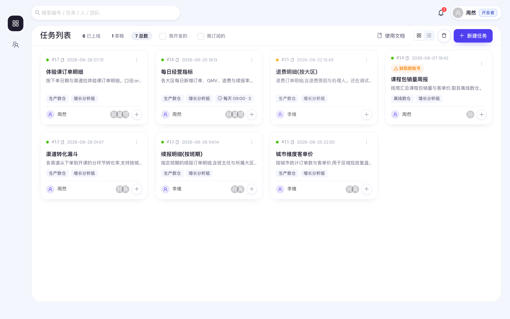

- **标题右侧的小片**是状态筛选：已上线 / 草稿 / 总数，点一下只看该状态，再点取消。
- **小片下面那一排是搜索和筛选**：最左边的**搜索框**按任务编号、任务名、作者、团队、被授权人搜；右边跟着团队下拉和「我开发的 / 我订阅的」。搜索词和筛选都会写进网址，可以直接把链接发给同事，他打开就是你看到的这一屏。
- **卡片本体点一下就是取数**。点不动时把鼠标停上去，提示会说明原因：没上线，还是你只有查看权限。
- **卡片上有什么**：状态色点（黄=草稿、绿=已上线、红=已下线）、**任务编号**（形如 `#128`，点一下复制）、任务名与说明、数据源与团队标签、作者、被授权人的头像组。右上 **⋮** 里是运行记录、订阅等操作。
- **任务编号**：每个任务有一个唯一编号，建好就不变，改名也不变。点编号即复制**纯数字**（`128`），粘到任务列表的搜索框就能直接定位这个任务——找同事问某个任务时，报编号比报名字准（任务是可以重名的）。列表视图第一列就是它，点列头可按编号排序。
  搜 `128` 会把**编号是 128 的那个任务**和**名字里带 128 的任务**一起列出来（编号命中的排在最前）；只要编号那一条，就写成 `#128`。
- **⊞ / ☰ 两个按钮**切卡片和列表视图。任务多的时候列表一屏能看几十行，选了哪种会记在你这台电脑上。两种视图看的是同一批任务，筛选和搜索都照样生效。

开发者和管理员还会多看到一些东西：**新建任务**按钮、回收站、团队下拉、「我开发的 / 我订阅的」勾选框，以及橙色的「缺取数账号」告警。普通用户没有这些。

### 2.3 填参数

点开任务后右侧弹出抽屉，顶部灰底方框是作者写的说明，下面是参数表单。**所有参数都必填，没有默认值。**

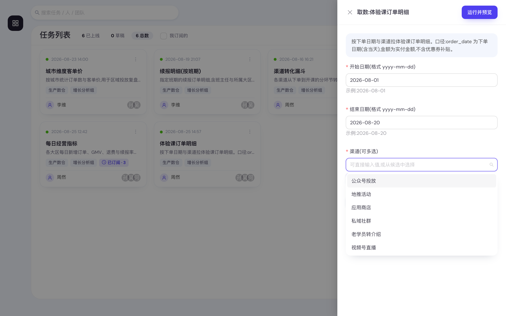

参数只有两种：

| 形态 | 长什么样 | 怎么填 |
|---|---|---|
| **单值** | 一个输入框 | 直接输入，如 `2026-07-01`、`100` |
| **值列表** | 可多选的标签框 | 填一组值，对应 SQL 里的 `IN` / `NOT IN` |

控件下面的灰字「示例：…」是作者填的格式，照着填不会错。

值列表下面可能还有两个帮手，取决于作者开没开：

- **候选值**：打开抽屉时候选已经在那儿了，展开勾选即可，不用等查询。灰字写着候选个数和谁在什么时候更新的。觉得过时就点 **更新枚举值** 重新取一次——**结果对这个任务的所有人生效**。
- **上传/粘贴列表**：选一个 csv/txt 文件，或直接粘贴一串值（一行一个，逗号分号空格分隔也认），自动去重后加进来。

### 2.4 运行、预览、下载

点右上 **运行并预览**，**不要重复点**。表单上方会显示「排队中」或「正在取数」和已等时长。

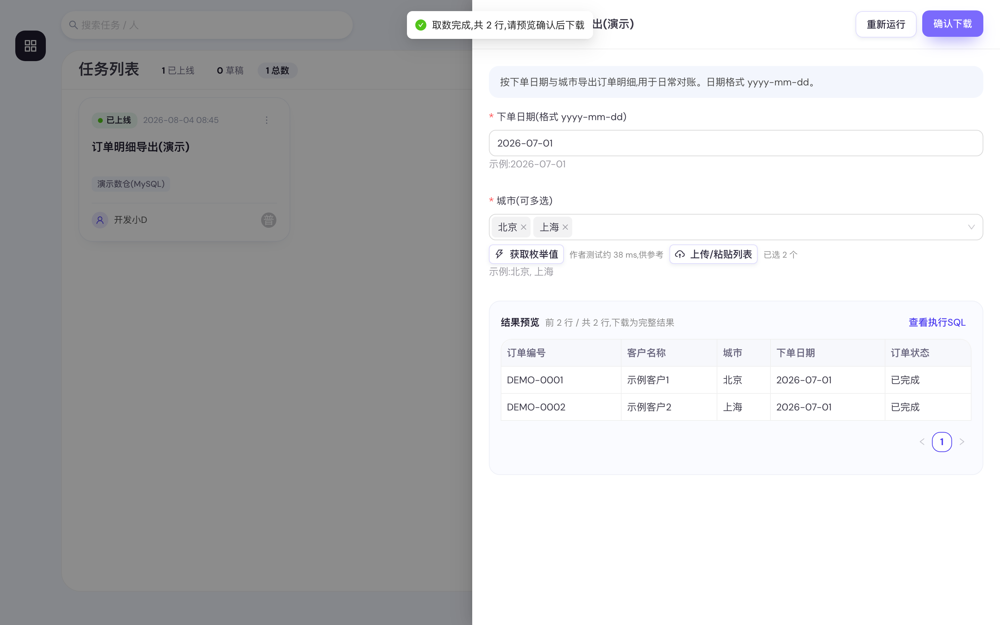

跑完抽屉变宽，出现结果预览：

- 预览只给**前 50 行**，下载的是完整结果。
- 点 **查看执行SQL** 看参数代入后的真实语句。
- 点 **确认下载** 拿 CSV；点 **重新运行** 换参数再跑，表单还在。

**结果文件**是 CSV（带 UTF-8 BOM，Excel 双击打开中文不乱码），文件名形如 `任务名_运行编号.csv`。

**关掉抽屉不影响它跑完**。页面最多等 20 分钟，超时后会提示你去通知或运行记录里领结果。

### 2.5 以前跑过的结果去哪儿找

要的数据同事刚跑过，就不用自己再跑一遍。运行记录有两个入口，看的是同一份：

- **取数抽屉下方的「运行记录」**：展开就能看到这个任务跑过的每一次，直接预览、导出。
- **卡片 ⋮ → 运行记录**：独立抽屉，列最全（多了运行人和执行SQL）。点通知跳过来的也是这里。

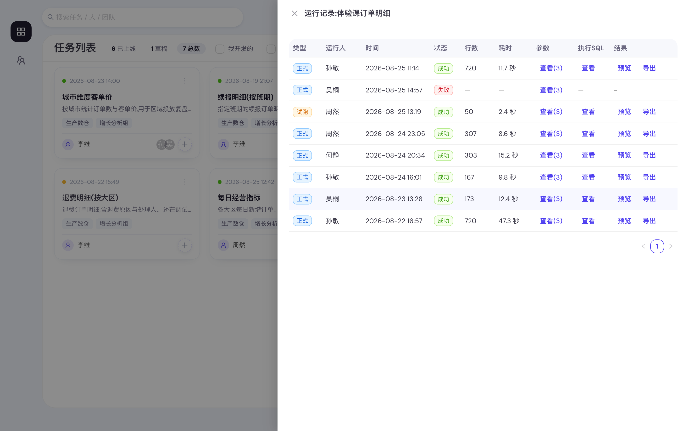

几个容易问的列：

- **类型**：正式＝业务填参跑的；试跑＝作者在编辑器里测的；定时＝平台按订阅计划自动跑的。
- **耗时**：只算真正执行的时间，**不含排队等待**。所以排了半小时、耗时写 12 秒，两个都对——
  排的那半小时看旁边的「排队」列。
- **排队**：从提交到真正开始执行之间等了多久。试跑不入队、平台上线这一列之前的老运行都显示 `-`，
  那是「没有记录」，不是「没排队」。
- **结果**：超过 7 天保留期会显示「已过期」，重跑一次即可，参数可以在 **查看(N)** 里照抄。

**谁看得到谁的记录**：普通用户只看得到自己跑的；任务所属团队的成员和管理员看得到这个任务下所有人的运行。列表只留最近 200 次。

### 2.6 通知

取数跑完（成功或失败）会推**飞书消息**和**站内通知**两处。点顶栏铃铛看列表，点某条通知会直接跳到对应任务的运行记录，马上就能下载。

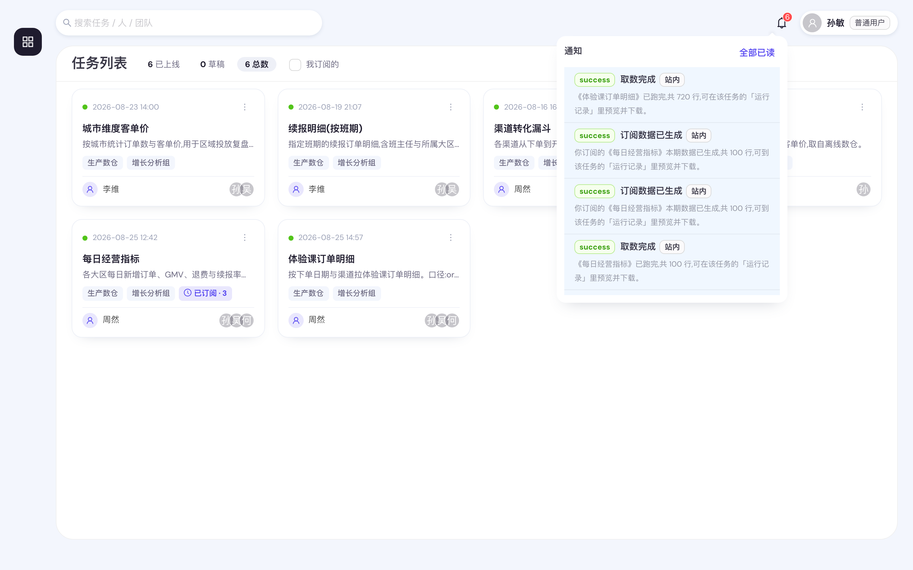

### 2.7 订阅：让平台按计划自动跑

有些任务不用填参数，比如每天的经营看板。作者给它开了**定时运行**之后，你订阅一下，平台就按计划自动跑、跑完推给你，不必每天自己点。

**怎么订**：卡片上带「每天 09:00」这类**计划标签**的任务就是开了定时运行的，点 **⋮ → 订阅本任务** 即可。订上之后标签变成「已订阅 · N」（N 是订阅人数），⋮ 里那一项变成 **退订**。看得见就订得上。

**也可能是别人替你订的**：任务负责人可以直接把任务订给你——那你会收到一条「**已为你订阅数据推送**」，说明是谁订的、按什么频次跑。任务随即出现在你的列表里（你要是还没有权限，平台会一并给你「查看」）。不需要就点 **⋮ → 退订**，跟自己订的完全一样。

**数据在哪**：每期跑完收到通知，点进去就是该任务的运行记录，那条的类型是「定时」，预览和导出跟自己跑的一样。

**五件要知道的事**：

- 只有**没有变量**的任务能开订阅——定时跑的时候没人在场填参。
- **连续 10 期不看就自动退订**。某期结果你既没预览也没导出就算一期没看，连着 10 期平台自动取消并通知你。想继续要就重订一次，计数清零。跑失败的那期不算。**别人替你订的也一样计数**，不看照样会被退掉。
- **任务负责人也能把你移出名单**，你会收到一条「订阅已取消」。这只停推送、不收回查看权限，你随时能自己订回来。
- **任务下线＝推送暂停**，订阅关系还在，重新上线自动恢复，不用重订。
- **最新一期的结果不会过期**，一直留到下一期成功把它换掉为止。

---

## 3. 建任务（开发者）

本章只有开发者和管理员能操作。

> 经常建任务的同学请看[《开发者手册》](./developer-manual.md)：变量设计、候选值生命周期、SQL 安全网关、排障速查、上线前自检清单。

### 3.1 整体流程

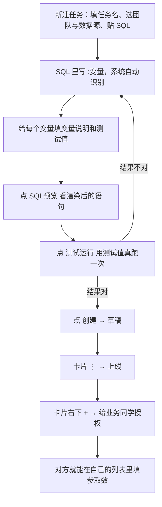
```mermaid
flowchart TD
    A[新建任务：填任务名、选团队与数据源、贴 SQL] --> B[SQL 里写 :变量，系统自动识别]
    B --> C[给每个变量填变量说明和测试值]
    C --> D[点 SQL预览 看渲染后的语句]
    D --> E[点 测试运行 用测试值真跑一次]
    E -->|结果不对| B
    E -->|结果对| F[点 创建 → 草稿]
    F --> G[卡片 ⋮ → 上线]
    G --> H[卡片右下 + → 给业务同学授权]
    H --> I[对方就能在自己的列表里填参取数]
```

### 3.2 任务编辑器

点任务列表右上 **新建任务**。按钮是灰的说明你还不属于任何团队，找管理员把你加进团队。

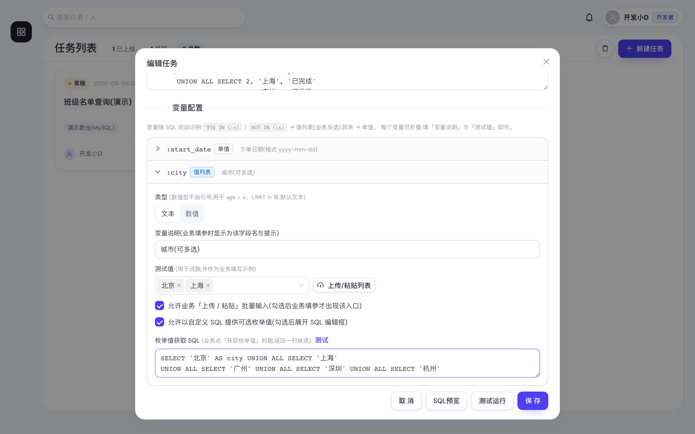

**第一段·基本信息**

| 字段 | 必填 | 说明 |
|---|---|---|
| 任务名称 | 是 | 业务方看到的名字，写清楚查什么 |
| 所属团队 | 是 | 决定谁看得见这个任务、取数用哪套库账号。建好后你改不了，要转移找管理员 |
| 数据源 | 是 | 管理员配好的数据库，决定 SQL 用哪种方言。选完下方会提示本团队的取数账号就绪没 |
| 查询超时(秒) | 否 | 留空按引擎默认：MySQL 120 秒、Hive 3600 秒 |
| 任务说明 | 否 | 显示在业务方取数抽屉顶部，写清口径与限制 |

**第二段·SQL**

用 `:变量名` 作占位符。**变量是单值还是值列表，由你的写法决定，不用手选**：

- 写成 `字段 IN (:x)` 或 `NOT IN (:x)` → 业务方看到可多选的标签框；
- 写在其他任何位置，如 `dt = :dt` → 业务方看到一个输入框。

**只允许单条 SELECT / WITH 查询**，多语句和任何写操作都会被安全网关拒绝。

**第三段·变量配置**

停止输入 SQL 约 0.4 秒后，系统自动扫出 `:变量` 并生成折叠卡。每张卡里可配：

| 配置项 | 适用 | 说明 |
|---|---|---|
| 类型（文本 / 数值） | 全部 | 数值型不加引号，用于 `age > :x`、`LIMIT :n`；默认文本 |
| 变量说明 | 全部 | 业务填参时显示为这个字段的名字，如「开始日期(yyyy-mm-dd)」 |
| 测试值 | 全部 | 用于测试运行，同时就是业务方看到的「示例：…」 |
| 允许上传/粘贴 | 仅值列表 | 勾了业务方才有批量输入入口 |
| 枚举值获取 SQL | 仅值列表 | 一段返回**一列候选值**的独立查询 |

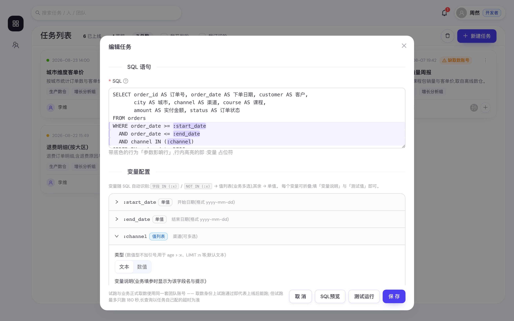

> **配了枚举值获取 SQL 就记得点一次「测试」再保存。** 测出来的那批值会直接成为业务侧的共享候选，业务方打开抽屉就能勾。测完又改了 SQL 再保存，那批值会被丢弃——值和 SQL 必须对得上。

**底部四个按钮**

| 按钮 | 作用 |
|---|---|
| 取消 | 关掉不保存 |
| SQL预览 | 把测试值代入看最终语句，**不连数据库** |
| 测试运行 | 用测试值真跑一次，最多 50 行、最多 180 秒。所有变量都得有测试值 |
| 创建 / 保存 | 落库，新建后是草稿 |

### 3.3 上线与下线

| 状态 | 业务方能跑吗 | 怎么切换 |
|---|---|---|
| **草稿** | 不能 | ⋮ → 上线；不想要了 ⋮ → **移入回收站** |
| **已上线** | 被授权的能 | ⋮ → 下线，进回收站 |
| **已下线** | 不能 | 回收站里 ⋮ → **恢复为草稿**（捡回来接着改）或 **重新上线**（直接放给业务） |

任务**不能删除**，只能收进回收站（任务列表右上的圆形按钮切过去）。**草稿也能收**——写废了的草稿不必一直留在列表里碍眼，⋮ → 移入回收站即可，之后随时能恢复为草稿。

两件容易踩的事：

- **编辑已上线的任务，保存后新版本自动接替上线**，不用再点一次上线。也因此，保存时会和上线一样检查取数账号。
- 上线被拦下并提示「团队 X 尚未配置数据源 Y 的取数账号」，是正常卡点，见下一节。

### 3.4 团队与团队取数账号

左侧菜单 **我的团队** 进去，有三个页签：**成员**、**团队取数账号**、**任务编辑权**，都由**团队管理员**维护。

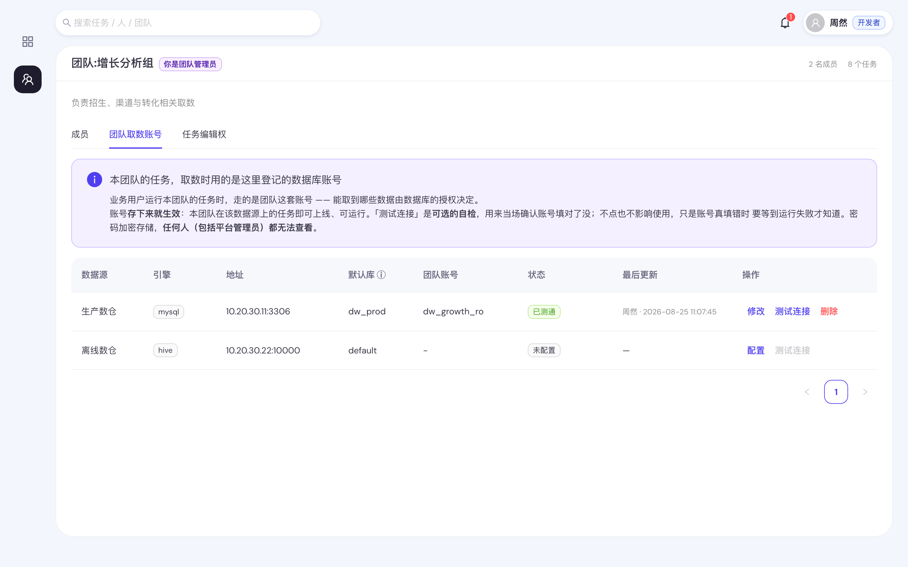

**团队决定三件事**：

- **谁看得见**：同团队成员互相看得到彼此的任务（含草稿），不同团队互不可见。
- **谁能改**：默认只能改自己建的。团队管理员能改本团队全部任务，也能按任务把编辑权授给某个成员。
  「任务编辑权」页签上方有搜索框，可按**任务名 / 任务编号 / 作者 / 可编辑的人**筛（比如想知道「张三能改哪些任务」，直接搜他的名字）。
  注意这里**只列本团队的任务**——搜一个别的团队的编号是搜不到的，得去那个团队页找。
- **用谁的身份取数**：业务方跑任务时，用的是**任务所属团队**的数据库账号。团队在这个数据源上没登记账号，任务就不能上线也不能运行，**不会偷偷改用公共账号**。

关于「测试连接」，只有一句话要记：**它是可选的自检，不是必须走的一步**。账号存下来就生效、任务就能跑。点一下的好处是当场知道账号填对没有，还会列出这个账号能访问哪些库——**那份清单就是这个任务能取的全部范围**。改过密码后「已测通」标记会清空，那只是自检痕迹失效，**任务照跑**。

> ⚠️ **加入团队＝拿到该团队取数账号的全部数据权限。** 团队账号是共享的，任何成员都能在编辑器里用它试跑任意 SQL。加人要谨慎，每次成员变更都进审计。

### 3.5 给业务同学授权

平台上有两层授权，别混：**团队**决定同事之间谁看得见、谁能改；**任务授权**（这一节）决定业务同学能不能用。**任务上线后还要单独授权，业务方才看得到。**

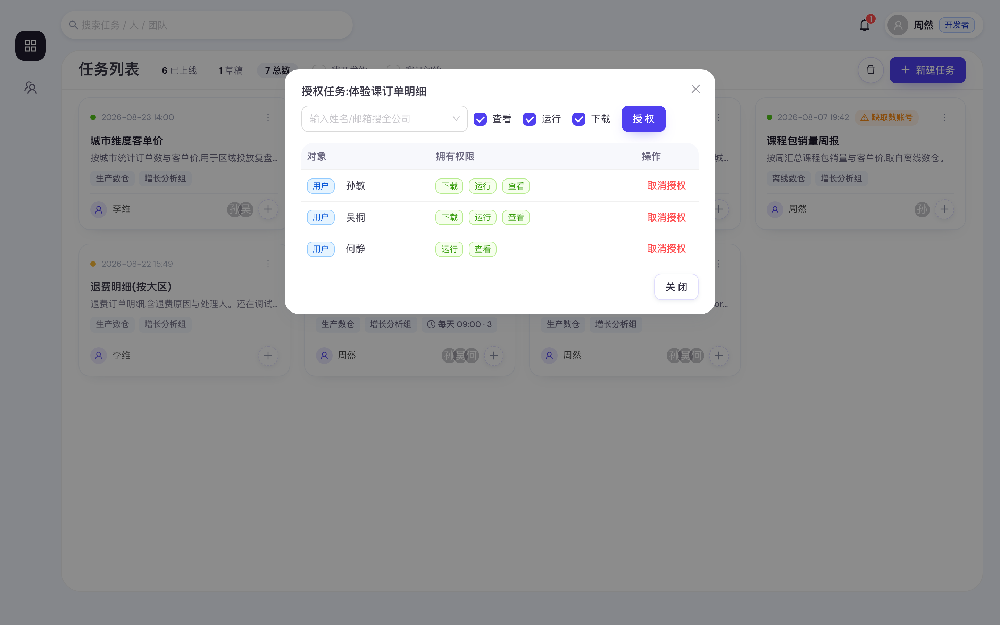

在卡片右下角点虚线 **+**：

1. 输入姓名或邮箱**搜全公司**（走飞书通讯录，按你自己的可见范围）。
2. 勾权限，默认三个全勾：**查看**（能在列表里看到，仅限已上线的）、**运行**（能填参跑）、**下载**（能导出结果）。
3. 点 **授权**。要收回就点该行的 **取消授权**。

这个弹窗里**没有「编辑」**——任务编辑权是团队内的事，由团队管理员在团队页授予。

如果这个任务开了定时运行，你也可以**跳过这一步**：直接在「订阅者名单」里把它订给业务方，平台会在同一次操作里顺手补上「查看」——见 3.6。

### 3.6 开启定时运行

编辑器最下面有 **订阅与定时运行**：打开 **允许订阅**，平台就按你设的计划自动跑，并把结果推给订阅者。

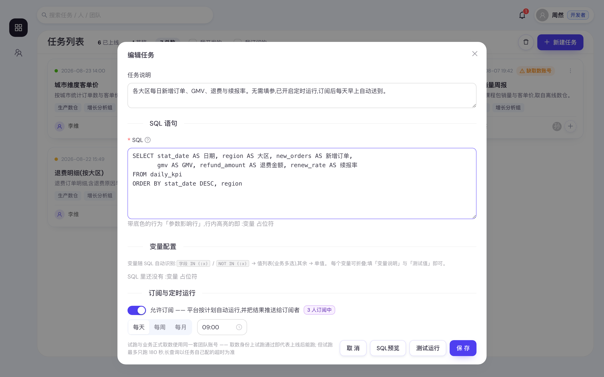

- 频次可选**每天 / 每周**（选周几）**/ 每月**（选几号），加一个 `HH:MM` 运行时刻。
- **只有没有变量的任务能开**，SQL 里还留着 `:变量` 就存不下来。
- **没有单独的暂停**：下线即暂停，重新上线自动恢复。
- **关掉「允许订阅」再保存＝清退全部订阅者**并逐一通知，保存前界面会再提醒一次。
- 跑失败时**你**收到带原因的通知，订阅者只收到一句「本期数据生成失败」。
- 没人订阅的那一期不会真跑，省一次取数。

卡片 **⋮ → 订阅者名单** 看谁订了、这一行是他自己订的还是你替他订的、连续几期没看（临近 10 期标橙）；旁边的「订阅记录」页签记着谁在何时订阅、退订、被代订、被移出、被清退。

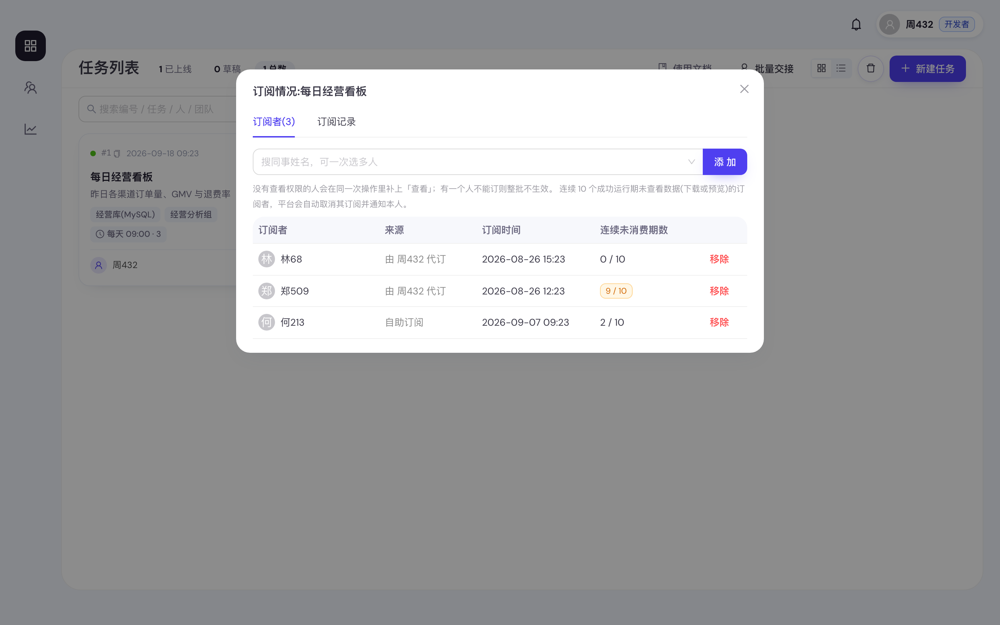

**直接订给业务方**：名单上方的搜索框搜同事姓名（走飞书通讯录，可一次选多人）→ **添加**。几条规则：

- **没有查看权限的人会被顺手补上「查看」**，够他预览和导出订阅结果；不会多给「运行」「下载」。授权与订阅在审计里各留各的痕。
- **任务必须已上线**。草稿补了权限对方也看不到数据，平台会直接拦下，让你先上线。
- **一次挑多人时，有一个人不能订则整批不生效**（已离职的、平台系统账号），弹窗会逐条说明是谁、为什么；**已经在名单里的人自动跳过**，不算失败。
- 被你订上的人会收到一条通知，说明是你订的、按什么频次跑、怎么退订。

**把人请出名单**：每行右侧的 **移除**。对方收到一条「订阅已取消」，此后不再收到推送；**查看权限不受影响**（要收权请到卡片的 ➕ 授权里取消）。被移除的人随时可以自己订回来。

---

## 4. 平台管理（管理员）

### 4.1 用户与角色

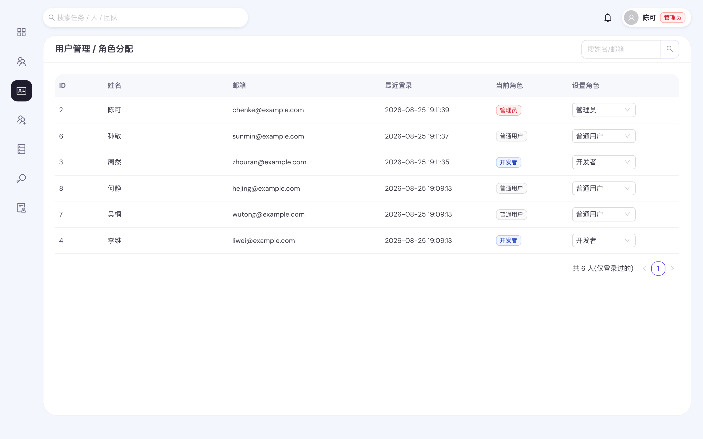

列出 ID、姓名、邮箱、最近登录、角色，最后一列下拉可直接改角色。**只列出登录过的人**——同事飞书登录一次才会出现在这里。

> **把开发者降为普通用户，会连带把他清出所有团队**，并撤销他在这些团队任务上的编辑权。清了哪些团队可以在审计里查。提升角色不清队。

### 4.2 团队管理

列出团队、团队管理员、成员数、任务数。行操作有 **成员**（加人，只能加开发者角色且登录过的）、**编辑**、**删除**（团队下还有任务时删不掉，含回收站里的）。

**指定团队管理员是你的职责**——之后他就能自己加成员、配账号、授编辑权，日常不用再找你。没有团队管理员的团队会标橙色告警。

**转移任务所属团队**只有管理员能做，在任务编辑器里改「所属团队」。转移会同时改变可见范围和取数账号，并撤销原团队里的编辑权。

**转移任务作者**（离职交接）不必找你——**作者本人和该任务所属团队的团队管理员**都能做，
入口在任务列表的 ⋮ 菜单和团队页的「任务编辑权」面板。接手人只能是**该任务所属团队的在职成员**，
所以你不能把任务转给自己（管理员不进团队）。转移后新旧双方各收一条飞书通知；
原作者除非是团队管理员，否则不再能编辑该任务，但仍看得见、跑得动。
版本历史里「哪一版是谁保存的」不会被改写，业务方的授权与订阅也不受影响。

人走了要一次交接一批时，用任务列表右上角的**「批量交接」**：先选接手人，
不能转给他的任务会置灰并说明原因，勾完一次提交。两条性质值得知道——
**全部成功才生效**（有一个转不了就整批不动，并逐条说明是哪几个），
**通知按人合并**（新旧作者各收一条汇总，不是每个任务一条）。
审计里仍是**每个任务一条** `转移任务作者`，同一批共享一个批次号。

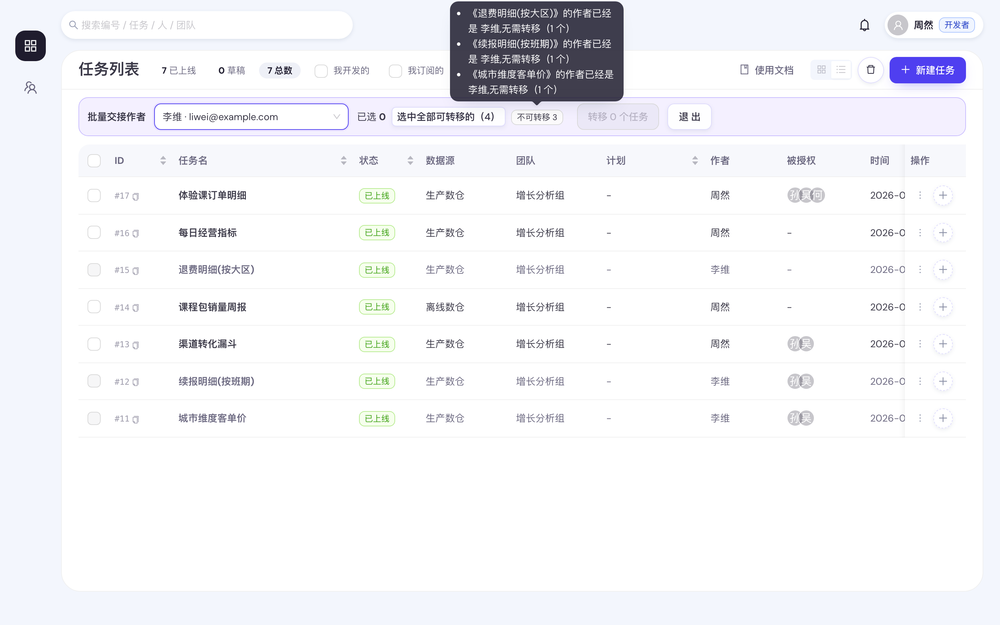

> 提醒离职同事：**先转作者，再降角色**。降级会把人清出全部团队，之后他本人就做不了转移了
> （只能由团队管理员或你代办）。

### 4.3 数据源

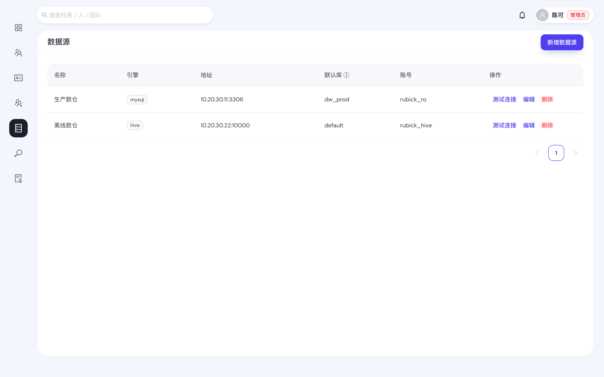

**新增数据源**要填：名称、引擎（MySQL / Hive）、Host / Port、Database（可选）、只读账号与密码。

三条要点：

- **必须用只读账号**。平台的 SQL 网关只是一层防护，数据库侧的只读权限才是最终兜底。
- **Database 只是「不写库名时的解析起点」**，不是「平台连哪儿」。账号对它没权限也照样能连、能取数，只是任务 SQL 要把表名写全（`库名.表名`）。
- 数据源上这套账号是**平台公共账号，只用于本页的「测试连接」**；业务取数一律走团队账号。

被任务引用的数据源**删不掉**，提示会说明被几个任务用着。

### 4.4 取数账号治理

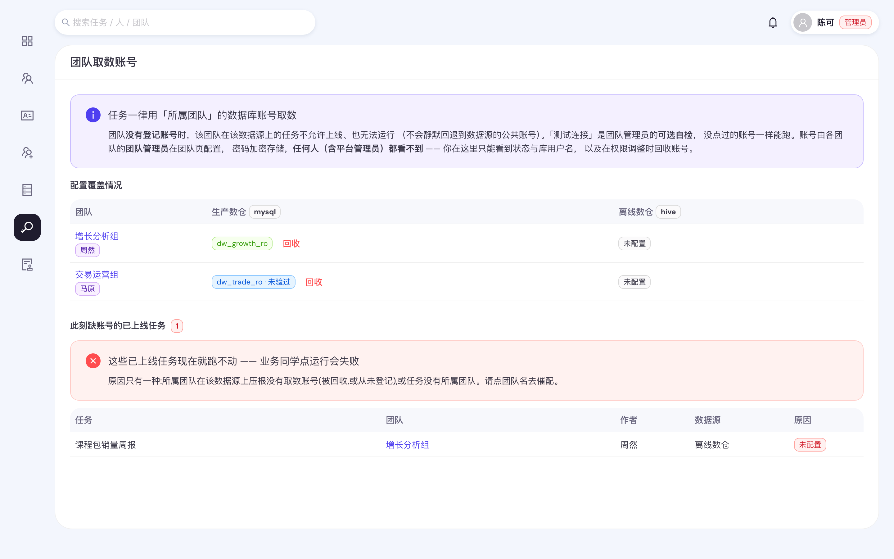

账号由各团队的团队管理员在团队页配置，你在这一页只做治理，看两块：

- **配置覆盖情况**：一行一个团队、一列一个数据源。绿色=已测通、蓝色=已配置但没验过（**照样能跑**）、灰色=未配置。每格可**回收**。**你也看不到密码**，密码加密存储且接口永不回传。
- **此刻缺账号的已上线任务**：这些任务**现在就跑不动**，业务同学点运行会失败。点团队名可以直接跳去催配。「没验过」不算在内。

> **没有开关。** 没登记账号的任务不允许上线也不允许运行，不会静默回退到公共账号。所以首次启用前，先让各团队把账号配齐。

### 4.5 审计日志

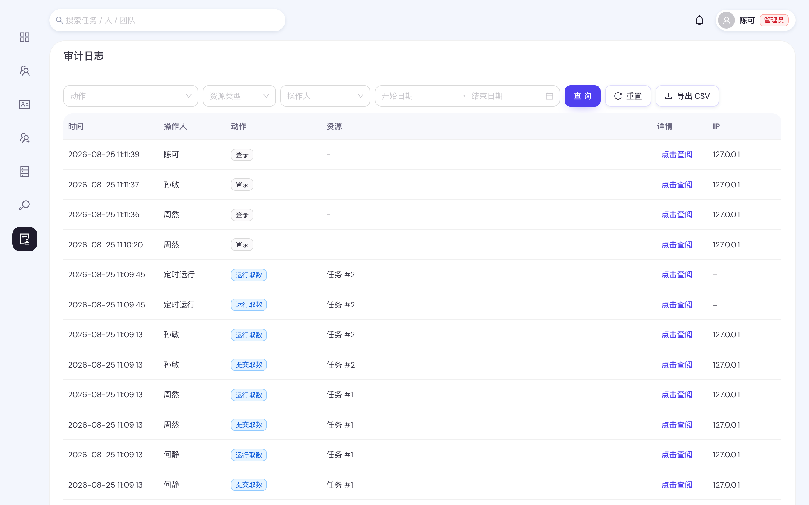

按**动作 / 资源类型 / 操作人 / 时间范围**检索，可 **导出 CSV**（一次最多导出最新 5 万条，导出这个动作本身也会留痕）。

留痕覆盖：登录；提交取数、运行取数、取数失败、下载结果；新建 / 编辑 / 上线 / 下线任务、转移团队、转移作者、订阅与退订、代订阅与移除订阅者、更新枚举候选值；授予和撤销各类权限；团队与团队取数账号的全部增删改；修改平台角色、数据源增删改；导出审计日志。

> 任务类、数据源类、角色变更类的记录带**名称快照**，改名或删除后依然读得懂。取数类记录只带编号，显示成 `任务 #12`——
> 这里的 `#12` 与任务卡片、列表和任务详情标题上的编号是**同一个**，拿它去任务列表的搜索框一搜就能回到那个任务。

### 4.6 运营分析

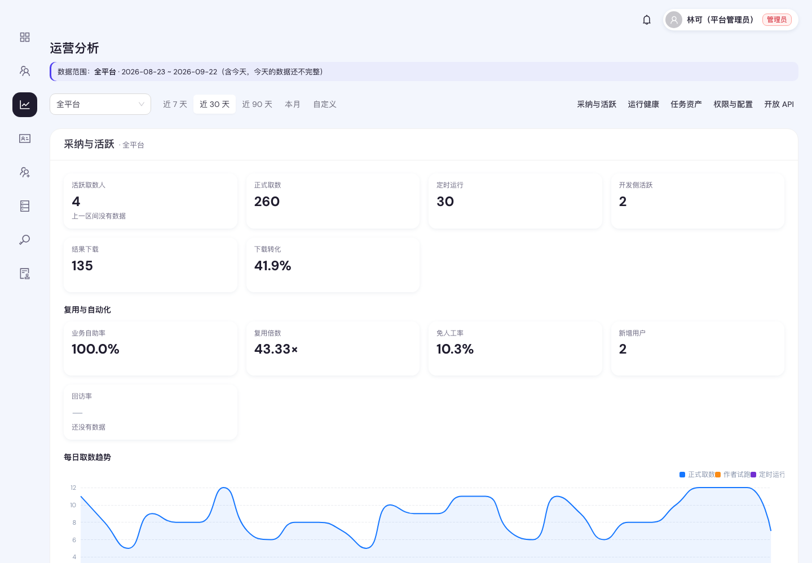

一页看清平台被用得怎么样。**团队管理员也进得来**，但只看得到自己那个团队。

四个板块，按「打开这页最先想知道什么」排：

| 板块 | 回答的问题 |
|---|---|
| **采纳与活跃** | 有没有人用、用得深不深。取数次数、活跃人数、下载转化，以及「复用与自动化」三个数 |
| **运行健康** | 跑得顺不顺。成功率、失败归因、执行耗时、**排队等了多久** |
| **任务资产** | 资产在被复用还是在腐烂。状态分布、闲置、从未被运行、跑得最多的任务 |
| **权限与配置** | 有没有治理漏洞。空转授权、失效的编辑权、缺账号的任务、下载集中度 |

**三件读数字之前要知道的事**：

- **「此刻」标记**。带这个小标记的数字反映**当前状态**，不随上方的时间范围变化——任务总数、缺账号数都是这种。
  切了时间范围它们纹丝不动是对的，不是没刷新。
- **`—` 不是 0**。灰色的「—」是「还没有数据」，实打实的 `0` 配一句绿色的「本区间没有发生」才是「跑了很多次、一次没出问题」。
  这两件事在页面上看着就不一样。
- **三种运行来源分开算**。正式取数、作者试跑、定时运行的成功率各算各的。试跑失败率天然偏高——写 SQL 本就是试错；
  定时运行失败才是需要处理的事故。混成一个数字，这块板就没人看了。

**能点的数字都能点**。闲置任务跳到任务列表的「闲置」筛选、排行榜某一行跳到那个任务、缺账号跳到取数账号页、
治理动作跳到审计页并自动带上筛选条件。

**团队管理员看到的**：

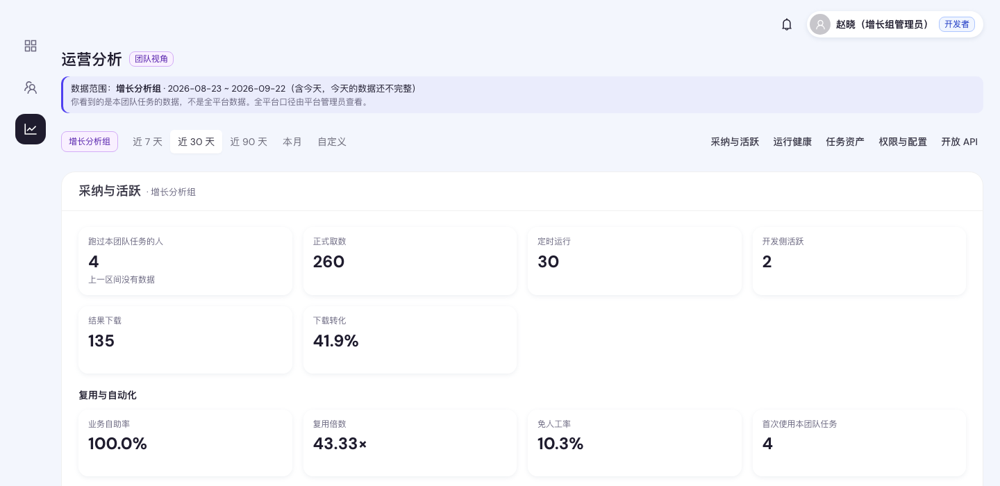

页面顶部那条**数据范围**一直在，写明「你看到的是本团队任务的数据，不是全平台数据」；每个板块标题后面也跟着团队名。
平台级的内容（角色分布、团队总数、跨团队对比、审计流水）整块不显示——不是显示成 0，是压根没有。

> **平台管理员可以下钻**：左上角的范围下拉选某个团队，看到的就和那个团队的管理员一模一样。
> 选回「全平台」即恢复。

---

## 5. 细则与限制

以下是代码默认值，管理员可以在部署配置里调整，拿不准以实际部署为准。

| 项目 | 默认值 | 说明 |
|---|---|---|
| 查询超时 | MySQL 120 秒 / Hive 3600 秒 | 可在任务上单独覆盖，到点强制终止 |
| 单次结果行数 | 无上限 | 有多少给多少。Excel 单表最多 104 万行，超了请换工具打开 |
| 结果文件保留期 | 7 天 | 到期显示「已过期」，需重新运行 |
| 运行记录显示 | 最近 200 次 | 更早的请管理员去审计日志里查 |
| 下载链接有效期 | 1 小时 | 过期重新点一次 |
| 页面等待结果 | 20 分钟 | 超时后改由通知 + 运行记录领取 |
| 登录有效期 | 12 小时 | 过期自动跳回登录页 |
| 运营分析默认区间 | 近 30 天 | 可切 7 / 90 天、本月或自定义；带「此刻」标记的指标不受它影响 |
| 运营分析可见范围 | 管理员看全平台、团队管理员看本团队 | 团队管理员看不到平台级内容（角色分布、跨团队对比、审计流水） |
| 订阅计划粒度 | 每天 / 每周 / 每月 + `HH:MM` | 服务器本地时间；每月 29/30/31 遇小月顺延到当月最后一天 |
| 订阅自动退订 | 连续 10 期未消费 | 预览或导出都算消费；失败的期不计入；自己订的和被代订的一视同仁 |
| 一次代订阅人数 | 50 人 | 有一人不能订则整批不生效；被代订的人可随时自己退订 |
| 订阅结果保留 | 最新一期始终保留 | 直到下一期成功把它取代；更早的按 7 天清理 |
| 编辑器测试运行 | 最多 50 行 / 180 秒 | 只是前台自检的上限，正式取数不受这 180 秒约束 |
| 枚举候选值上限 | 1000 个 | 超出提示「已截断，可直接输入未列出的值」 |
| 枚举候选值缓存 | 按 任务 × 变量 共享 | 手动更新，不自动过期；作者改了 SQL 或换数据源即作废 |
| 枚举更新复用窗口 | 30 秒 | 窗口内重复点直接复用最新结果，不重复查库 |
| 枚举获取超时 | 120 秒 | **独立于任务的查询超时**，很慢的维度请指向小维表 |
| 值列表建议规模 | 5000 个值 | 超过会提示可能导致查询过慢或失败 |
| 结果格式 | CSV（UTF-8 BOM） | 暂不支持 xlsx，也没有结果水印 |
| SQL 限制 | 单条 SELECT / WITH | 多语句与任何写操作都会被拒绝 |

**平台目前没有的能力**（别按这些做方案）：字段级/行级脱敏、结果水印、候选值定时自动刷新、产品内提需求单、按部门或用户组授权、自定义角色、团队级数据源白名单。

---

## 6. 常见问题

### 取数时

**同事给了我一个任务编号（比如 128），怎么打开它？**
到任务列表页，粘进上方的搜索框即可，带不带 `#` 都认。两种写法的差别只在范围：`128` 连同**名字里带 128** 的任务一起列出来（编号命中的排最前），`#128` 则只给编号 128 的那一条。搜出来是空的，说明这个任务没授权给你——把编号发给任务作者要权限。

**任务列表是空的？**
还没有人给你授权，或授权的任务被下线了。找任务作者或管理员，说明要哪个任务的「查看 / 运行 / 下载」。
说清是哪个任务时，**报编号比报名字准**——任务是可以重名的。

**卡片点不开？**
把鼠标停上去看提示。「任务未上线」＝找作者；「未授权，暂不可取数」＝你只有查看权限，找作者补运行权限。

**提示「缺少必填参数」或「参数需为数值」？**
所有参数都必填、没有默认值。值列表要确认标签真的加进框里了（输入后回车，或从候选里选）。数值型参数去掉引号、空格和中文单位。

**报错是一段看不懂的英文？**
那是数据库原样返回的，通常是 SQL 或数据源的问题，不是你填错了。把任务名和报错截图发给任务作者。报错里的 `***` 是脱敏掉的数据库账号名。

**卡片上写的作者已经离职了，找谁？**
找该任务**所属团队**的团队管理员（团队名就在卡片的标签上），或者平台管理员。
作者是可以交接的：离职前本人转，忘了转的由团队管理员补转，卡片上的作者随即变成接手人。

**以前的结果提示已过期？**
结果只留 7 天。重跑一次即可，参数可以在运行记录的 **查看(N)** 里照抄。

**收到通知说取数被中断？**
机器重启或进程异常退出赶上了你这次运行，重跑即可。**常规版本更新不会这样**——更新前平台会先等所有在跑的取数跑完。

**结果行数比预期少？**
平台没有行数上限，少的行不是平台丢的。从参数（时间范围、筛选值）和任务 SQL 去找，拿不准就把 **参数** 和 **执行SQL** 截图给作者。

**值列表没有候选值？**
候选值只在作者配了「枚举值获取 SQL」时才有。直接手输即可，或让作者开启「上传 / 粘贴」。

**候选值是最新的吗？我点更新别人看得到吗？**
候选是这个任务的**共享候选**，不自动刷新，灰字里写着谁在什么时候更新的。任何有权限的人点一下 **更新枚举值** 就重新取，**结果对所有人生效**，别人下次打开抽屉就用上了。

**提示「作者已更新配置，请点获取枚举值」？**
作者改了那段查询或换了数据源，旧候选已作废，平台刻意不拿旧值糊弄你。点一下重新取即可。

**卡片上写着「每天 09:00」，怎么才能收到？**
那是作者开了定时运行，点 **⋮ → 订阅本任务**。之后每期跑完都有通知，结果在运行记录里，类型是「定时」。

**订阅了这期却没收到？**
三种可能：任务被下线了（推送暂停，重新上线自动恢复）；本期跑失败了（作者已同时收到通知）；你连续 10 期没看被自动退订了，重订一次即可。

**我没订过，怎么收到订阅通知了？**
任务负责人替你订的，通知里写了是谁。不想要就在任务卡片 **⋮ → 退订**，跟自己订的一样。

**页面突然跳回登录页？**
登录态 12 小时过期，重新点飞书登录。未提交的表单会丢。

### 建任务时

**「新建任务」按钮是灰的？**
你还不属于任何团队。任务必须归属团队，找管理员把你加进去。

**同事的任务我看不到？**
你们不在同一个团队，不同团队的任务互相不可见。找管理员把你加进那个团队，或把任务转移过来。

**同团队的任务我改不了，提示「无权编辑该任务」？**
默认只能改自己建的。请该团队的**团队管理员**在团队页「任务编辑权」里对**那一个任务**给你授权。

**保存时提示「只允许 SELECT 查询」「只允许单条语句」「检测到危险关键字」？**
安全网关只放行单条 SELECT / WITH。删掉多余的分号、`SET`、建临时表等语句，复杂逻辑请用 CTE（`WITH`）。

**SQL 里的变量没出现在变量配置里？**
变量要写成 `:名字`（字母或下划线开头）。停止输入约 0.4 秒后才重扫，变量卡默认是收起的，别看漏。

**业务方要多选，界面却只给一个输入框？**
形态由 SQL 写法决定。把条件改成 `字段 IN (:x)` 再保存就变成值列表了。

**改完 SQL 要再点一次上线吗？**
不用。已上线的任务保存后新版本自动接替上线。草稿和已下线的才需要手动上线。

**上线或运行被拦下，说「团队 X 尚未配置数据源 Y 的取数账号」？**
任务用的是**所属团队**的数据库账号。你是团队管理员就去「我的团队 → 团队取数账号」补一套，否则把这条提示转给团队管理员（他也会收到同样的通知）。**不需要先点测试连接**。

**开订阅时提示「已开启订阅的任务不能有变量」？**
把 SQL 里的 `:变量` 去掉，或者先关掉「允许订阅」。二者不能同时成立。

**关掉「允许订阅」，订阅者会怎样？**
保存那一刻全部订阅者被清退，并各收到一条「订阅已取消」。界面会在保存前提示还有几个人在订。

**业务方没有权限，能直接订给他吗？**
能。⋮ → 订阅者名单里搜人添加即可，平台会在同一次操作里补上「查看」。但**任务得先上线**——草稿补了权限对方也看不到数据。

**把人从订阅名单里移除后，他还看得到这个任务吗？**
看得到。移除只停推送，不收回查看权限；要收权请到卡片的 ➕ 授权里取消。

**改了库账号密码，任务会跑不了吗？**
不会。「已测通」标记会清空，那只是自检痕迹失效，任务照跑。想确认就点一次测试连接。

**为什么我配的密码自己也看不到？**
密码加密存储、接口永不回传，管理员也看不到。要换就重填一遍，留空＝不修改。

### 管理时

**数据源删不掉？**
被任务引用的数据源不允许删除，提示会说明被几个任务使用。先把这些任务改到其它数据源。

**授权选人时搜不到某个同事？**
搜索走飞书通讯录，按**你自己的可见范围**，超出范围搜不到。换关键词、换个管理员试，或让对方先登录一次平台。

---

## 7. 术语表

| 说法 | 意思 |
|---|---|
| 任务 | 一条可复用的取数 SQL，配好变量后可授权给别人运行 |
| 任务编号 | 任务的唯一标识（`#128`），建好就不变、改名也不变；点一下复制，可用于搜索与沟通。不同于「运行编号」（每跑一次一个，出现在结果文件名里） |
| 上线 / 下线 / 回收站 | 让任务对业务方可运行 / 收回 / 不在台面上的任务（已下线的和收起来的草稿）的存放处，不会真删 |
| 运行记录 | 每次取数的流水：谁、何时、什么参数、多少行、结果 |
| 正式 / 试跑 / 定时 | 业务填参跑的 / 作者在编辑器里测的 / 平台按订阅计划自动跑的 |
| 单值 / 值列表 | 参数的两种形态，由 SQL 里是否写成 `IN (:x)` 决定 |
| 枚举值获取 SQL | 作者预置的一段查询，用来跑出值列表变量的候选值 |
| 共享候选值 | 存下来的那批候选，按 任务 × 变量 共享，打开抽屉直接能勾 |
| 团队 | 任务的归属单元。同团队互相可见，不同团队互不可见 |
| 团队管理员 | 团队内的管理角色（不是第四种平台角色）：管成员、配账号、授编辑权 |
| 团队取数账号 | 某个团队在某个数据源上的数据库账号，该团队的任务用它取数 |
| 任务编辑权 | 团队管理员按任务授予成员的编辑许可，与业务侧的查看/运行/下载是两回事 |
| 数据源 | 一个可被查询的数据库连接（MySQL / Hive），由管理员配置 |
| 订阅 / 定时运行 | 让平台按计划把结果定期推给你 / 平台按计划自动发起的取数 |
| 审计 | 全平台操作留痕，仅管理员可查 |

**有问题找谁**：功能问题、权限申请、口径疑问，找对应任务的**作者**（卡片左下角显示）或平台管理员。
